## 210-nomination-kiesraad-strict.xsd

Het beperkte complex data type EMLstructure210 gebruikt het type EMLstructureKR als base type en maakt child elementen IssueDate en kr:CreationDateTime verplicht.

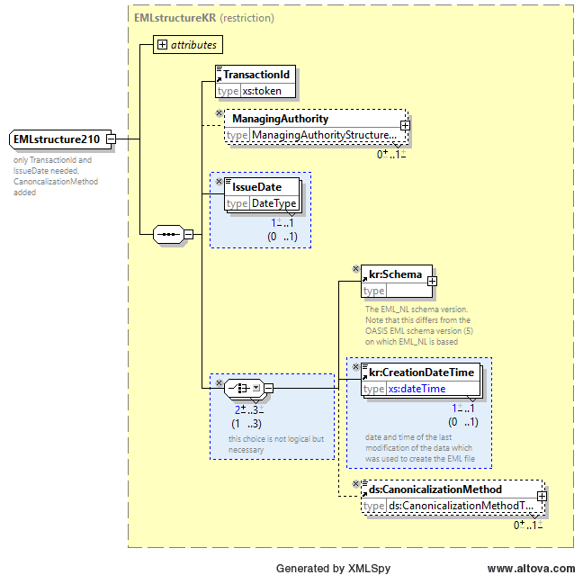

Het beperkte complex data type ElectionIdentifierStructure210 gebruikt het type ElectionIdentifierStructureKR als base type, en maakt het child element kr:NominationDate verplicht.

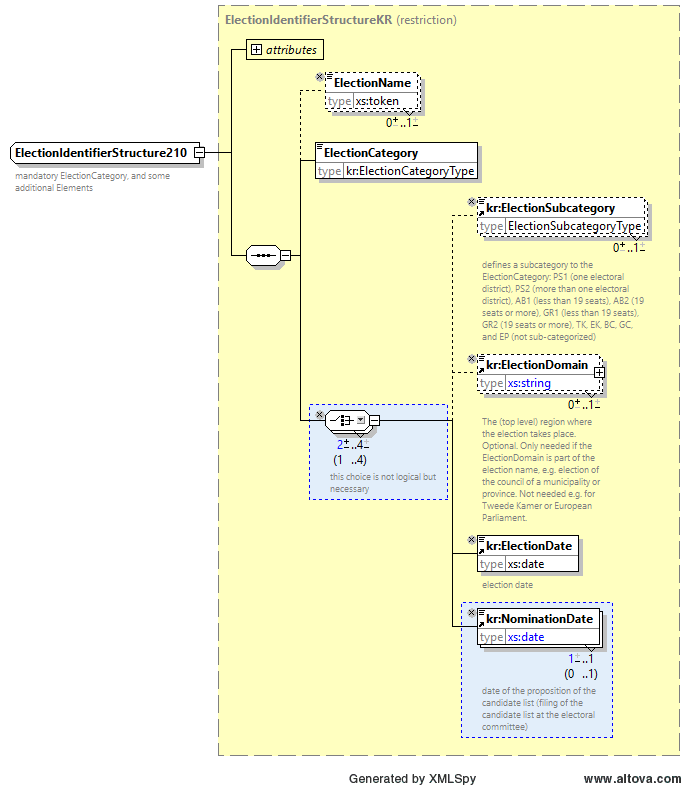

Het beperkte complex data type ContestIdentifierStructure210 gebruikt het type ContestIdentifierStructureKR als base type, en maakt child element ContestName verplicht.

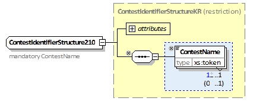

Het beperkte complex data type CandidateStructure210 gebruikt het type CandidateStructureKR als base type, beperkt het type van het child element CandidateIdentifier tot CandidateIdentifierStructure210, en maakt de child elementen CandidateFullName, en QualifyingAddress verplicht.

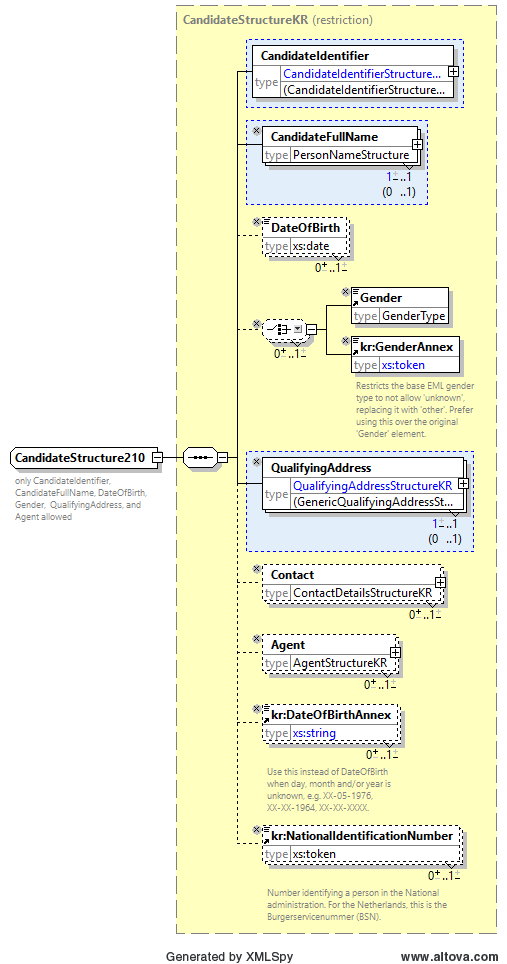

Het beperkte complex data type CandidateIdentifierStructure210 gebruikt het type CandidateIdentifierStructureKR als base type, verwerpt het child element ShortCode, en maakt het ld attribuut verplicht.

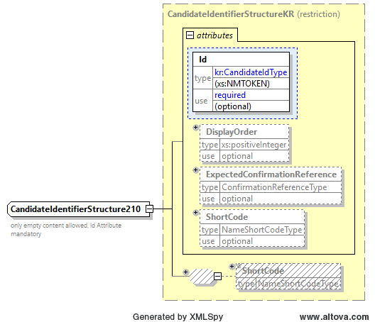

Het beperkte complex data type AffiliationStructure210 gebruikt het type AffiliationStructureKR als base type, en beperkt type van het child element AffiliationIdentifier tot AffiliationIdentifierStructure210.

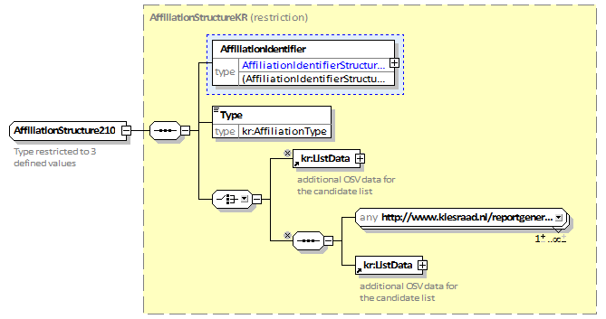

Het beperkte complex data type AffiliationIdentifierStructure210 gebruikt het type AffiliationIdentifierStructureKR als base type, en staat het Id attribuut niet toe.

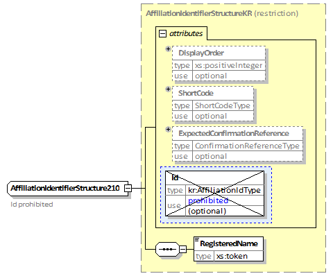

Het beperkte complex data type ProposerStructureRestricted is benodigd als een intermediate type wegens de ontoereikendheid van het eigen schema restrictie mechanisme. Het child element Id is niet toegestaan omdat het niet kan worden gebruikt in een beperkt type wegens de naamloze originele definitie. Verder zijn child elementen Contact en JobTitle verplicht. Het element JobTitle is beperkt tot de waarden van de vier gedefineerde functies in de Nederlandse situatie.

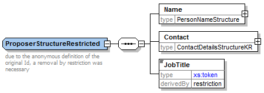

Het uitgebreide complex data type ProposerStructureKR haalt Id en kr:LivingAddress child elementen weer terug die eerder verwijderd was. Daarnaast wordt het optionele element kr:LivingAddress toegevoegd. De herdefiniëring is effectief type compatible aan de originele EML definitie. Dit element wordt gebruikt voor de inrichting van de vervangende agenten.

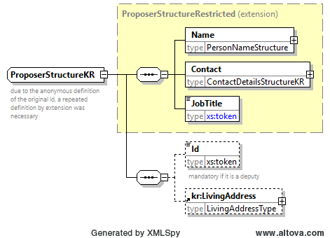

Het base type van het EML (root) element is beperkt tot EMLstructure210. Daarna is het uitgebreid op dezelfde manier als in de originele EML V5.0 definitie door het child element Nomination.

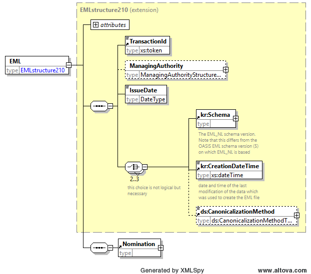

Het element Nomination is beperkt compatibel in een aantal manieren vergeleken met het originele EML element. Het type van het child element ElectionIdentifier is beperkt tot ElectionIdentifierStructure210. Het type van het child element ContestIdentifier is beperkt tot ContestIdentifierStructure210. Verder zijn alleen child elementen Affiliation en Nominate toegestaan, welke beiden verplicht zijn. Andere opties zijn niet toegestaan. De “any" extension point wordt gehandhaafd.

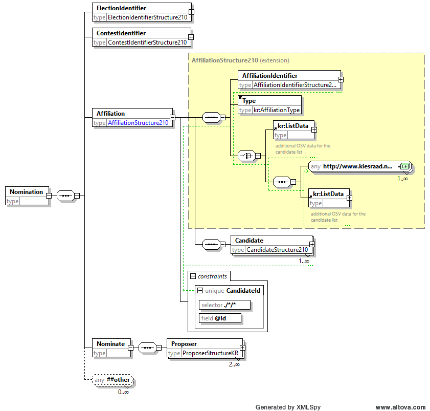

Het type van het child element Affiliation is eerst beperkt tot AffiliationStructure210, en daarna uitgebreid op dezelfde manier as in de originele EML V5.0 definitie door een opeenvolging van Candidate elementen. Het type van het child element Candidate is beperkt tot CandidateStructure210. Het child element Nominate is zelf gebonden aan een opeenvolging van child elementen Proposer, waarvan twee gevallen verplicht zijn. De "any" extension point is verwijderd. Het type van het child element Proposer is beperkt tot ProposerStructureKR.

Hieronder staat een voorbeeld van een EML 210 voor het Europees Parlement\[5\]:
```xml
<EML xmlns="urn:oasis:names:tc:evs:schema:eml" xmlns:ds="http://www.w3.org/2000/09/xmldsig#" xmlns:kr="http://www.kiesraad.nl/extensions" xmlns:xal="urn:oasis:names:tc:ciq:xsdschema:xAL:2.0" xmlns:xnl="urn:oasis:names:tc:ciq:xsdschema:xNL:2.0" Id="210" SchemaVersion="5" xmlns:xsi="http://www.w3.org/2001/XMLSchema-instance">
  <TransactionId>1</TransactionId>
  <ManagingAuthority>
    <AuthorityIdentifier Id="0000"/>
    <AuthorityAddress/>
    <kr:CreatedByAuthority Id="0000">De politieke partij</kr:CreatedByAuthority>
  </ManagingAuthority>
  <IssueDate>2024-02-18</IssueDate>
  <kr:Schema Version="1.3"/>
  <kr:CreationDateTime>2024-02-18T10:24:30.735</kr:CreationDateTime>
  <ds:CanonicalizationMethod Algorithm="http://www.w3.org/TR/2001/REC-xml-c14n-20010315#WithComments"/>
  <Nomination>
    <ElectionIdentifier Id="EP2024">
      <ElectionName>Verkiezing van het Europees Parlement 2024</ElectionName>
      <ElectionCategory>EP</ElectionCategory>
      <kr:ElectionSubcategory>EP</kr:ElectionSubcategory>
      <kr:ElectionDate>2024-06-06</kr:ElectionDate>
      <kr:NominationDate>2024-04-23</kr:NominationDate>
    </ElectionIdentifier>
    <ContestIdentifier Id="alle">
      <ContestName/>
    </ContestIdentifier>
    <Affiliation>
      <AffiliationIdentifier>
        <RegisteredName>De Partij</RegisteredName>
      </AffiliationIdentifier>
      <Type>op zichzelf staande lijst</Type>
      <kr:ListData PublicationLanguage="nl" PublishGender="true"/>
      <Candidate>
        <CandidateIdentifier Id="1"/>
        <CandidateFullName>
          <xnl:PersonName>
            <xnl:NameLine NameType="Initials">T.</xnl:NameLine>
            <xnl:FirstName>Thymen</xnl:FirstName>
            <xnl:LastName>Schrijer</xnl:LastName>
          </xnl:PersonName>
        </CandidateFullName>
        <DateOfBirth>1981-10-31</DateOfBirth>
        <!-- Ook al is PublishGender="true", op individueel niveau mag -->
        <!-- het geslacht weggelaten worden! -->
        <!-- <Gender>male</Gender> -->
        <QualifyingAddress>
          <xal:Locality>
            <xal:LocalityName>Veenendaal</xal:LocalityName>
          </xal:Locality>
        </QualifyingAddress>
        <Contact>
          <MailingAddress>
            <xal:Locality>
              <xal:AddressLine>Zijdevlinderhoek 95</xal:AddressLine>
              <xal:LocalityName>Veenendaal</xal:LocalityName>
              <xal:PostalCode>
                <xal:PostalCodeNumber>3905KC</xal:PostalCodeNumber>
              </xal:PostalCode>
            </xal:Locality>
          </MailingAddress>
        </Contact>
        <kr:NationalIdentificationNumber>668388212</kr:NationalIdentificationNumber>
      </Candidate>
    </Affiliation>
    <Nominate>
      <Proposer>
        <Name>
          <xnl:PersonName>
            <xnl:NameLine NameType="Initials">I.</xnl:NameLine>
            <xnl:FirstName>Igor</xnl:FirstName>
            <xnl:LastName>Nieskens</xnl:LastName>
          </xnl:PersonName>
        </Name>
        <Contact>
          <MailingAddress>
            <xal:Country>
              <xal:CountryNameCode>DE</xal:CountryNameCode>
              <xal:Locality>
                <xal:AddressLine>Knesebeckstrasse 9</xal:AddressLine>
                <xal:LocalityName>Forst</xal:LocalityName>
                <xal:PostalCode>
                  <xal:PostalCodeNumber>03141</xal:PostalCodeNumber>
                </xal:PostalCode>
              </xal:Locality>
            </xal:Country>
          </MailingAddress>
        </Contact>
        <JobTitle>inleveraar</JobTitle>
        <kr:LivingAddress>
          <kr:LocalityName>Forst</kr:LocalityName>
          <kr:CountryNameCode>DE</kr:CountryNameCode>
        </kr:LivingAddress>
      </Proposer>
      <Proposer>
        <Name>
          <xnl:PersonName>
            <xnl:NameLine NameType="Initials">G.</xnl:NameLine>
            <xnl:FirstName>Gianluca</xnl:FirstName>
            <xnl:LastName>Bogaarts</xnl:LastName>
          </xnl:PersonName>
        </Name>
        <Contact>
          <MailingAddress>
            <xal:Locality>
              <xal:AddressLine>Korenbloemstraat 140</xal:AddressLine>
              <xal:LocalityName>Rheden</xal:LocalityName>
              <xal:PostalCode>
                <xal:PostalCodeNumber>6991VP</xal:PostalCodeNumber>
              </xal:PostalCode>
            </xal:Locality>
          </MailingAddress>
        </Contact>
        <JobTitle>plaatsvervanger van de inleveraar</JobTitle>
        <Id>1</Id>
        <kr:LivingAddress>
          <kr:LocalityName>Rheden</kr:LocalityName>
        </kr:LivingAddress>
      </Proposer>
    </Nominate>
  </Nomination>
</EML>
```