Het Nederlandse profiel van de EML 5.0

EML\_NL – Het bestandsformaat voor de uitwisseling van gegevens voor de vaststelling van de uitslag van verkiezingen (inclusief de zetelverdeling)

versie 1.3

Juli 2026

Inhoud

[EML\_NL 1.3 1](#_Toc354588622)

[1 Inleiding 3](#inleiding)

[2 Toepassing 4](#toepassing)

[2.1 Doel van de aangepaste in EML\_NL 4](#_Toc204774676)

[2.2 Ontwerpregels 5](#ontwerpregels)

[3 Wijzingen ten opzichte van EML 5.0 6](#wijzingen-ten-opzichte-van-eml-5.0)

[3.1 emlcore-kiesraad-strict.xsd als vervanging van emlcore-v5-0.xsd 6](#emlcore-kiesraad-strict.xsd-als-vervanging-van-emlcore-v5-0.xsd)

[3.2 emlexternals-kiesraad-strict.xsd als vervanging van emlexternals-v5-0.xsd 6](#emlexternals-kiesraad-strict.xsd-als-vervanging-van-emlexternals-v5-0.xsd)

[3.3 xAL-kiesraad-strict.xsd als vervanging voor external/xAL.xsd 7](#xal-kiesraad-strict.xsd-als-vervanging-voor-externalxal.xsd)

[3.4 xNL-kiesraad-strict.xsd als vervanging voor external/xNL.xsd 11](#xnl-kiesraad-strict.xsd-als-vervanging-voor-externalxnl.xsd)

[4 Toevoegingen ten opzichte van EML 5.0 13](#toevoegingen-ten-opzichte-van-eml-5.0)

[4.1 kiesraad-eml-extensions.xsd 13](#kiesraad-eml-extensions.xsd)

[4.2 kiesraad-eml-sb-extensions.xsd 17](#kiesraad-eml-sb-extensions.xsd)

[4.3 kiesraad-eml-restrictions.xsd 22](#kiesraad-eml-restrictions.xsd)

[5 Restricties van de specifieke berichten 36](#restricties-van-de-specifieke-berichten)

[5.1 110a-electionevent-kiesraad-strict.xsd 36](#a-electionevent-kiesraad-strict.xsd)

[5.2 110b-electionevent-kiesraad-strict.xsd 42](#b-electionevent-kiesraad-strict.xsd)

[5.3 210-nomination-kiesraad-strict.xsd 50](#nomination-kiesraad-strict.xsd)

[5.4 230-candidatelist-kiesraad-strict.xsd 60](#candidatelist-kiesraad-strict.xsd)

[5.5 510-count-kiesraad-strict.xsd 65](#count-kiesraad-strict.xsd)

[5.6 520-result-kiesraad-strict.xsd 77](#result-kiesraad-strict.xsd)

[5.7 630-optionslist-kiesraad-strict.xsd 84](#optionslist-kiesraad-strict.xsd)

**Licentie**

Dit document is beschikbaar onder de volgende Creative Commons licentie:

<http://creativecommons.org/licenses/by/3.0/nl/> 

# Inleiding

EML\_NL is een variant van de internationale Election Markup Language (EML) standaard die is opgesteld door de Organization for the Advancement of Structured Information Standards (OASIS). EML\_NL komt voort uit EML versie 5.0 van OASIS en is aangepast aan het Nederlandse kiesrecht.

EML\_NL wordt bij verkiezingen gebruikt voor de uitwisseling van gegevens. Het gaat om de uitwisseling van kandidaatgegevens en stemtotalen om de verkiezingsuitslag te kunnen vaststellen. Volgens de eisen die de staatssecretaris van Binnenlandse Zaken en Koninkrijksrelaties in 2008 aan verkiezingssoftware heeft gesteld, moet de programmatuur die hiervoor gebruikt wordt modulair opgebouwd zijn en moet gebruik gemaakt worden van de EML standaard. EML\_NL heeft tot doel de gegevensuitwisseling (de interoperabiliteit) tussen verschillende programmatuur te waarborgen. De verkiezingssoftware wordt gebruikt door politieke partijen en hoofd- en centraal stembureaus.

De EML\_NL is tot stand gekomen in samenhang met de ontwikkeling van de Ondersteunende Software Verkiezingen (OSV). Het beheer en eigendom van OSV berust bij de Kiesraad (centraal stembureau) te Den Haag. In de ontwikkelfase van OSV heeft, in overleg met derden (Klankbordgroep met externe leden, softwareleveranciers en gebruikers), een vertaling plaatsgevonden van de EML standaard naar de Nederlandse situatie. Wijzingen in de EML\_NL als gevolg van wijzingen in wet- en regelgeving, worden besproken met softwareleveranciers en gebruikers. Op de Github pagina van de Kiesraad ([www.github.com/kiesraad/EML\_NL](http://www.github.com/kiesraad/EML_NL)) wordt de specificatie van EML\_NL open-source doorontwikkeld en gepubliceerd en bestaat de mogelijkheid om voorstellen te doen om de EML\_NL verder te verbeteren.

# Toepassing

EML\_NL wordt gebruikt voor de overdracht van gegevens tussen verschillende programma’s en voor de permanente opslag van verkiezingsresultaten. EML\_NL definieert aanpassingen op de EML schema’s die worden gebruikt voor de vaststelling van de verkiezingsuitslag (includief de zetelverdeling) en het uitwisselen van gegeven over kandidatenlijsten, stembureaus en de verkiezing zelf. De EML schema’s die nader zijn gedefinieerd zijn: 110a, 110b, 210, 230b, 230c, 510a, 510b, 510c, 510d, 520, 630. In de onderstaande tabel wordt een overzicht gegeven.

| **EML**  | **Beschrijving**                                            |
| -------- | ----------------------------------------------------------- |
| **110a** | **Verkiezingsdefinitie**                                    |
| **110b** | **Stembureaus**                                             |
| 210      | Kandidatenlijst                                             |
| 230b     | Kandidatenlijsten                                           |
| 230c     | Totaallijsten                                               |
| 510a     | Tellingbestand van stembureau (SB)                          |
| 510b     | Tellingbestand van gemeentelijk stembureau (GSB) = gemeente |
| 510c     | Tellingbestand van hoofdstembureau (HSB)                    |
| 510d     | Totaaltelling van centraal stembureau (CSB)                 |
| 520      | Resultaatbestand                                            |
| 630      | Referendumopties                                            |

In de EML\_NL zijn (ten opzichte van de internationale EML standaard) aanpassingen doorgevoerd om dubbelzinnigheden te vermijden. Daarnaast zijn aanpassingen doorgevoerd om de standaard geschikt te maken voor het Nederlandse verkiezingsproces. In dit document worden de aanpassingen op twee manieren beschreven:

1.  Beschrijving van de restricties en verbeteringen van de EML standaard schema’s

2.  Beschrijving van concrete voorbeelden voor geselecteerde verkiezingstypes.

## Doel van de aangepaste in EML\_NL

De beschrijvingen van de aanpassingen dienen twee doelen:

1.  Formele beschrijving van de bestandsformaten voor gegevensuitwisseling tussen de verschillende programma’s;

2.  Validatie van de door programma’s aangemaakte EML-bestanden;

## Ontwerpregels

Veel voorkomende uitbreidingen zijn opgenomen in het bestand kiesraad-eml-extensions.xsd. Veel voorkomende restricties zijn opgenomen in het bestand kiesraad-eml-restrictions.xsd. Specifieke restricties voor bepaalde EML schema’s zijn opgenomen in de zogeheten specifieke schema-bestanden. Uitbreidingen gerelateerd aan stembureaus zijn opgenomen in het bestand kiesraad-eml-sb-extensions.xsd.

De werkwijze van schema-gebaseerde herdefinitie is niet gebruikt vanwege de slechte ‘gereedschaps-’ondersteuning. In plaats hiervan werden waar mogelijk nieuwe globale types met lokale element-definities gebruikt. Restricties die niet in bovenstaande gevallen konden worden opgenomen, zijn uitgevoerd door de originele schema-bestanden te kopiëren en daarna te wijzigen. Dit is met name het geval voor elementen die geen deel uitmaken van het EML- naamgebied en die daarom niet lokaal konden worden gedefinieerd in specifieke schema-bestanden.

Attributen die niet in de EML\_NL schema’s worden gebruikt, werden niet gewijzigd. Sommige attributen zijn verplicht gemaakt en voor de meest gebruikte attributen werden restricties toegepast op toegestane waarden.

Verplichte elementen met geen duidelijke toepassing voor het Nederlandse verkiezinsgproces zijn onveranderd gebleven, omdat het geen zin had deze te veranderen en verwijdering de EML-compatibiliteit in gevaar zou brengen. Zelfs optionele child elementen binnen deze verplichte elementen zijn niet verwijderd omdat dit weinig toegevoegde waarde zou hebben.

# Wijzingen ten opzichte van EML 5.0

## emlcore-kiesraad-strict.xsd als vervanging van emlcore-v5-0.xsd

Wijzigingen werden aangebracht na het kopiëren van het originele bestand. In plaats van het originele schema bestand emlexternals-v5-0.xsd, werd het bestand emlexternals-kiesraad-strict.xsd geïmporteerd. Er zijn geen andere aanpassingen toegepast.

## emlexternals-kiesraad-strict.xsd als vervanging van emlexternals-v5-0.xsd

Na het kopiëren van het originele bestand zijn er wijzigingen in aangebracht. In plaats van het originele schema-bestand xAL.xsd, en xNL.xsd, werden de bestanden xAL-kiesraad-strict.xsd, en xNL-kiesraad-strict.xsd geïmporteerd.

Bovendien werd de definitie van het complexe type PersonNameStructure veranderd. In plaats van een (lege) extensie van het type xnl:NameDetails, dat effectief alleen een alias is van het basistype, werd het basis type xnl:NameDetails beperkt om alleen xnl:PersonName te bevatten als toegestaan child element.

## xAL-kiesraad-strict.xsd als vervanging voor external/xAL.xsd

Wijzigingen werden aangebracht na het kopiëren van het originele bestand en alleen de wijzigingen die niet mogelijk waren door de nieuwe bestanden hieronder te gebruiken.

Element PostalCode is aangepast aan de Nederlandse situatie. Alleen child element PostalCodeNumber is toegestaan en moet precies één keer voorkomen.

Het naamloze type van element Locality werd gekopieerd in het complexe type LocalityType. Dit type is beperkt tot de Nederlandse situatie. Alleen child elementen AddressLine, LocalityName en PostalCode kunnen voorkomen en moeten precies één keer voorkomen.

Het complexe type LocalityType is nu deel van een hoger type hiërarchie, met GenericLocalityType als basis. In het complexe type GenericLocalityType, zijn de child elementen AddressLine, en PostalCode optioneel. Het complex type LocalityType is een restrictie van het complex type GenericLocalityType. De andere restrictie van het complexe type GenericLocalityType is het complexe type MinimalLocalityType. Het staat het gebruik van child elementen AddressLine, en PostalCode niet toe.

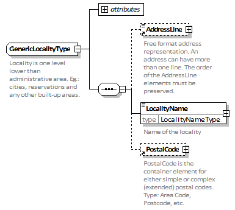

Het nieuwe globale element Country werd gedefinieerd. Hiervan is het type een nieuw complex type CountryType, dat een restrictie is van vorig aanwezig lokale definitie van het Country element in het globale AddressDetails element.

Alleen child elementen CountryNameCode en Locality zijn toegestaan, en moeten precies één keer voorkomen.

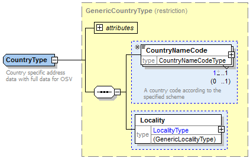

Het complexe type CountryType maakt nu deel van een hoger type hiërarchie met, GenericCountryType als basis. Om het complexe type GenericCountryType, hebben de child elementen Locality het complexe type GenericLocalityType als basis type. Het complexe type CountryType is een restrictie van het complexe type GenericCountryType, met child element Locality beperkt tot LocalityType. De andere restrictie van het complexe type GenericCountryType is het complexe type MinimalCountryType, met child element Locality beperkt tot MinimalLocalityType.

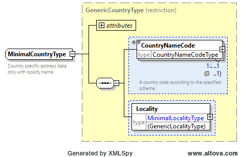

Bovendien zijn verschillende groepen met een keuze tussen elementen Locality en Country gedefinieerd. De reden om hier deze groepen te definiëren, is de mogelijkheid om correct xal:AddressDetails te beperken in schema’s met andere doelnaamgebieden. Alhoewel het niet expliciet kan worden uitgedrukt in XML schema, definiëren de groepen een hiërarchie van keuzes, waar de keuzes in groepen AddressGroup en MinimalAddressGroup wettelijke restricties voorstellen van de keuze in de GenericAddressGroup. Elke groep definieert Locality en een Country als een lokaal element met een eigen complex type. In GenericAddressGroup, zijn deze GenericLocalityType en GenericCountryType. In AddressGroup, zijn deze LocalityType en CountryType. In MinimalAddressGroup, zijn deze MinimalLocalityType en MinimalCountryType.

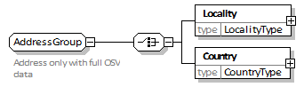

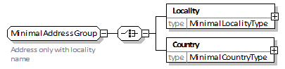

## xNL-kiesraad-strict.xsd als vervanging voor external/xNL.xsd

Wijzigingen werden aangebracht na het kopiëren van het originele bestand, en alleen de wijzigingen die niet mogelijk waren door de nieuwe bestanden hieronder te gebruiken.

Complex type PersonName is beperkt tot de Nederlandse situatie. Alleen child elementen NameLine, FirstName, NamePrefix en LastName zijn toegestaan. Child elementen NameLine en LastName zijn verplicht en moeten precies een keer voorkomen.

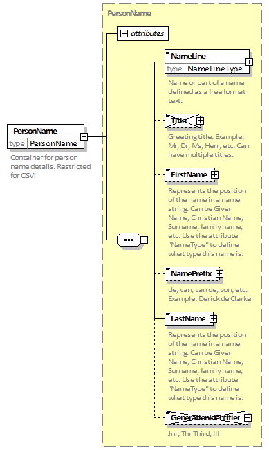

Complex type NameLineType, welke gebruikt wordt voor element NameLine, was beperkt tot de Nederlandse situatie. Het attribuut hiervan NameType werd verplicht gemaakt en ingesteld op de vaste waarde "Initials".

Element PersonName werd vereenvoudigd tot het basis type PersonName. Naamloze extensies binnen de elementdefinitie werden verwijderd zodat de huidige definitie effectief een restrictie is van de oorspronkelijke definitie.

# Toevoegingen ten opzichte van EML 5.0

## kiesraad-eml-extensions.xsd

Dit bestand definieert nieuwe elementen die informatie verschaffen en welke niet worden gedekt door standaard EML tags. Deze elementen worden in de andere schema definities geïmporteerd onder de kr namespace.

Element Schema is een leeg element met één verlicht attribuut Version welke het versienummer van gebruikte EML\_NL standaard bevat (bijvoorbeeld 1.3).

Voor toepassing in het element ElectionIdentifier, worden elementen ElectionSubcategory, ElectionDomain, ElectionDate, en NominationDate gebruikt. Voor toepassing in het element ManagingAuthority, wordt het nieuwe element CreatedByAuthority gebruikt. Voor toepassing in het element Affiliation wordt het nieuwe element ListData gebruikt.

Element ElectionSubcategory definieert een subcategorie naar de ElectionCategory: PS1 (een kieskring), PS2 (meer dan een kieskring), GR1 en AB1 (minder dan 19 zetels), GR2 en AB2 (19 of meer zetels), KCCN (Kiescollege Caribisch Nederland), KCNI (Kiescollege niet ingezetenen).

Element ElectionDomain is de (top niveau) regio waar de verkiezing plaats vindt. Het element is alleen nodig wanneer ElectionDomain deel uitmaakt van de verkiezingsnaam, bijvoorbeeld gemeenteraadsverkiezingen of Provinciale Statenverkiezingen. Dit is niet nodig voor bijvoorbeeld Tweede Kamerverkiezingen of Europese Parlementsverkiezingen.

Element ElectionDate is de datum van de verkiezing.

Element NominationDate is de datum van indiening van de kandidatenlijst bij het centraal stembureau.

Element CreationDateTime is de datum en tijd waarop de EML gegenereerd is.

Element CreatedByAuthority duidt een procedure aan die een dataset aangemaakt heeft voor een andere procedure. Het zou alleen gebruikt moeten worden indien de beherende autoriteit (die het aanmaakt) verschillend is van de verantwoordelijke autoriteit.

Element ReportingUnitInvestigations bevat informatie over of een bepaalde ReportingUnit onderzoek heeft gedaan naar de uitslag vanwege bijvoorbeeld een onverklaard verschil of een andere fout. Het bevat de combinaties aan ‘vinkjes’ zoals deze op de modellen voor decentrale- en centrale stemopneming staan. Dit element is alleen bedoeld voor gebruik in EML 510b en gaat dus over stembureaus.

Element ListData definieert verschillende additionele gegevens die de kandidaatlijsten nodig hebben. De gegevens zijn opgeslagen in attributen van dit element. Het attribuut PublishGender slaat een boolean op indien de geslachtsaanduiding gepubliceerd of ingesloten moet worden in (officiële) uitslagen EML bestanden. De volgende drie attributen zijn optioneel. Deze worden alleen gebruikt als de informatie op de specifieke lijst van toepassing is. Het attribuut PublicationLanguage geeft aan in welke taal de kandidatenlijst gepubliceerd wordt (geldige waarden zijn nl en fy), dit is van belang om de afkorting voor het geslacht correct op de kandidatenlijsten te weergeven. De attributen BelongsToSet en BelongsToCombination slaat het aantal lijstenstellen op waaraan de lijst behoort. Het attribuut zou alleen gebruikt moeten worden in EML 230b en c indien de gebruiker definieert dat de lijst aan een lijstencombinatie toebehoord.

Daarnaast bevat element ListData ook het element Contests, wat uit één of meer elementen Contest bestaat. Dit element bevat de Ids van de Contest waarvoor deze lijst ingeleverd wordt.

Er zijn ook zes simpele data type gedefinieerd die meerdere keren worden hergebruikt in de beperkte schema’s van EML\_NL. Deze zijn XSBType, ElectionCategoryType, ElectionIdType, CandidateIdType, AffiliationType, AffiliationIdType en ContestIdType.

Simple type XSBType definieert de toegestane waarden voor de autoriteit Id (CSB, HSB, empty string (wat GSB betekent), of SB, gevolgd door een nummer).

Simple type ElectionCategoryType definieert de toegestane waarden voor de verkiezingscategorie (verkiezingstype afkorting).

Simple type ElectionIdType definieert de toegestane waarden voor de verkiezing Id. Het bestaat uit de verkiezingscategorie en het verkiezingsjaar.

Simple type CandidateIdType definieert de toegestane waarden voor de kandidaat Id. Het is gedefinieerd als een positief decimaal nummer.

Simple type AffiliationType definieert de toegestane waarden voor het affiliation type. Dat zijn voornamelijk de drie mogelijke samenstellingen voor de lijst van een groepering.

Simple type AffiliationIdType definieert de toegestane waarden voor de affiliation ld. Het is gedefinieerd als een positief decimaal nummer.

Simple type ContestIdType definieert de toegestane waarden voor de context identifier Id. Dit kan een positief decimaal nummer zijn, een Romeins cijfer, of "geen", of "alle".

Daarnaast duidt het *element* ReportingUnitType, bedoeld voor gebruik in de EML 510b, het type reportingunit (= stembureau) aan. Dit is ofwel FixedLocation voor een standard stembureau welke in een stemlokaal gevestigd is, Mobile voor een mobiel stembureau welke meerdere locaties kan hebben en Special voor bijzondere stembureaus welke eventueel aangepaste openingstijden hebben.

Element SharedLocation, bedoeld voor gebruik in de EML 510b, geeft aan of een reporting unit een locatie deelt met andere reporting units. In deze gevallen kan het stembureau bijvoorbeeld anders behandeld worden in controles die door het Centraal Stembureau uitgevoerd worden. De waarde is ofwel true ofwel false.

Element CountingMethod, bedoeld voor gebruik in de EML 510b, geeft aan op welke manier de stemmen geteld zijn. Sinds de Nieuwe Procedure Vaststelling Verkiezingsuitslagen is het namelijk mogelijk om de stemmen centraal te tellen. Dit element is leeg, maar heeft een verplicht attribuut MethodCode met ofwel de waarde “centrale stemopneming” ofwel “decentrale stemopneming”.

Element Phase, bedoeld voor gebruik in de EML 510a, 510b en EML 510c, geeft aan op welke ‘fase’ van het telproces het EML bestand betrekking heeft. Sinds de NPVV kan een SB, GSB of een HSB namelijk ook een corrigendum opstellen met daarin gewijzigde aantallen. Dit element geeft via een verplicht attribuut PhaseCode aan of het EML bericht behoort tot de “eerste zitting” of tot een “corrigendum”.

Complex type UncountedVotesType wordt gebruikt als restrictie op het element uit EML 5.0. Het element UncountedVotes met dit type wordt gebruikt in EML 510a, 510b, 510c en 510d om extra gegevens op te nemen die inzicht geven in eventuele telverschillen en het aantal volmachtstemmen. Het type uit EML 5.0 heeft een verplichte ReasonCode, dit type beperkt deze ReasonCode tot de volgende geldige waarden: "geldige stempassen", "geldige volmachtbewijzen", "geldige kiezerspassen", "toegelaten kiezers", "meer getelde stembiljetten", "minder getelde stembiljetten", "meegenomen stembiljetten", "te weinig uitgereikte stembiljetten", "te veel uitgereikte stembiljetten", "geen briefstembiljetten", "te veel briefstembiljetten", "kwijtgeraakte stembiljetten", "geen verklaring" en "andere verklaring".

Complex type RejectedVotesType wordt gebruikt als restirctie op het element RejectedVotes uit EML 5.0. Het element RejectedVotes met dit type wordt gebruikt in EML 510a, 510b, 510c en 510d om bij te houden hoeveel blanco en ongeldige stemmen er op dat niveau uitgebracht zijn. Het attribuut ReasonCode is hiervoor beperkt tot geldige waarden “blanco” en “ongeldig”.

De elementen InitialValidVotes, InitialCast, InitialTotalCounted, InitialRejectedVotes en InitialUncountedVotes zijn elementen die optioneel in een 510a, 510b of 510c voor kunnen komen in het geval dat element Phase Phasecode=”corrigendum” heeft. De bedoeling van deze elementen is om het initiële aantal (dus het aantal zoals vastgesteld in de eerste zitting) vast te leggen zodat deze vergeleken kan worden met het gecorrigeerde aantal (hetzelfde element maar dan zonder prefix ‘Initial’). Dit element komt alleen voor indien het aantal in het corrigendum aangepast is. Als de waarde in het corrigendum niet aangepast is, komt het element dus ook niet voor.

Tevens zijn de elementen NumberOfSeats, PreferenceThreshold, RegisteredParties, ElectionTree, Region, RegionName, en Committee gedefinieerd en de simple types RegionCategoryType en CommitteeCategoryType.

Het element NumberOfSeats definieert het aantal te verdelen zetels bij de te houden verkiezingen.

Het element PreferenceThreshold geeft de voorkeurdrempel aan in procenten van de kiesdeler.

Het element RegisteredParties bestaat uit een lijst van RegisteredParty elementen. Het Element RegisteredParty definieert de naam van een partij volgens de Kieswet “Hoofdstuk G. De registratie van de aanduiding van een politieke groepering”, in zoverre deze bij het aanmaken van het EML-110a bestand bekend is.

Het complexe element ElectionTree beschrijft de gebiedsstructuur bij de verkiezingen. De daarin opgenomen Region elementen definieren gebieden zoals provincies en gemeenten. Een gebied kan Committee elementen bevatten, deze definieren welke stembureaus (bijvoorbeeld CSB of HSB) zich in het gebied bevinden.

Element RegionName definieert de naam van een Region.

Simple type RegionCategoryType definieert de verschillende gebiedstypen binnen de gebieden, Bijv.. PROVINCIE, KIESKRING, GEMEENTE, DEELGEMEENTE, STEMBUREAU of KIESCOLLEGE.

Simple type CommitteeCategoryType definieert de verschillende stembureautypen: CSB, HSB, PSB en PROV\_SB. PROV\_SB geeft hierbij het provinciale stembureau aan bij EK.

Het element DateOfBirthAnnex definieert de geboortedatum, ook als deze slechts deels bekend is, bijv. “XX-05-1976”.

Het element GenderAnnex is een vervangend element voor het core EML Gender element. Aangezien Gender in alle specifieke EML schemas een optioneel veld is, is de waarde ‘unknown’ niet nodig. In plaats daarvan bevat dit element de optie ‘other’ welke bij een wijziging in het kiesbesluit als indicatie voor het geslacht \<\<x\>\> gebruikt zou kunnen worden\[1\].

Het element NationalIdentificationNumber voegt de mogelijkheid toe om het BSN-nummer van een kandidaat te registreren in de EML-210. In het modelformulier H9 (de instemmingsverklaring) wordt bij de kandidaatgegevens dit nummer opgenomen. Dit nummer dient ter ondersteuning van de controle van de kandidaatsgegevens door het centraal stembureau.

Simple type LivingAddressType en element LivingAddress beschrijven het woonadres (alleen woonplaats en optioneel de landcode) voor kandidaten en kandidaatsgemachtigden.

## kiesraad-eml-sb-extensions.xsd

Dit bestand definieert nieuwe elementen die informatie over stembureaus verschaffen en welke niet worden gedekt door standaard EML tags. Deze elementen worden in de andere schema definities geïmporteerd onder de sb namespace.

Deze elementen worden gebruikt om de EML 110b flink uit te breiden met informatie over stembureaus. Hiervoor is [de open data standaard stembureaus van waarismijnstemlokaal.nl](https://waarismijnstemlokaal.nl/files/Stembureaus%20Open%20Data%20Standaard%201.6%20-%20Europese%20Parlementsverkiezingen%202024%20voorbeeld.ods), specifiek verise 1.6, vertaald naar XSD schema definities die in de EML\_NL standaard gebruikt kunnen worden. Dit maakt het mogelijk voor software die deze extra stembureauinformatie verzamelt mogelijk deze ook weg te schrijven in de EML 110b.

Simple type BuildingUsageType definieert een gebruiksdoel van een pand zoals gedinieerd in de BAG\[2\] en staat de volgende waarden toe: “Wonen”, “Bijeenkomst”, “Winkel”, “Gezondheidszorg”, “Kantoor”, “Logies”, “Industrie”, “Onderwijs”, “Sport”, “Overig” of “Cel”.

Simple type Coordinate definieert het type dat gebruikt wordt om de latitude en longitude van de locatie van een stembureau te registreren. Het bestaat uit twee getallen, gevolgd door een punt (“.”) en dan vier of meer getallen om de locatie met voldoende precisie vast te leggen. Voorbeelden van geldige waarden zijn “1.1234”, “52.546493” en “12.123456789”.

Simple type RDCoordinate definieert het type dat gebruikt wordt om de locatie van een stembureau te registreren met Rijksdriehoekscoördinaten. Het bestaat uit een tot zes getallen, optioneel gevolgd door een punt (“.”) met daarachter 1 of meer getallen. De zes worden voor de EML\_NL standaard als voldoende precies gezien, aangezien Rijksdriehoekscoördinaten in meters uitgedrukt worden. Meer precieze coordinaten vastleggen is wel toegestaan.

Simple type WebsiteType definieert een website, beginnend met http, eventueel een s, :// en dan een of meer karakters. Er wordt geen volledige URL-verificatie uitgevoerd.

Element Location bevat alle informatie gerelateerd aan de locatie van een stembureau. Zie het onderstaande diagram voor de samenstelling.

Element BAGId is de identifier van de [BAG nummeraanduiding](https://catalogus.kadaster.nl/bag/nl/page/Nummeraanduiding), vindbaar door bijvoorbeeld het adres van het stembureau op <https://bagviewer.kadaster.nl/> in te voeren en links onder het kopje 'Nummeraanduiding' te kijken bij ‘Identificatienummer’. Deze BAGId bestaat uit zestien getallen.

Element StreetName definieert de straatnaam waar het stembureau zich bevindt.

Element Number definieert het huisnummer van het adres waar het stembureau zich bevindt. Het type is een getal, eventuele huisletters of toevoegingen moeten in het element Letter of NumberAddition gedefinieerd worden.

Element Letter definieert een eventuele huisletter van het adres waar het stembureau zich bevindt.

Element NumberAddition definieert een eventuele huisnummertoevoeging van het adres waar het stembureau zich bevindt.

Element PostalCode definieert een postcode in het Nederlandse adressensysteem en bestaat uit vier getallen gevolgd door een spatie en dan twee hoofdletters. Er is gekozen om dit element onder de sb namespace te herdefiniëren en *niet* die uit xAL te gebruiken om externe afhankelijkheden te voorkomen en alles onder de sb namespace te laten vallen.

Element City definieert de plaats waarin het stembureau zich bevindt.

Element AdditionalAddressInformation definieert eventuele extra informatie over de locatie van het stembureau, bijvoorbeeld 'Ingang aan achterkant gebouw' of 'Mobiel stembureau op het midden van het plein'.

Element BuildingUsage definieert het gebruiksdoel van het gebouw waar het stembureau huist volgens de BAG. Zie ook het type BuildingUsageType.

Element DistictName definieert de naam van de wijk waarin het stembureau zich bevindt. Een wijk bestaat uit één of meer buurten.

Element DistrictCode definieert de CBS-codering\[3\] van de wijk waarin het stembureau zich bevindt. Deze wijkcode begint met de letters ‘WK’ gevolgd door zes karakters: vier voor de gemeentecode en twee voor de wijkcode.

Element NeighbourhoodName definieert de naam van de buurt waarin het stembureau zich bevindt.

Element NeighbourhoodCode definieert de CBS-codering van de buurt waarin het stembureau zich bevindt. Deze buurtcode begint met de letters ‘BU’ gevolgd door acht karakters: vier voor de gemeentecode, twee voor de wijkcode en twee voor de buurtcode.

Element Website definieert de website van de locatie waar het stembureau zich bevindt.

Elementen OpenTime en ClosingTime definiëren de openingstijd en sluitingstijd van het stembureau op deze locatie in xs:dateTime formaat (CCYY-MM-DDThh:mm:ss.sssZ waar CCYY het jaar is, MM de maand, DD de dag, hh het uur, mm de minuut en ss de seconden met optionele fracties. Daarnaast kan optioneel Z gedefinieerd worden als UTC of een offset van UTC). Deze elementen moeten als paar voorkomen.

Elementen RDx en RDy definiëren de locatie van het stembureau als paar coordinaten in het Rijksdriehoeksstelsel. Deze elementen moeten als paar voorkomen.

Elementen Latitude en Logitude definiëren de locatie van het stembureau als paar coordinaten (EPSG:4326). Deze elementen moeten als paar voorkomen.

Element CountingLocation is een boolean die aangeeft of deze locatie ook een locatie is waar de stemmen worden geteld.

Element Accessibility bevat informatie over de toegankelijkheid van de locatie waar het stembureau gevestigd is. Het bestaat uit boolean element Accessible dat verplicht voorkomt indien het Accessibility element voorkomt dat een algemene beoordeling geeft van de toegankelijkheid van de locatie. Daarnaast bevat het optioneel het element AccessibilityProperties met meer gedetailleerde informatie over de toegankelijkheid van de locatie. Deze informatie wordt gedefinieerd in het type AccessibilityPropertiesType.

Complex type AccessibilityPropertiesType bevat de volgende elementen:

  - Boolean element AccessiblePublicTransport dat aangeeft of er een toegankelijke OV-halte in de buurt is.

  - Boolean element AccessibleToilet dat aangeeft of er een toegankelijke WC aanwezig is op de locatie.

  - Boolean element HostPresent dat aangeeft of er iemand aanwezig is die kiezers ontvangt en kan helpen.

  - Element GuideLines met als type een restrictie van een string. Geeft aan of er geleidelijnen aanwezig zijn buiten en/of binnen het stembureau voor mensen met een visuele beperking? Toegestane waarden zijn: “inside and outside”, “outside”, “inside” en “not present”.

  - Boolean element VotingTemplate dat aangeeft of er een stemmal met audio-ondersteuning (stembox/soundbox) aanwezig is voor mensen met een visuele beperking of mensen die moeite hebben met lezen\[4\].

  - Boolean element BrailleCandidateList dat aangeeft of er een kandidatenlijst in braille aanwezig is voor mensen met een visuele beperking.

  - Boolean element LargeLetteredCandidateList dat aangeeft of er een kandidatenlijst in braille aanwezig is voor mensen met een visuele beperking.

  - Element SignLanguageInterpreter met als type een restrictie van een string. Geeft aan of er een gebarentolk op locatie in het stembureau of op afstand (via videobellen) aanwezig is die de Nederlandse Gebarentaal (NGT) beheerst. Indien de gebarentolk niet de hele dag aanwezig is, vermeldt dan gedurende welke periode(n) deze precies aanwezig is met een extra Other element. Toegestane waarden zijn: “at location””, “remote” of “not present”.

  - Boolean element SignLanguagePollingStationMember dat aangeeft of er een stembureaulid aanwezig is die de Nederlandse Gebarentaal (NGT) beheerst.

  - Boolean element AcousticsForHearingImpaired dat aangeeft of de akoestiek van het stembureau geschikt is voor slechthorenden.

  - Boolean element LowStimulusEnvironment dat aangeeft of de ruimte zo is ingericht dat er weinig prikkels zijn.

  - Eventueel meerdere Other elementen van een vrij teksttype. Deze elementen kunnen toegevoegd worden om toegankelijkheidskenmerken door te geven die (nog) niet in de EML\_NL standaard gespecificeerd zijn, of om bijvoorbeeld extra informatie over reeds aanwezige toegankelijkheidskenmerken toe te voegen.

Als laatste bevat het Location element het element OtherInfo waar algemene extra informatie voor de locatie toegevoegd kan worden.

Ook worden nog twee elementen die niet locatiegebonden zijn gedefinieerd: MunicipalityContactDetails en MunicipalityElectionSite.

Element MunicipalityContactDetails bevat de afdeling of specifieke functie binnen de gemeente die zich bezighoudt met de stembureaus; bij voorkeur dus niet de naam/contactgegevens van een persoon. Dit kan een e-mailadres of telefoonnummer zijn.

Element MunicipalityElectionSite bevat het webadres van de website (type WebsiteType) van de gemeente met data of informatie over de stembureaus of verkiezingen. Dit is een algemene pagina, en is dus niet verbonden aan één specifieke locatie of stembureau.

## kiesraad-eml-restrictions.xsd

Dit bestand definieert de meest gebruikte restricties van de originele EML data types. Het definieert meerdere complexe data types die restricties zijn van corresponderende EML data types. Alle types zijn gedefinieerd binnen het EML naamgebied (in tegenstelling tot kiesraad-eml-extensions.xsd) om compatibiliteit met EML te houden.

Er is een derived simple type in dit schema NameShortCodeType, alsook achttien derived complex types: EMLstructureKR, ManagingAuthorityStructureKR, AuthorityIdentifierStructureKR, ElectionIdentifierStructureKR, ContestIdentifierStructureKR, CandidateStructureKR, CandidateIdentifierStructureKR, AddressStructureRestrictedKR, GenericQualifyingAddressStructureKR, QualifyingAddressStructureKR, MinimalQualifyingAddressStructureKR, GenericMailingAddressStructureKR, MailingAddressStructureKR, AffiliationStructureKR, AffiliationIdentifierStructureKR, ContactDetailsStructureKR, AgentStructureKR, en ReportingUnitIdentifierStructureKR.

In tegenstelling tot andere simple types, is het beperkte simple date type NameShortCodeType gedefinieerd in dit bestand en niet in kiesraad-eml-extensions.xsd omdat het een EML base type vereist, in tegenstelling tot andere die algemene schema base types vereisen. NameShortCodeType is een string met een maximum lengte van 15 tekens. Het moet beginnen met een letter. Na de letter kunnen verschillende letters volgen, vermeerder met 0 tot 7 decimale nummers indien nodig.

Het beperkte complex data type EMLstructureKR staat alleen child elements TransactionId, ManagingAuthority, IssueDate, en de drie elementen kr:Schema, kr:CreationDateTime en ds:CanonicalizationMethod toe. Laatstgenoemde drie elementen werden toegevoegd door gebruik van het "any" extensie punt. De constructie met 1 tot 3 choices is noodzakelijk om te voldoen aan de eisen van restricties in XML-schemas. Hierdoor valideren EML bestanden welke deze elementen niet bevatten ook. De formele specificatie in dit document is echter leidend. Deze drie elementen zijn:

  - kr:Schema (verplicht aanwezig, versie van EML\_NL welke gebruikt is)

  - kr:CreationDateTime (optioneel aanwezig, datetime van wanneer de EML gegenereerd is

  - ds:CanonicalizationMethod (optioneel maar canonisatie wordt toegepast voorafgaand aan de berekening van de hash code en het schrijven van het EML bestand, dus in werkelijkheid zou het altijd aanwezig moeten zijn).

Het beperkte complex data type ManagingAuthorityStructureKR staat alleen child elementen AuthorityIdentifier, AuthorityAddress, en kr:CreatedByAuthority toe. Laatstgenoemde werd toegevoegd door gebruik van het "any" extensie punt. Het is optioneel. Het child element AuthorityIdentifier gebruikt de afgeleide AutorityIdentifierStructureKR als type.

Het child element AuthorityAddress wordt eigenlijk niet gebuikt maar is verplicht in het originele type zodat het niet kan worden verwijderd.

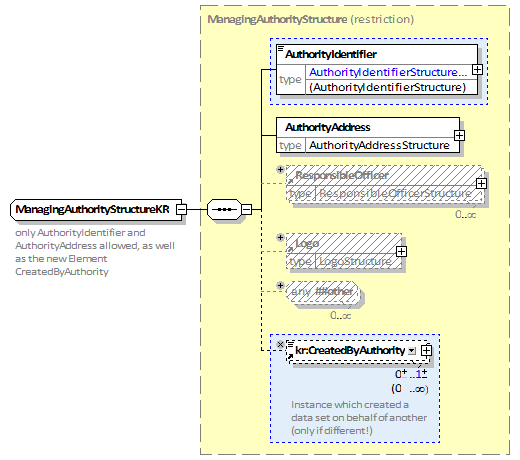

Het beperkte complex data type AuthorityIdentifierStructureKR beperkt het data type van zijn Id attribuut naar kr:XSBType.

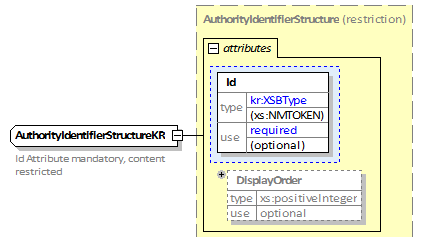

Het beperkte complex data type ElectionIdentifierStructureKR staat alleen child elementen ElectionName, ElectionCategory, kr:ElectionSubcategory, kr:ElectionDomain, kr:ElectionDate, en kr:NominationDate toe. De laatste vier elementen zijn toegevoegd met gebruik van het "any" extension point. Het child element ElectionName is optioneel.

De child elements kr:ElectionSubcategory, kr:ElectionDomain en kr:NominationDate zijn ook optioneel omdat ze niet in alle berichtformaten worden gebruikt. Het element kr:ElectionDate komt verplicht voor.

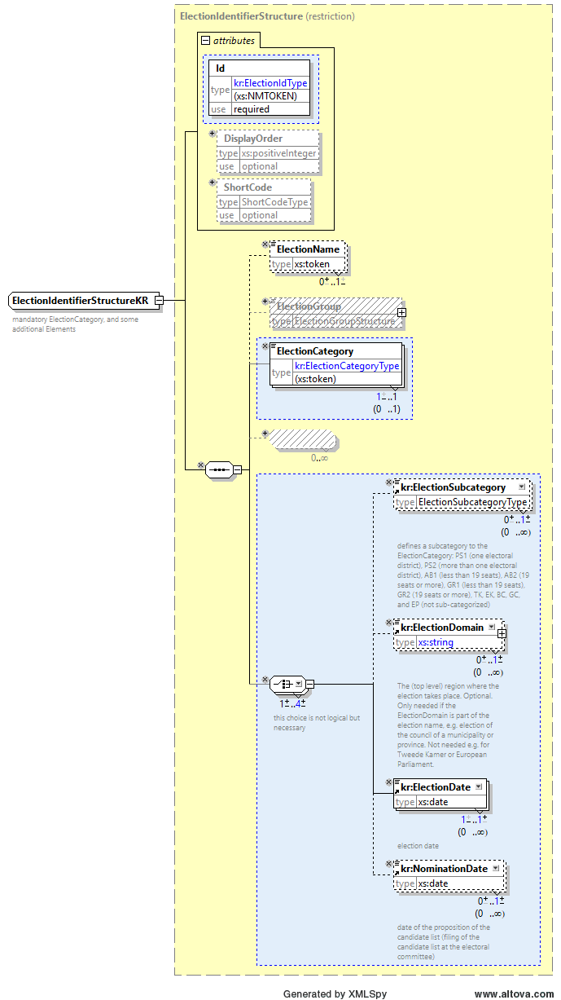

Het beperkte complex data type ContestIdentifierStructureKR maakt zijn Id attribuut verplicht en begrenst het data type van laatstgenoemde aan kr:ContestIdType.

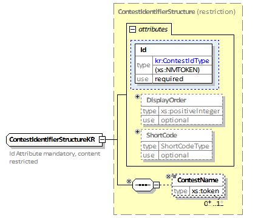

Het beperkte complex data type CandidateStructureKR herdefinieert het EML type CandidateStructure zonder erfenis door inflexibele restrictie regels. Echter, de nieuwe definitie is nog steeds een wettelijke restrictie van de oude definitie. Het staat alleen child elementen CandidateIdentifier, CandidateFullName, DateOfBirth, Gender of kr:GenderAnnex, QualifyingAddress, Contact, Agent, kr:DateOfBirthAnnex en kr:NationalIdentificationNumber toe. Het type van het child element CandidateIdentifier is beperkt tot CandidateIdentifierStructureKR. Het type van het child element QualifyingAddress is beperkt tot QualifyingAddressStructureKR. Het type van het child element Affiliation is beperkt tot AffiliationStructureKR. Het type van het child element Agent is beperkt tot AgentStructureKR.

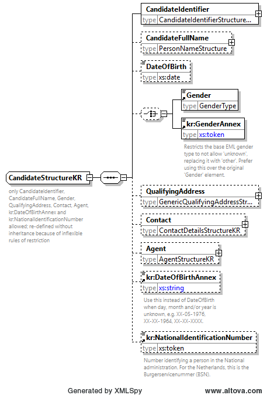

Het beperkte complex data type CandidateIdentifierStructureKR staat alleen child element ShortCode toe, en beperkt het type van de ShortCode attributen evenals het type van het child element ShortCode tot NameShortCodeType.

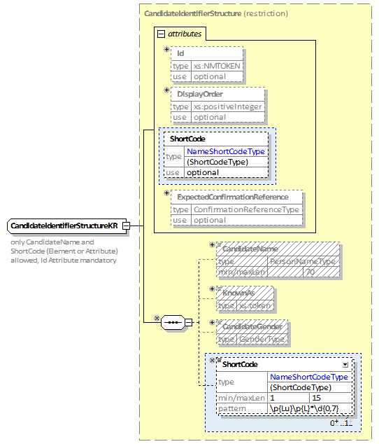

Het beperkte complex data type AddressStructureRestrictedKR is noodzakelijk doordat het schema restrictie mechanisme zelf gebreken kent. Het haalt het basis type uit elkaar naar alleen de attributen.

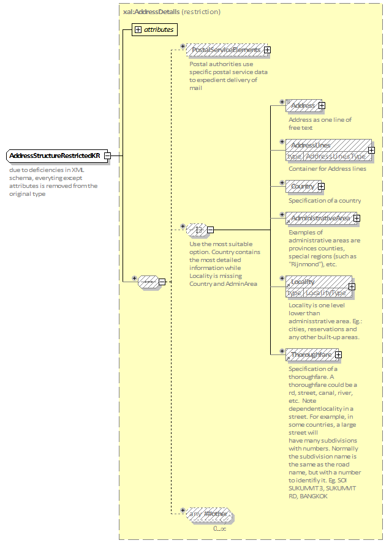

Het complexe type GenericQualifyingAddressStructureKR is een uitbreiding op het basis type AddressStructureRestrictedKR.

De uitgebreide complex data type QualifyingAddressStructureKR gebruikt het base type AddressStructureRestrictedKR om handmatig een effectieve restrictie te bepalen van de xal:AddressDetails base type.

Het staat als het child element exact één van de (eerder verwijderd) xal:Locality en xal:Country toe.

Het complexe type MinimalQualifyingAddressStructureKR is een beperking van het basis type GenericQualifyingAddressStructureKR.

Het complexe type GenericMailingAddressStructureKR is een uitbreiding van het basis type AddressStructureRestrictedKR.

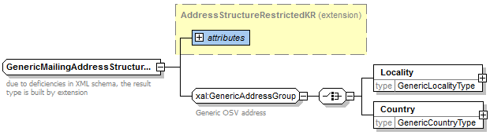

Het beperkte complex data type MailingAddressStructureKR gebruikt GenericMailingAddressStructureKR als base type. Het staat alleen een xal:GenericAddressGroup toe als child element.

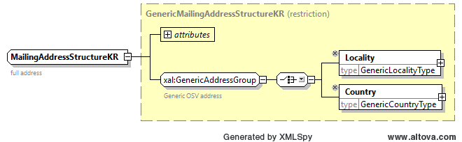

Het beperkte complex data type AffiliationStructureKR staat alleen child elements AffiliationIdentifier, Type, en de additionele kr:ListData toe (die het "any" extensie punt gebruikt). Een extra syntactische constructie was nodig om het gebruik van formulieren generator extensies intern nog mogelijk te maken. Het child element AffiliationIdentifier is beperkt tot het type AffiliationIdentifierStructureKR, het child element Type is beperkt tot the simple type kr:AffiliationType.

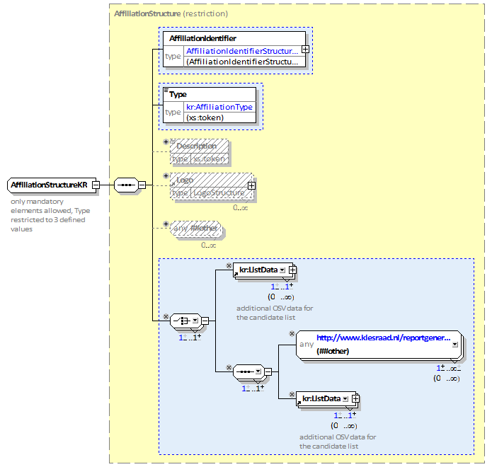

Het beperkte complex data type AffiliationIdentifierStructureKR beperkt zijn Id attribuut kr:AffiliationIdType.

Het beperkte complex data type ContactDetailsStructureKR herdefinieert door beperkingen in XML-schema het element in plaats van een beperking op ContactDetailsStructure te zijn. Echter, de nieuwe definitie is nog steeds een wettelijke restrictie van de oude definitie. Het staat alleen child element MailingAddress toe als verplicht element.

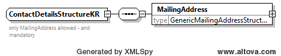

Het beperkte complex data type AgentStructureKR herdefinieert door beperkingen in XML-schema het element in plaats van een beperking op AgentStructure te zijn. Echter, de nieuwe definitie is nog steeds een wettelijke restrictie van de oude definitie. Het staat alleen child elementen AgentIdentifier, en Contact toe en voegt kr:LivingAddress toe. Contact is optioneel.

Het complexe type ReportingUnitIdentifierStructureKR is een restrictie van het basis type ReportingUnitIdentifierStructure, dat het id attribuut verplicht maakt.

# Restricties van de specifieke berichten

## 110a-electionevent-kiesraad-strict.xsd

Het beperkte complex data type EMLstructure110 gebruikt het type EMLstructureKR als base type en maakt child element kr:CreationDateTime verplicht.

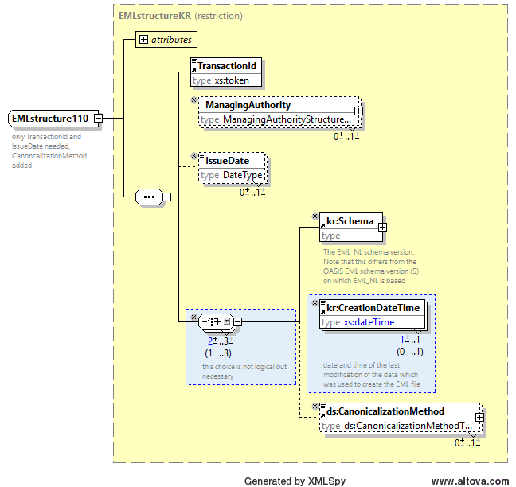

Het beperkte complex data type ElectionIdentifierStructure110a gebruikt het type ElectionIdentifierStructureKR als base type en maakt ElectionName, kr:ElectionSubcategory en kr:NominationDate verplicht.

Het beperkte complex data type ContestIdentifierStructure110a gebruikt het type ContestIdentifierStructureKR als base type. Het element ContestName is niet toegestaan.

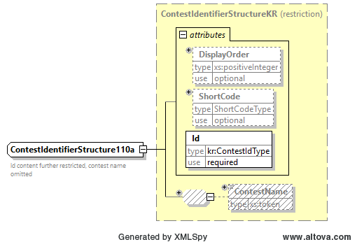

Het complex data type PollingPlaceStructure110 wordt opnieuw gedefinieerd en is in beperkte mate compatibel met het core EML element PollingPlaceStructure. Hoewel dit element in de 110a wordt gedefinieerd wordt deze feitelijk niet in de 110a gebruikt. Uitgebreidere informatie over stembureaus wordt in de 110b uitgevraagd. Het beperkt de attributes tot Channel. Daarnaast is het enige toegestane child element beperkt tot PhysicalLocation. Het Address element is beperkt tot het xal:Address type uit EML\_NL. Daarnaast is het PollingStation element toegevoegd met een verplicht Id attribuut.

Het base type van het EML (root) element is beperkt tot EMLstructure110. Daarna is het uitgebreid op dezelfde manier als in de originele EML V5.0 definitie door het child element ElectionEvent.

Het element ElectionEvent is beperkt compatibel in een aantal manieren vergeleken met het originele EML element. Het type van het child element ElectionIdentifier is beperkt tot ElectionIdentifierStructure110a. Het type van het child element ContestIdentifier is beperkt tot ContestIdentifierStructure110a. Verder zijn alleen child elementen EventIdentifier en Election toegestaan, welke beiden verplicht zijn. Andere opties zijn niet toegestaan. Het “any" extension point is verwijderd. Verder zijn enkele extra elementen onder de kr namespace toegevoegd om benodigde informatie over Nederlandse verkiezingen te kunnen registreren. Ook wordt de kr:ElectionTree in dit bestand opgenomen om de hiërarchie van de regios welke meedoen aan deze verkiezing te definiëren.

Een voorbeeld van een EML 110a voor de Europees Parlementsverkiezing wordt hieronder weergegeven:

<table>
<tbody>
<tr class="odd">
<td>
&lt;?xml version="1.0" encoding="UTF-8" standalone="yes"?&gt;

&lt;EML xmlns:xnl="urn:oasis:names:tc:ciq:xsdschema:xNL:2.0"

xmlns="urn:oasis:names:tc:evs:schema:eml"

xmlns:xal="urn:oasis:names:tc:ciq:xsdschema:xAL:2.0"

xmlns:kr="http://www.kiesraad.nl/extensions" Id="110a" SchemaVersion="5"&gt;

&lt;TransactionId&gt;1&lt;/TransactionId&gt;

&lt;IssueDate&gt;2024-04-29&lt;/IssueDate&gt;

&lt;kr:Schema Version="1.3"/&gt;

&lt;kr:CreationDateTime&gt;2024-04-29T18:13:50.148&lt;/kr:CreationDateTime&gt;

&lt;ElectionEvent&gt;

&lt;EventIdentifier/&gt;

&lt;Election&gt;

&lt;ElectionIdentifier Id="EP2024"&gt;

&lt;ElectionName&gt;Europees Parlement 2024&lt;/ElectionName&gt;

&lt;ElectionCategory&gt;EP&lt;/ElectionCategory&gt;

&lt;kr:ElectionSubcategory&gt;EP&lt;/kr:ElectionSubcategory&gt;

&lt;kr:ElectionDate&gt;2024-06-06&lt;/kr:ElectionDate&gt;

&lt;kr:NominationDate&gt;2024-04-23&lt;/kr:NominationDate&gt;

&lt;/ElectionIdentifier&gt;

&lt;Contest&gt;

&lt;ContestIdentifier Id="alle"/&gt;

&lt;VotingMethod&gt;SPV&lt;/VotingMethod&gt;

&lt;MaxVotes&gt;&lt;/MaxVotes&gt;

&lt;/Contest&gt;

&lt;kr:NumberOfSeats&gt;31&lt;/kr:NumberOfSeats&gt;

&lt;kr:PreferenceThreshold&gt;10&lt;/kr:PreferenceThreshold&gt;

&lt;kr:ElectionTree&gt;

&lt;kr:Region RegionCategory="STAAT"&gt;

&lt;kr:RegionName&gt;Nederland&lt;/kr:RegionName&gt;

&lt;kr:Committee CommitteeCategory="CSB" CommitteeName="De Kiesraad"/&gt;

&lt;kr:Committee CommitteeCategory="HSB" CommitteeName="De Kiesraad" AcceptCentralSubmissions="true"/&gt;

&lt;/kr:Region&gt;

&lt;kr:Region RegionNumber="1" RegionCategory="KIESKRING" SuperiorRegionCategory="STAAT"&gt;

&lt;kr:RegionName&gt;Groningen&lt;/kr:RegionName&gt;

&lt;/kr:Region&gt;

...

&lt;kr:Region RegionNumber="14" RegionCategory="GEMEENTE" SuperiorRegionNumber="1" SuperiorRegionCategory="KIESKRING"&gt;

&lt;kr:RegionName&gt;Groningen&lt;/kr:RegionName&gt;

&lt;/kr:Region&gt;

...

&lt;/kr:ElectionTree&gt;

&lt;kr:RegisteredParties&gt;

&lt;kr:RegisteredParty&gt;

&lt;kr:RegisteredAppellation&gt;GROENLINKS / Partij van de Arbeid (PvdA)&lt;/kr:RegisteredAppellation&gt;

&lt;/kr:RegisteredParty&gt;

...

&lt;/kr:RegisteredParties&gt;

&lt;/Election&gt;

&lt;/ElectionEvent&gt;

&lt;/EML&gt;
</td>
</tr>
</tbody>
</table>

## 110b-electionevent-kiesraad-strict.xsd

Het beperkte complex data type EMLstructure110 gebruikt het type EMLstructureKR als base type en maakt child elementen ManagingAuthority en kr:CreationDateTime verplicht. **LET OP:** hoewel dit type een naam deelt met het type uit de 110a zijn er dus wel verschillen\!

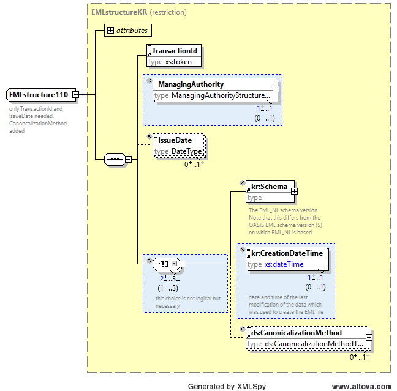

Het beperkte complex data type ElectionIdentifierStructure110 gebruikt het type ElectionIdentifierStructureKR als base type en staat het element kr:NominationDate niet toe.

Het beperkte complex data type ContestIdentifierStructure110 gebruikt het type ContestIdentifierStructureKR als base type. Het element ContestName is niet toegestaan.

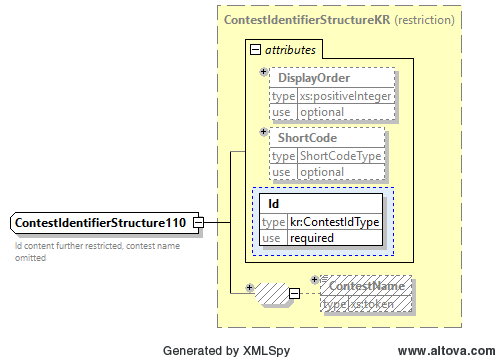

Het complex data type PollingPlaceStructure110 wordt opnieuw gedefinieerd en is in beperkte mate compatibel met het core EML element PollingPlaceStructure. Het beperkt de attributes tot Channel. Daarnaast is het enige toegestane child element beperkt tot PhysicalLocation. Het Address element is beperkt tot een lokaal type waar exact één keer een Locality voor moet komen welke beperkt is tot het type xal:LocalityType110 en optioneel een onbeperkt aantal sb:Location elementen met daarin extra informatie over het stembureau. Indien het een mobiel stembureau betreft dan kunnen er meerdere sb:Location elementen gedefinieerd worden. Daarnaast zijn de volgende elementen toegevoegd: PollingStation met een verplicht Id attribuut en de elementen kr:ReportingUnitType en kr:SharedLocation.

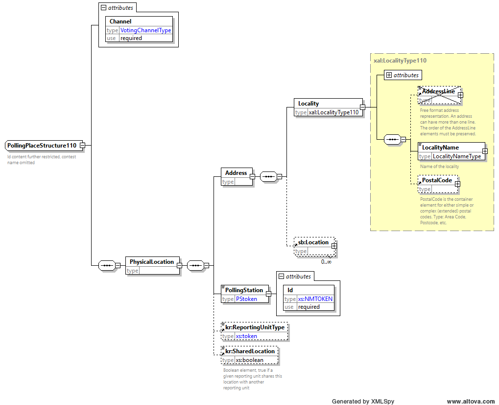

Het base type van het EML (root) element is beperkt tot EMLstructure110. Daarna is het uitgebreid op dezelfde manier als in de originele EML V5.0 definitie door het child element ElectionEvent.

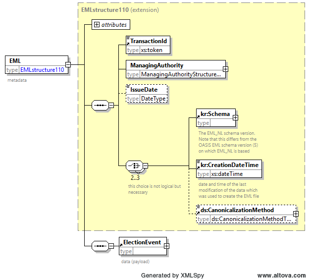

Het element ElectionEvent is beperkt compatibel in een aantal manieren vergeleken met het originele EML element. Het type van het child element ElectionIdentifier is beperkt tot ElectionIdentifierStructure110. Het type van het child element ContestIdentifier is beperkt tot ContestIdentifierStructure110. Verder zijn alleen child elementen EventIdentifier en Election toegestaan, welke beiden verplicht zijn. Er kunnen 1 of meerdere Election elementen voorkomen. Andere opties zijn niet toegestaan. Het “any" extension point is verwijderd. Onder het Contest element zijn alleen de elementen ContestIdentifier, ReportingUnit (de naam en code van de gemeente), VotingMethod (welk in de praktijk leeg gelaten wordt) en MaxVotes met het aantal kiesgerechtigden toegestaan welke verplicht zijn. Optioneel gezien kunnen de contactgegevens en de website van de gemeente toegevoegd worden met de elementen sb:MunicipalityContactDetails en sb:MunicipalityElectionSite. Als laatste komt verplicht minimaal één PollingPlace element voor, waarvan het type beperkt is tot PollingPlaceStructure110

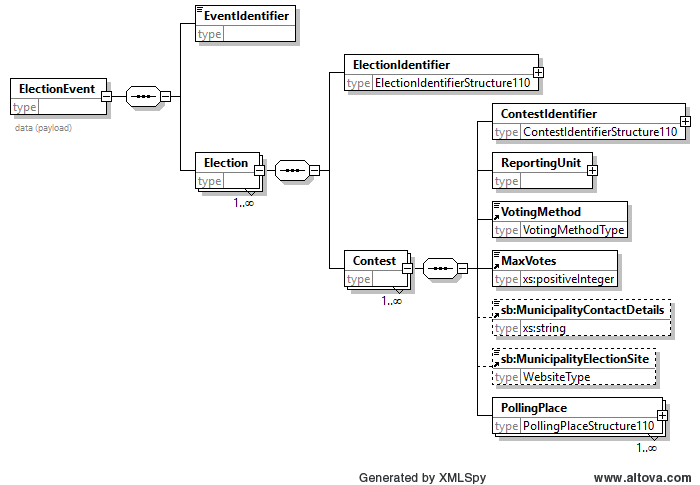

Hieronder staat een voorbeeld van een EML 110b met een mobiel stembureau dat op twee verschillende locaties gestationeerd is:

<table>
<tbody>
<tr class="odd">
<td>
&lt;?xml version="1.0" encoding="UTF-8"?&gt;

&lt;EML xmlns="urn:oasis:names:tc:evs:schema:eml"

xmlns:ds="http://www.w3.org/2000/09/xmldsig#"

xmlns:kr="http://www.kiesraad.nl/extensions"

xmlns:sb="http://www.kiesraad.nl/sb-extensions"

xmlns:xal="urn:oasis:names:tc:ciq:xsdschema:xAL:2.0"

xmlns:xsi="http://www.w3.org/2001/XMLSchema-instance" Id="110b" SchemaVersion="5"&gt;

&lt;TransactionId&gt;1&lt;/TransactionId&gt;

&lt;ManagingAuthority&gt;

&lt;AuthorityIdentifier Id="0999"&gt;Juinen&lt;/AuthorityIdentifier&gt;

&lt;AuthorityAddress/&gt;

&lt;/ManagingAuthority&gt;

&lt;kr:Schema Version="1.3"/&gt;

&lt;kr:CreationDateTime&gt;2024-05-27T17:05:57&lt;/kr:CreationDateTime&gt;

&lt;ds:CanonicalizationMethod Algorithm="http://www.w3.org/TR/2001/REC-xml-c14n-20010315#WithComments"/&gt;

&lt;ElectionEvent&gt;

&lt;EventIdentifier/&gt;

&lt;Election&gt;

&lt;ElectionIdentifier Id="EP2024"&gt;

&lt;ElectionName&gt;Europees Parlement 2024&lt;/ElectionName&gt;

&lt;ElectionCategory&gt;EP&lt;/ElectionCategory&gt;

&lt;kr:ElectionSubcategory&gt;EP&lt;/kr:ElectionSubcategory&gt;

&lt;kr:ElectionDate&gt;2024-06-06&lt;/kr:ElectionDate&gt;

&lt;/ElectionIdentifier&gt;

&lt;Contest&gt;

&lt;ContestIdentifier Id="geen"/&gt;

&lt;ReportingUnit&gt;

&lt;ReportingUnitIdentifier Id="0999"&gt;Juinen&lt;/ReportingUnitIdentifier&gt;

&lt;/ReportingUnit&gt;

&lt;VotingMethod&gt;SPV&lt;/VotingMethod&gt;

&lt;MaxVotes&gt;123456&lt;/MaxVotes&gt;

&lt;PollingPlace Channel="polling"&gt;

&lt;PhysicalLocation&gt;

&lt;Address&gt;

&lt;!-- Het oude Locality element bestaat nog steeds, en is verplicht !--&gt;

&lt;Locality&gt;

&lt;xal:LocalityName&gt;Mobiele recreatieruimte "Good Times"&lt;/xal:LocalityName&gt;

&lt;/Locality&gt;

&lt;!-- Er kunnen één of meerdere locaties waar het stembureau zich bevindt toegevoegd worden, elk met zijn eigen info --&gt;

&lt;sb:Location&gt;

&lt;sb:BAGId&gt;0518200000747446&lt;/sb:BAGId&gt;

&lt;sb:StreetName&gt;Schoolstraat&lt;/sb:StreetName&gt;

&lt;sb:Number&gt;12&lt;/sb:Number&gt;

&lt;sb:Letter&gt;B&lt;/sb:Letter&gt;

&lt;sb:NumberAddition&gt;ABCD&lt;/sb:NumberAddition&gt;

&lt;sb:PostalCode&gt;3011 AD&lt;/sb:PostalCode&gt;

&lt;sb:City&gt;'s-Gravenhage&lt;/sb:City&gt;

&lt;sb:AdditionalAddressInformation&gt;Ingang aan achterkant gebouw&lt;/sb:AdditionalAddressInformation&gt;

&lt;sb:BuildingUsage&gt;Bijeenkomst&lt;/sb:BuildingUsage&gt;

&lt;sb:Website&gt;https://good-times.nl&lt;/sb:Website&gt;

&lt;sb:OpenTime&gt;2024-06-06T07:30:00&lt;/sb:OpenTime&gt;

&lt;sb:ClosingTime&gt;2024-06-06T10:00:00&lt;/sb:ClosingTime&gt;

&lt;sb:RDx&gt;81611.123456789&lt;/sb:RDx&gt;

&lt;sb:RDy&gt;454909&lt;/sb:RDy&gt;

&lt;sb:Latitude&gt;52.0815&lt;/sb:Latitude&gt;

&lt;sb:Longitude&gt;4.32419&lt;/sb:Longitude&gt;

&lt;sb:Accessibility&gt;

&lt;sb:Accessible&gt;true&lt;/sb:Accessible&gt;

&lt;sb:AccessibilityProperties&gt;

&lt;!-- Alle in de ODS gedefinieerde waarden mogelijk + vrije mogelijkheid via 1 of meer 'Other' elementen --&gt;

&lt;sb:AccessibleToilet&gt;true&lt;/sb:AccessibleToilet&gt;

&lt;sb:SignLanguageInterpreter&gt;remote&lt;/sb:SignLanguageInterpreter&gt;

&lt;sb:Other&gt;Lokale soort 1&lt;/sb:Other&gt;

&lt;sb:Other&gt;Lokale soort 2&lt;/sb:Other&gt;

&lt;/sb:AccessibilityProperties&gt;

&lt;/sb:Accessibility&gt;

&lt;sb:OtherInfo&gt;Let op het opstapje!&lt;/sb:OtherInfo&gt;

&lt;/sb:Location&gt;

&lt;sb:Location&gt;

&lt;sb:StreetName&gt;Schoolstraat&lt;/sb:StreetName&gt;

&lt;sb:Number&gt;14&lt;/sb:Number&gt;

&lt;sb:Letter&gt;B&lt;/sb:Letter&gt;

&lt;sb:NumberAddition&gt;ABCD&lt;/sb:NumberAddition&gt;

&lt;sb:PostalCode&gt;3011 AD&lt;/sb:PostalCode&gt;

&lt;sb:City&gt;'s-Gravenhage&lt;/sb:City&gt;

&lt;sb:AdditionalAddressInformation&gt;Ingang aan achterkant gebouw&lt;/sb:AdditionalAddressInformation&gt;

&lt;sb:OpenTime&gt;2024-06-06T10:00:00&lt;/sb:OpenTime&gt;

&lt;sb:ClosingTime&gt;2024-06-06T21:00:00&lt;/sb:ClosingTime&gt;

&lt;sb:RDx&gt;81611&lt;/sb:RDx&gt;

&lt;sb:RDy&gt;454909&lt;/sb:RDy&gt;

&lt;sb:Latitude&gt;52.08119&lt;/sb:Latitude&gt;

&lt;sb:Longitude&gt;4.32419&lt;/sb:Longitude&gt;

&lt;/sb:Location&gt;

&lt;/Address&gt;

&lt;PollingStation Id="1"&gt;1234&lt;/PollingStation&gt;

&lt;kr:ReportingUnitType&gt;Mobile&lt;/kr:ReportingUnitType&gt;

&lt;kr:SharedLocation&gt;true&lt;/kr:SharedLocation&gt;

&lt;/PhysicalLocation&gt;

&lt;/PollingPlace&gt;

...

&lt;/Contest&gt;

&lt;/Election&gt;

&lt;/ElectionEvent&gt;

&lt;/EML&gt;
</td>
</tr>
</tbody>
</table>

## 210-nomination-kiesraad-strict.xsd

Het beperkte complex data type EMLstructure210 gebruikt het type EMLstructureKR als base type en maakt child elementen IssueDate en kr:CreationDateTime verplicht.

Het beperkte complex data type ElectionIdentifierStructure210 gebruikt het type ElectionIdentifierStructureKR als base type, en maakt het child element kr:NominationDate verplicht.

Het beperkte complex data type ContestIdentifierStructure210 gebruikt het type ContestIdentifierStructureKR als base type, en maakt child element ContestName verplicht.

Het beperkte complex data type CandidateStructure210 gebruikt het type CandidateStructureKR als base type, beperkt het type van het child element CandidateIdentifier tot CandidateIdentifierStructure210, en maakt de child elementen CandidateFullName, en QualifyingAddress verplicht.

Het beperkte complex data type CandidateIdentifierStructure210 gebruikt het type CandidateIdentifierStructureKR als base type, verwerpt het child element ShortCode, en maakt het ld attribuut verplicht.

Het beperkte complex data type AffiliationStructure210 gebruikt het type AffiliationStructureKR als base type, en beperkt type van het child element AffiliationIdentifier tot AffiliationIdentifierStructure210.

Het beperkte complex data type AffiliationIdentifierStructure210 gebruikt het type AffiliationIdentifierStructureKR als base type, en staat het Id attribuut niet toe.

Het beperkte complex data type ProposerStructureRestricted is benodigd als een intermediate type wegens de ontoereikendheid van het eigen schema restrictie mechanisme. Het child element Id is niet toegestaan omdat het niet kan worden gebruikt in een beperkt type wegens de naamloze originele definitie. Verder zijn child elementen Contact en JobTitle verplicht. Het element JobTitle is beperkt tot de waarden van de vier gedefineerde functies in de Nederlandse situatie.

Het uitgebreide complex data type ProposerStructureKR haalt Id en kr:LivingAddress child elementen weer terug die eerder verwijderd was. Daarnaast wordt het optionele element kr:LivingAddress toegevoegd. De herdefiniëring is effectief type compatible aan de originele EML definitie. Dit element wordt gebruikt voor de inrichting van de vervangende agenten.

Het base type van het EML (root) element is beperkt tot EMLstructure210. Daarna is het uitgebreid op dezelfde manier als in de originele EML V5.0 definitie door het child element Nomination.

Het element Nomination is beperkt compatibel in een aantal manieren vergeleken met het originele EML element. Het type van het child element ElectionIdentifier is beperkt tot ElectionIdentifierStructure210. Het type van het child element ContestIdentifier is beperkt tot ContestIdentifierStructure210. Verder zijn alleen child elementen Affiliation en Nominate toegestaan, welke beiden verplicht zijn. Andere opties zijn niet toegestaan. De “any" extension point wordt gehandhaafd.

Het type van het child element Affiliation is eerst beperkt tot AffiliationStructure210, en daarna uitgebreid op dezelfde manier as in de originele EML V5.0 definitie door een opeenvolging van Candidate elementen. Het type van het child element Candidate is beperkt tot CandidateStructure210. Het child element Nominate is zelf gebonden aan een opeenvolging van child elementen Proposer, waarvan twee gevallen verplicht zijn. De "any" extension point is verwijderd. Het type van het child element Proposer is beperkt tot ProposerStructureKR.

Hieronder staat een voorbeeld van een EML 210 voor het Europees Parlement\[5\]:

<table>
<tbody>
<tr class="odd">
<td>
&lt;EML xmlns="urn:oasis:names:tc:evs:schema:eml" xmlns:ds="http://www.w3.org/2000/09/xmldsig#" xmlns:kr="http://www.kiesraad.nl/extensions" xmlns:xal="urn:oasis:names:tc:ciq:xsdschema:xAL:2.0" xmlns:xnl="urn:oasis:names:tc:ciq:xsdschema:xNL:2.0" Id="210" SchemaVersion="5" xmlns:xsi="http://www.w3.org/2001/XMLSchema-instance"&gt;

&lt;TransactionId&gt;1&lt;/TransactionId&gt;

&lt;ManagingAuthority&gt;

&lt;AuthorityIdentifier Id="0000"/&gt;

&lt;AuthorityAddress/&gt;

&lt;kr:CreatedByAuthority Id="0000"&gt;De politieke partij&lt;/kr:CreatedByAuthority&gt;

&lt;/ManagingAuthority&gt;

&lt;IssueDate&gt;2024-02-18&lt;/IssueDate&gt;

&lt;kr:Schema Version="1.3"/&gt;

&lt;kr:CreationDateTime&gt;2024-02-18T10:24:30.735&lt;/kr:CreationDateTime&gt;

&lt;ds:CanonicalizationMethod Algorithm="http://www.w3.org/TR/2001/REC-xml-c14n-20010315#WithComments"/&gt;

&lt;Nomination&gt;

&lt;ElectionIdentifier Id="EP2024"&gt;

&lt;ElectionName&gt;Verkiezing van het Europees Parlement 2024&lt;/ElectionName&gt;

&lt;ElectionCategory&gt;EP&lt;/ElectionCategory&gt;

&lt;kr:ElectionSubcategory&gt;EP&lt;/kr:ElectionSubcategory&gt;

&lt;kr:ElectionDate&gt;2024-06-06&lt;/kr:ElectionDate&gt;

&lt;kr:NominationDate&gt;2024-04-23&lt;/kr:NominationDate&gt;

&lt;/ElectionIdentifier&gt;

&lt;ContestIdentifier Id="alle"&gt;

&lt;ContestName/&gt;

&lt;/ContestIdentifier&gt;

&lt;Affiliation&gt;

&lt;AffiliationIdentifier&gt;

&lt;RegisteredName&gt;De Partij&lt;/RegisteredName&gt;

&lt;/AffiliationIdentifier&gt;

&lt;Type&gt;op zichzelf staande lijst&lt;/Type&gt;

&lt;kr:ListData PublicationLanguage="nl" PublishGender="true"/&gt;

&lt;Candidate&gt;

&lt;CandidateIdentifier Id="1"/&gt;

&lt;CandidateFullName&gt;

&lt;xnl:PersonName&gt;

&lt;xnl:NameLine NameType="Initials"&gt;T.&lt;/xnl:NameLine&gt;

&lt;xnl:FirstName&gt;Thymen&lt;/xnl:FirstName&gt;

&lt;xnl:LastName&gt;Schrijer&lt;/xnl:LastName&gt;

&lt;/xnl:PersonName&gt;

&lt;/CandidateFullName&gt;

&lt;DateOfBirth&gt;1981-10-31&lt;/DateOfBirth&gt;

&lt;!-- Ook al is PublishGender="true", op individueel niveau mag --&gt;

&lt;!-- het geslacht weggelaten worden! --&gt;

&lt;!-- &lt;Gender&gt;male&lt;/Gender&gt; --&gt;

&lt;QualifyingAddress&gt;

&lt;xal:Locality&gt;

&lt;xal:LocalityName&gt;Veenendaal&lt;/xal:LocalityName&gt;

&lt;/xal:Locality&gt;

&lt;/QualifyingAddress&gt;

&lt;Contact&gt;

&lt;MailingAddress&gt;

&lt;xal:Locality&gt;

&lt;xal:AddressLine&gt;Zijdevlinderhoek 95&lt;/xal:AddressLine&gt;

&lt;xal:LocalityName&gt;Veenendaal&lt;/xal:LocalityName&gt;

&lt;xal:PostalCode&gt;

&lt;xal:PostalCodeNumber&gt;3905KC&lt;/xal:PostalCodeNumber&gt;

&lt;/xal:PostalCode&gt;

&lt;/xal:Locality&gt;

&lt;/MailingAddress&gt;

&lt;/Contact&gt;

&lt;kr:NationalIdentificationNumber&gt;668388212&lt;/kr:NationalIdentificationNumber&gt;

&lt;/Candidate&gt;

&lt;/Affiliation&gt;

&lt;Nominate&gt;

&lt;Proposer&gt;

&lt;Name&gt;

&lt;xnl:PersonName&gt;

&lt;xnl:NameLine NameType="Initials"&gt;I.&lt;/xnl:NameLine&gt;

&lt;xnl:FirstName&gt;Igor&lt;/xnl:FirstName&gt;

&lt;xnl:LastName&gt;Nieskens&lt;/xnl:LastName&gt;

&lt;/xnl:PersonName&gt;

&lt;/Name&gt;

&lt;Contact&gt;

&lt;MailingAddress&gt;

&lt;xal:Country&gt;

&lt;xal:CountryNameCode&gt;DE&lt;/xal:CountryNameCode&gt;

&lt;xal:Locality&gt;

&lt;xal:AddressLine&gt;Knesebeckstrasse 9&lt;/xal:AddressLine&gt;

&lt;xal:LocalityName&gt;Forst&lt;/xal:LocalityName&gt;

&lt;xal:PostalCode&gt;

&lt;xal:PostalCodeNumber&gt;03141&lt;/xal:PostalCodeNumber&gt;

&lt;/xal:PostalCode&gt;

&lt;/xal:Locality&gt;

&lt;/xal:Country&gt;

&lt;/MailingAddress&gt;

&lt;/Contact&gt;

&lt;JobTitle&gt;inleveraar&lt;/JobTitle&gt;

&lt;kr:LivingAddress&gt;

&lt;kr:LocalityName&gt;Forst&lt;/kr:LocalityName&gt;

&lt;kr:CountryNameCode&gt;DE&lt;/kr:CountryNameCode&gt;

&lt;/kr:LivingAddress&gt;

&lt;/Proposer&gt;

&lt;Proposer&gt;

&lt;Name&gt;

&lt;xnl:PersonName&gt;

&lt;xnl:NameLine NameType="Initials"&gt;G.&lt;/xnl:NameLine&gt;

&lt;xnl:FirstName&gt;Gianluca&lt;/xnl:FirstName&gt;

&lt;xnl:LastName&gt;Bogaarts&lt;/xnl:LastName&gt;

&lt;/xnl:PersonName&gt;

&lt;/Name&gt;

&lt;Contact&gt;

&lt;MailingAddress&gt;

&lt;xal:Locality&gt;

&lt;xal:AddressLine&gt;Korenbloemstraat 140&lt;/xal:AddressLine&gt;

&lt;xal:LocalityName&gt;Rheden&lt;/xal:LocalityName&gt;

&lt;xal:PostalCode&gt;

&lt;xal:PostalCodeNumber&gt;6991VP&lt;/xal:PostalCodeNumber&gt;

&lt;/xal:PostalCode&gt;

&lt;/xal:Locality&gt;

&lt;/MailingAddress&gt;

&lt;/Contact&gt;

&lt;JobTitle&gt;plaatsvervanger van de inleveraar&lt;/JobTitle&gt;

&lt;Id&gt;1&lt;/Id&gt;

&lt;kr:LivingAddress&gt;

&lt;kr:LocalityName&gt;Rheden&lt;/kr:LocalityName&gt;

&lt;/kr:LivingAddress&gt;

&lt;/Proposer&gt;

&lt;/Nominate&gt;

&lt;/Nomination&gt;

&lt;/EML&gt;
</td>
</tr>
</tbody>
</table>

## 230-candidatelist-kiesraad-strict.xsd

Het beperkte complex data type EMLstructure230 gebruikt het type EMLstructureKR als base type, en maakt child elementen ManagingAuthority, IssueDate en kr:CreationDateTime verplicht.

Het beperkte complex data type ElectionIdentifierStructure230 gebruikt het type ElectionIdentifierStructureKR als base type, en maakt het child element kr:NominationDate verplicht.

Het base type van het EML (root) element is beperkt tot EMLstructure230. Daarna is het uitgebreid op dezelfde manier als in de originele EML V5.0 definitie door het child element CandidateList.

Het element CandidateList is beperkt compatibel in een aantal opzichten in vergelijking tot het originele EML element. Alleen child elementen ListDate en Election zijn toegestaan. Het maximale aantal kardinale getallen Election is teruggebracht naar één. De "any" extension point wordt gehandhaafd.

Het child element Election is ook beperkt compatibel. Het type van het child element ElectionIdentifier is beperkt tot ElectionIdentifierStructure230. Het ander child element is Contest. Het child element van het type ContestIdentifier is beperkt tot ContestIdentifierStructureKR. Verder is het andere toegestane child element van Contest een opeenvolging van het verplichte element Affiliation. Andere opties zijn niet toegestaan. De "any" extension point wordt behouden. Het type van het child element Affiliation is eerst beperkt tot AffiliationStructureKR, en daarna uitgebreid als op dezelfde manier als in de originele EML V5.0 definitie door een opeenvolging van Candidate elementen. Het type child element Candidate is beperkt tot CandidateStructureKR.

Een voorbeeld van EML\_NL 230b voor de Tweede Kamerverkiezingen voor een specifieke kieskring wordt hieronder getoond:

<table>
<tbody>
<tr class="odd">
<td>
&lt;?xml version="1.0" encoding="UTF-8"?&gt;

&lt;EML xmlns="urn:oasis:names:tc:evs:schema:eml"

xmlns:ds="http://www.w3.org/2000/09/xmldsig#"

xmlns:kr="http://www.kiesraad.nl/extensions"

xmlns:xal="urn:oasis:names:tc:ciq:xsdschema:xAL:2.0"

xmlns:xnl="urn:oasis:names:tc:ciq:xsdschema:xNL:2.0" Id="230b" SchemaVersion="5"&gt;

&lt;TransactionId&gt;1&lt;/TransactionId&gt;

&lt;ManagingAuthority&gt;

&lt;AuthorityIdentifier Id="CSB"&gt;De Kiesraad&lt;/AuthorityIdentifier&gt;

&lt;AuthorityAddress/&gt;

&lt;/ManagingAuthority&gt;

&lt;IssueDate&gt;2025-01-20&lt;/IssueDate&gt;

&lt;kr:Schema Version="1.3"/&gt;

&lt;kr:CreationDateTime&gt;2025-01-20T10:35:51.604&lt;/kr:CreationDateTime&gt;

&lt;ds:CanonicalizationMethod Algorithm="http://www.w3.org/TR/2001/REC-xml-c14n-20010315#WithComments"/&gt;

&lt;CandidateList&gt;

&lt;Election&gt;

&lt;ElectionIdentifier Id="TK2025"&gt;

&lt;ElectionName&gt;Tweede Kamer der Staten-Generaal 2025&lt;/ElectionName&gt;

&lt;ElectionCategory&gt;TK&lt;/ElectionCategory&gt;

&lt;kr:ElectionSubcategory&gt;TK&lt;/kr:ElectionSubcategory&gt;

&lt;kr:ElectionDate&gt;2025-02-03&lt;/kr:ElectionDate&gt;

&lt;kr:NominationDate&gt;2025-01-06&lt;/kr:NominationDate&gt;

&lt;/ElectionIdentifier&gt;

&lt;Contest&gt;

&lt;ContestIdentifier Id="14"&gt;

&lt;ContestName&gt;Dordrecht&lt;/ContestName&gt;

&lt;/ContestIdentifier&gt;

&lt;Affiliation&gt;

&lt;AffiliationIdentifier Id="1"&gt;

&lt;RegisteredName&gt;De Partij&lt;/RegisteredName&gt;

&lt;/AffiliationIdentifier&gt;

&lt;Type&gt;op zichzelf staande lijst&lt;/Type&gt;

&lt;kr:ListData PublicationLanguage="nl" PublishGender="true"/&gt;

&lt;Candidate&gt;

&lt;CandidateIdentifier Id="1"/&gt;

&lt;CandidateFullName&gt;

&lt;xnl:PersonName&gt;

&lt;xnl:NameLine NameType="Initials"&gt;H.&lt;/xnl:NameLine&gt;

&lt;xnl:FirstName&gt;Horatio&lt;/xnl:FirstName&gt;

&lt;xnl:LastName&gt;Bultenaar&lt;/xnl:LastName&gt;

&lt;/xnl:PersonName&gt;

&lt;/CandidateFullName&gt;

&lt;!-- Hier kan op dezelfde manier het geslacht weggelaten --&gt;

&lt;!-- worden zoals in de EML 210: --&gt;

&lt;!-- &lt;Gender&gt;male&lt;/Gender&gt; --&gt;

&lt;QualifyingAddress&gt;

&lt;xal:Locality&gt;

&lt;xal:LocalityName&gt;Hellevoetsluis&lt;/xal:LocalityName&gt;

&lt;/xal:Locality&gt;

&lt;/QualifyingAddress&gt;

&lt;/Candidate&gt;

...

&lt;/Affiliation&gt;

&lt;/Contest&gt;

&lt;/Election&gt;

&lt;/CandidateList&gt;

&lt;/EML&gt;
</td>
</tr>
</tbody>
</table>

##   
510-count-kiesraad-strict.xsd

Het beperkte complex data type EMLstructure510 gebruikt het type EMLstructureKR als base type, en maakt de elementen ManagingAuthority en kr:CreationDateTime verplicht. Child element IssueDate is niet toegestaan.

Het beperkte complex data type ElectionIdentifierStructure510 gebruikt het type ElectionIdentifierStructureKR als base type, en staat child element kr:NominationDate niet toe.

Het beperkte complex data type AffiliationIdentifierStructure510 gebruikt het type AffiliationIdentifierStructureKR als base type, maakt het Id attribuut verplicht, en beperkt zijn waarden tot decimale cijfers.

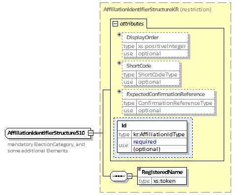

Het beperkte complex data type CandidateStructure510 gebruikt het type CandidateStructureKR als base type, beperkt het type van child element CandidateIdentifier tot CandidateIdentifierStructureKR, en laat het gebruik van child elementen DateOfBirth, Contact, Agent, en DateOfBirthAnnex niet toe. Child elementen Gender, CandidateFullName en QualifyingAddress worden optioneel toegestaan in het geval dat deze informatie benodigd is (in 510d).

Het beperkte complex data type CandidateIdentifierStructure510 gebruikt het type CandidateIdentifierStructureKR als base type, en staat het attribuut ShortCode niet toe.

Het Id attribuut is optioneel maar is feitelijk verplicht voor alle niveaus waar deze bekend zijn als kandidaatnummer van de specifieke kandidaat op de kandidatenlijsten. Voor aggregatieniveaus boven het niveau waarop kandidatenlijsten gedefinieerd zijn (dus bijvoorbeeld voor de Totaaltelling 510d bij een Tweede Kamer verkiezing) is het kandidaatnummer niet meer uniek aangezien de lijsten per kieskring kunnen verschillen. Daarom wordt in de 510d in dat geval het Id element weggelaten en wordt het ShortCode element gebruikt om de koppeling naar de kandidatenlijsten te kunnen maken.

Het beperkte complex data type ReportingUnitIdentifierStructure510 gebruikt het type ReportingUnitIdentifierStructure als base type, maakt het Id attribuut verplicht, en beperkt het type tot een hiërarchisch patroon. De hiërarchie start één niveau lager dan het niveau waar het hele EML 510 bestand aan toebehoort. Voor 510d is de hoogste reporting unit een HSB. Voor 510c, is de hoogste reporting unit de gemeente. Voor 510b is de reporting unit het stembureau. Een HSB wordt aangeduid door de identifier HSB gevolgd door zijn nummer, een gemeente alleen door een viercijferig nummer (het gemeentenummer volgens de CBS codering), een stembureau door de identifier SB gevolgd door zijn nummer. Reporting units die niet de hoogste zijn in het gegeven EML-510-bestand zijn omgeven door de codes van de unit die daaropvolgend hoger is tot aan de hoogste unit. De grens is altijd een dubbele punt (::).

Het base type van het EML (root) element is beperkt tot EMLstructure510. Het is daarna op dezelfde manier uitgebreid als de originele EML V5.0 definitie door het child element Count.

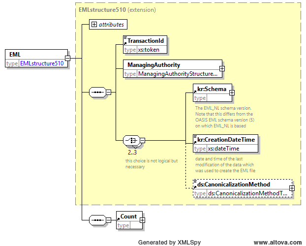

Het element Count is beperkt compatible in een aantal opzichten in vergelijking met het originele EML element. Alleen child elementen EventIdentifier en Election zijn toegestaan. Het maximale aantal kardinale getallen van een element Election is beperkt tot één. Daarnaast zijn als uitbereiding aan het originele element de optionele elementen kr:CountingMethod en kr:Phase toegevoegd. Het "any" extension point wordt gehandhaafd.

Het child element EventIdentifier wordt in werkelijkheid niet gebruikt maar mag niet worden verwijderd.

Het element Election is ook compatible beperkt. Het type van het child element ElectionIdentifier is beperkt tot ElectionIdentifierStructure510. Dit zijn wijzigingen in het descendent element Contest. Het type van het child element ContestIdentifier is beperkt tot ContestIdentifierStructureKR. Betreffende andere descendant elementen, zijn alleen verplichte elementen over, met uitzondering van de optionele opvolging van ReportingUnitVotes, welke ook is gehandhaafd.

Het element ReportingUnitVotes is uitgebreid ten opzichte van het originele EML element door toevoeging van de optionele elementen kr:ReportingUnitType, kr:SharedLocation en het element kr:ReportingUnitInvestigations.

Het type van child element ReportingUnitIdentifier is beperkt tot ReportingUnitIdentifierStructure510. De descendant VoteGroup was beperkt tot alleen de onbeperkte opvolging van het child element Selection, het child element Cast, het child element TotalCounted, en een opeenvolging van twee van de child elementen RejectedVotes, allen verplicht. Daarnaast zijn 0 tot 14 optionele elementen UncountedVotes toegevoegd. De child elementen van Selection kan één van de Candidate, AffiliationIdentifier, of ReferendumOptionIdentifier zijn, alsmede het element ValidVotes. Het type van het element Candidate is beperkt tot CandidateStructure510. Het type van het element AffiliationIdentifier is beperkt tot AffiliationIdentifierStructure510. Het element RejectedVotes kan alleen de waarden "blanco" en "ongeldig" hebben voor het attribuut ReasonCode.

Daarnaast is voor alle elementen welke een aantal beschrijven onder de kr namespace een element toegevoegd met prefix ‘Initial’. Deze elementen komen altijd voor de aantallen die voor het huidige EML bericht gelden en geven de initiële waarde van deze aantallen aan voordat er een corrigendum en dus een nieuw EML bericht is opgemaakt. Deze elementen mogen alleen voorkomen indien kr:Phase onder Count attribuut Phasecode=”corrigendum” heeft en het initiële aantal anders was dan het aantal na het corrigendum.

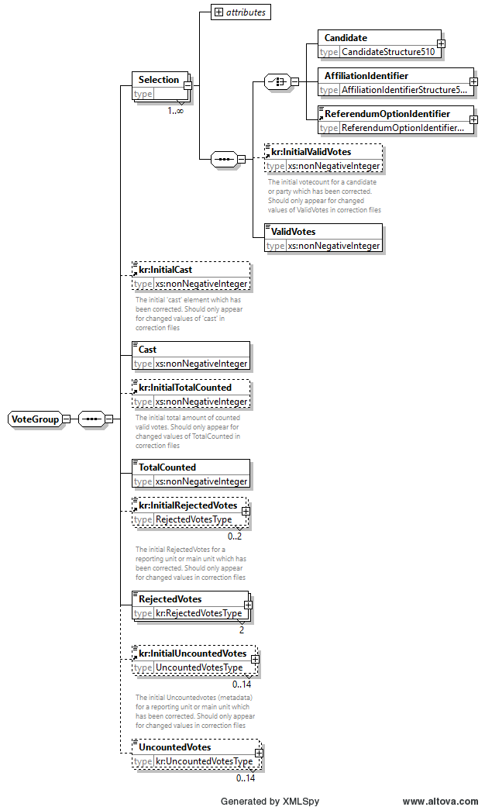

Een voorbeeld van de EML\_NL 510b voor de Tweede Kamerverkiezing is hieronder weergegeven. Het voorbeeld betreft een corrigendum met een aantal gecorrigeerde waarden

<table>
<tbody>
<tr class="odd">
<td>
&lt;EML xmlns="urn:oasis:names:tc:evs:schema:eml" xmlns:ds="http://www.w3.org/2000/09/xmldsig#" xmlns:kr="http://www.kiesraad.nl/extensions" xmlns:xal="urn:oasis:names:tc:ciq:xsdschema:xAL:2.0" xmlns:xnl="urn:oasis:names:tc:ciq:xsdschema:xNL:2.0" Id="510b" SchemaVersion="5"&gt;

&lt;TransactionId&gt;1&lt;/TransactionId&gt;

&lt;ManagingAuthority&gt;

&lt;AuthorityIdentifier Id="0312"&gt;Bunnik&lt;/AuthorityIdentifier&gt;

&lt;AuthorityAddress/&gt;

&lt;/ManagingAuthority&gt;

&lt;kr:Schema Version="1.3"/&gt;

&lt;kr:CreationDateTime&gt;2023-11-23T18:19:30.837&lt;/kr:CreationDateTime&gt;

&lt;ds:CanonicalizationMethod Algorithm="http://www.w3.org/TR/2001/REC-xml-c14n-20010315#WithComments"/&gt;

&lt;Count&gt;

&lt;kr:CountingMethod MethodCode="centrale stemopneming"/&gt;

&lt;EventIdentifier/&gt;

&lt;kr:Phase PhaseCode="corrigendum"/&gt;

&lt;Election&gt;

&lt;ElectionIdentifier Id="TK2023"&gt;

&lt;ElectionName&gt;Tweede Kamer der Staten-Generaal 2023&lt;/ElectionName&gt;

&lt;ElectionCategory&gt;TK&lt;/ElectionCategory&gt;

&lt;kr:ElectionSubcategory&gt;TK&lt;/kr:ElectionSubcategory&gt;

&lt;kr:ElectionDate&gt;2023-11-22&lt;/kr:ElectionDate&gt;

&lt;/ElectionIdentifier&gt;

&lt;Contests&gt;

&lt;Contest&gt;

&lt;ContestIdentifier Id="8"&gt;

&lt;ContestName&gt;Utrecht&lt;/ContestName&gt;

&lt;/ContestIdentifier&gt;

&lt;TotalVotes&gt;

&lt;Selection&gt;

&lt;AffiliationIdentifier Id="1"&gt;

&lt;RegisteredName&gt;De Partij&lt;/RegisteredName&gt;

&lt;/AffiliationIdentifier&gt;

&lt;kr:InitialValidVotes&gt;1887&lt;/kr:InitialValidVotes&gt;

&lt;ValidVotes&gt;1886&lt;/ValidVotes&gt;

&lt;/Selection&gt;

&lt;Selection&gt;

&lt;Candidate&gt;

&lt;CandidateIdentifier Id="1"/&gt;

&lt;/Candidate&gt;

&lt;ValidVotes&gt;1655&lt;/ValidVotes&gt;

&lt;/Selection&gt;

...

&lt;Cast&gt;12124&lt;/Cast&gt;

&lt;kr:InitialTotalCounted&gt;10704&lt;/kr:InitialTotalCounted&gt;

&lt;TotalCounted&gt;10702&lt;/TotalCounted&gt;

&lt;kr:InitialRejectedVotes ReasonCode="ongeldig"&gt;20&lt;/kr:InitialRejectedVotes&gt;

&lt;RejectedVotes ReasonCode="ongeldig"&gt;19&lt;/RejectedVotes&gt;

&lt;RejectedVotes ReasonCode="blanco"&gt;20&lt;/RejectedVotes&gt;

&lt;kr:InitialUncountedVotes ReasonCode="andere verklaring"&gt;1&lt;/kr:InitialUncountedVotes&gt;

&lt;UncountedVotes ReasonCode="geldige stempassen"&gt;9799&lt;/UncountedVotes&gt;

&lt;UncountedVotes ReasonCode="geldige volmachtbewijzen"&gt;922&lt;/UncountedVotes&gt;

&lt;UncountedVotes ReasonCode="geldige kiezerspassen"&gt;24&lt;/UncountedVotes&gt;

&lt;UncountedVotes ReasonCode="toegelaten kiezers"&gt;10745&lt;/UncountedVotes&gt;

&lt;UncountedVotes ReasonCode="meer getelde stembiljetten"&gt;0&lt;/UncountedVotes&gt;

&lt;UncountedVotes ReasonCode="minder getelde stembiljetten"&gt;3&lt;/UncountedVotes&gt;

&lt;UncountedVotes ReasonCode="meegenomen stembiljetten"&gt;0&lt;/UncountedVotes&gt;

&lt;UncountedVotes ReasonCode="te weinig uitgereikte stembiljetten"&gt;0&lt;/UncountedVotes&gt;

&lt;UncountedVotes ReasonCode="te veel uitgereikte stembiljetten"&gt;0&lt;/UncountedVotes&gt;

&lt;UncountedVotes ReasonCode="geen verklaring"&gt;3&lt;/UncountedVotes&gt;

&lt;UncountedVotes ReasonCode="andere verklaring"&gt;0&lt;/UncountedVotes&gt;

&lt;/TotalVotes&gt;

&lt;ReportingUnitVotes&gt;

&lt;ReportingUnitIdentifier Id="0312::SB4"&gt;Stembureau Prikkebeen (postcode: 3981 WC)&lt;/ReportingUnitIdentifier&gt;

&lt;Selection&gt;

&lt;AffiliationIdentifier Id="1"&gt;

&lt;RegisteredName&gt;De partij&lt;/RegisteredName&gt;

&lt;/AffiliationIdentifier&gt;

&lt;ValidVotes&gt;131&lt;/ValidVotes&gt;

&lt;/Selection&gt;

&lt;Selection&gt;

&lt;Candidate&gt;

&lt;CandidateIdentifier Id="1"/&gt;

&lt;/Candidate&gt;

&lt;ValidVotes&gt;113&lt;/ValidVotes&gt;

&lt;/Selection&gt;

...

&lt;Cast&gt;967&lt;/Cast&gt;

&lt;TotalCounted&gt;692&lt;/TotalCounted&gt;

&lt;RejectedVotes ReasonCode="ongeldig"&gt;3&lt;/RejectedVotes&gt;

&lt;RejectedVotes ReasonCode="blanco"&gt;0&lt;/RejectedVotes&gt;

&lt;UncountedVotes ReasonCode="geldige stempassen"&gt;650&lt;/UncountedVotes&gt;

&lt;UncountedVotes ReasonCode="geldige volmachtbewijzen"&gt;41&lt;/UncountedVotes&gt;

&lt;UncountedVotes ReasonCode="geldige kiezerspassen"&gt;4&lt;/UncountedVotes&gt;

&lt;UncountedVotes ReasonCode="toegelaten kiezers"&gt;695&lt;/UncountedVotes&gt;

&lt;UncountedVotes ReasonCode="meer getelde stembiljetten"&gt;0&lt;/UncountedVotes&gt;

&lt;UncountedVotes ReasonCode="minder getelde stembiljetten"&gt;0&lt;/UncountedVotes&gt;

&lt;UncountedVotes ReasonCode="meegenomen stembiljetten"&gt;0&lt;/UncountedVotes&gt;

&lt;UncountedVotes ReasonCode="te weinig uitgereikte stembiljetten"&gt;0&lt;/UncountedVotes&gt;

&lt;UncountedVotes ReasonCode="te veel uitgereikte stembiljetten"&gt;0&lt;/UncountedVotes&gt;

&lt;UncountedVotes ReasonCode="geen verklaring"&gt;0&lt;/UncountedVotes&gt;

&lt;UncountedVotes ReasonCode="andere verklaring"&gt;0&lt;/UncountedVotes&gt;

&lt;/ReportingUnitVotes&gt;

&lt;/Contest&gt;

&lt;/Contests&gt;

&lt;/Election&gt;

&lt;/Count&gt;

&lt;/EML&gt;
</td>
</tr>
</tbody>
</table>

Aangezien de 510d een aggregatie tot een niveau *boven* de kieskringen kan zijn, is het soms nodig om shortcodes te gebruiken om de kandidaten te identificeren. Dit aangezien het kandidaatnummer in de verschillende kieskringen die geaggregeerd zijn kan verschillen:

<table>
<tbody>
<tr class="odd">
<td>
&lt;EML xmlns="urn:oasis:names:tc:evs:schema:eml" xmlns:ds="http://www.w3.org/2000/09/xmldsig#" xmlns:kr="http://www.kiesraad.nl/extensions" xmlns:xal="urn:oasis:names:tc:ciq:xsdschema:xAL:2.0" xmlns:xnl="urn:oasis:names:tc:ciq:xsdschema:xNL:2.0" Id="510d" SchemaVersion="5"&gt;

&lt;TransactionId&gt;1&lt;/TransactionId&gt;

&lt;ManagingAuthority&gt;

&lt;AuthorityIdentifier Id="CSB"&gt;De Kiesraad&lt;/AuthorityIdentifier&gt;

&lt;AuthorityAddress/&gt;

&lt;/ManagingAuthority&gt;

&lt;kr:Schema Version="1.3"/&gt;

&lt;kr:CreationDateTime&gt;2023-12-03T14:20:55.204&lt;/kr:CreationDateTime&gt;

&lt;ds:CanonicalizationMethod Algorithm="http://www.w3.org/TR/2001/REC-xml-c14n-20010315#WithComments"/&gt;

&lt;Count&gt;

&lt;EventIdentifier/&gt;

&lt;Election&gt;

&lt;ElectionIdentifier Id="TK2023"&gt;

&lt;ElectionName&gt;Tweede Kamer der Staten-Generaal 2023&lt;/ElectionName&gt;

&lt;ElectionCategory&gt;TK&lt;/ElectionCategory&gt;

&lt;kr:ElectionSubcategory&gt;TK&lt;/kr:ElectionSubcategory&gt;

&lt;kr:ElectionDate&gt;2023-11-22&lt;/kr:ElectionDate&gt;

&lt;/ElectionIdentifier&gt;

&lt;Contests&gt;

&lt;Contest&gt;

&lt;ContestIdentifier Id="alle"/&gt;

&lt;TotalVotes&gt;

&lt;Selection&gt;

&lt;AffiliationIdentifier Id="1"&gt;

&lt;RegisteredName&gt;De Partij&lt;/RegisteredName&gt;

&lt;/AffiliationIdentifier&gt;

&lt;ValidVotes&gt;12345678&lt;/ValidVotes&gt;

&lt;/Selection&gt;

&lt;Selection&gt;

&lt;Candidate&gt;

&lt;CandidateIdentifier ShortCode="BakkerA"/&gt;

&lt;/Candidate&gt;

&lt;ValidVotes&gt;1234&lt;/ValidVotes&gt;

&lt;/Selection&gt;

...

&lt;/TotalVotes&gt;

&lt;ReportingUnitVotes&gt;

&lt;ReportingUnitIdentifier Id="HSB1"&gt;Kieskring Groningen&lt;/ReportingUnitIdentifier&gt;

&lt;Selection&gt;

&lt;AffiliationIdentifier Id="1"&gt;

&lt;RegisteredName&gt;De Partij&lt;/RegisteredName&gt;

&lt;/AffiliationIdentifier&gt;

&lt;ValidVotes&gt;1234&lt;/ValidVotes&gt;

&lt;/Selection&gt;

&lt;Selection&gt;

&lt;Candidate&gt;

&lt;CandidateIdentifier Id="1" ShortCode="BakkerA"/&gt;

&lt;/Candidate&gt;

&lt;ValidVotes&gt;12&lt;/ValidVotes&gt;

&lt;/Selection&gt;

...

&lt;/ReportingUnitVotes&gt;

&lt;/Contest&gt;

&lt;/Contests&gt;

&lt;/Election&gt;

&lt;/Count&gt;

&lt;/EML&gt;
</td>
</tr>
</tbody>
</table>

## 520-result-kiesraad-strict.xsd

Het beperkte complex data type EMLstructure520 gebruikt het type EMLstructureKR als base type, en maakt child elementen ManagingAuthority en kr:CreationDateTime verplicht. Het child element IssueDate is niet toegestaan.

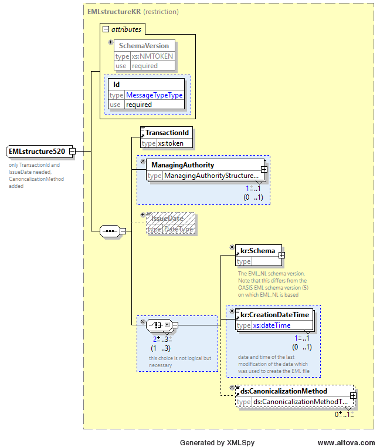

Het beperkte complex data type ElectionIdentifierStructure520 gebruikt het type ElectionIdentifierStructureKR als base type en staat het child element kr:NominationDate niet toe.

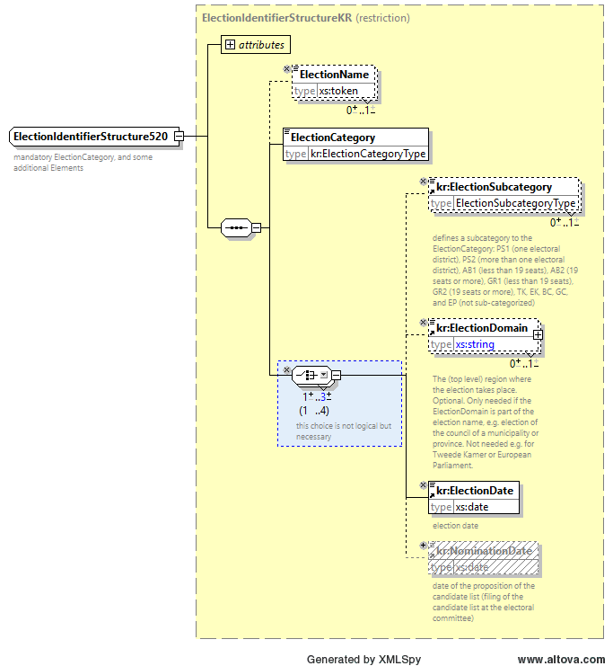

Het beperkte complex data type CandidateStructure520 gebruikt het type CandidateStructureKR als base type, beperkt het type van het child element CandidateIdentifier tot CandidateIdentifierStructure520, en staat child elementen DateOfBirth, Contact, Agent, kr:DateOfBirthAnnex en kr:NationalIdentificationNumber niet toe. Child elementen CandidateFullName en QualifyingAddress zijn verplicht gemaakt.

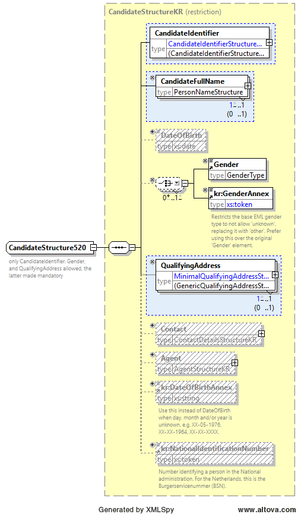

Het beperkte complex data type CandidateIdentifierStructure520 gebruikt het type CandidateIdentifierStructureKR als base type, maakt het Id attribuut verplicht, en beperkt de waarde tot positieve decimale cijfers.

Het Id attribuut is hier verplicht gemaakt *maar heeft niet dezelfde betekenis al in de* CandidateIdentifierStructure510*\!* Hier refereert het Id attribuut naar de volgorde waarin de zetels verdeeld zijn, waarbij de kandidaat die de eerste zetel van een partij toebedeeld heeft gekregen Id=1 krijgt, de tweede zetel Id=2 etc.

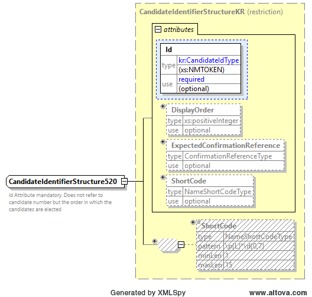

Het beperkte complex data type AffiliationIdentifierStructure520 gebruikt het type AffiliationIdentifierStructureKR als base type, maakt het Id attribuut verplicht en beperkt de waarden tot decimale nummers.

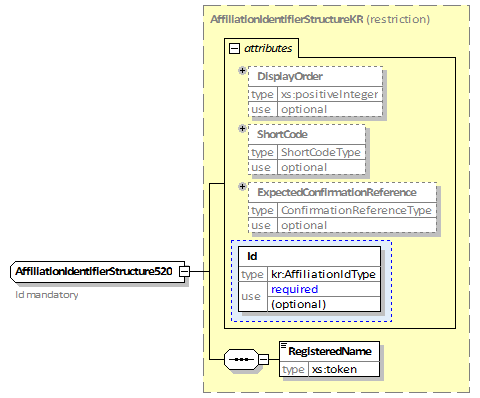

Het base type van het EML (root) element is beperkt tot EMLstructure520. Het is daarna uitgebreid op dezelfde manier als de originele EML V5.0 definitie door het child element Result.

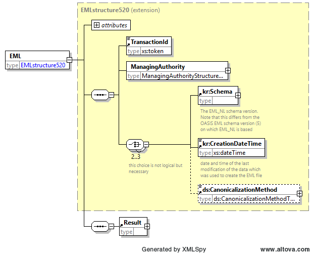

Het element Result is beperkt compatible in een aantal opzichten in vergelijking tot het originele EML element. Election is toegestaan. Het maximale aantal kardinale getallen Election is teruggebracht naar één. Het "any" extension point is behouden.

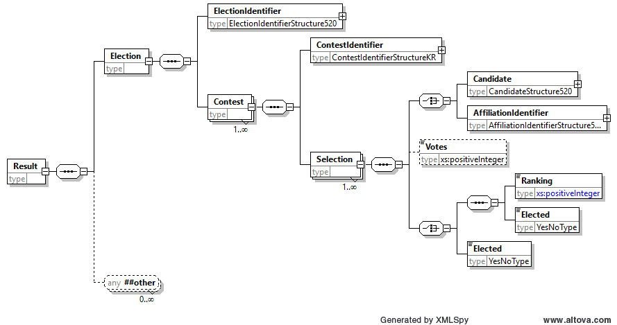

Het type van het child element ElectionIdentifier is beperkt tot ElectionIdentifierStructure520.

Voor het child element Contest, alleen child elementen ContestIdentifier, en de opvolging van Selection zijn toegestaan. Het type van het child element ContestIdentifier is beperkt tot ContestIdentifierStructureKR.

Het element Selection is in een aantal opzichten beperkt compatibel. Het bestaat uit child element Candidate, of child element AffiliationIdentifier, optioneel gevolgd door het aantal gekregen stemmen met element Votes, gevolgd door zowel een opvolging van twee elementen van Ranking en Elected (voor kandidaten), of alleen het element Elected (voor affiliaties). Het type van het child element Candidate is beperkt tot CandidateStructure520. Het type van het child element AffiliationIdentifier is beperkt tot AffiliationIndentifier520. Het element Ranking kan slechts twee waarden hebben: 1 (voor kandidaten die verkozen zijn over voorkeursdrempel ), of 2 (voor andere kandidaten).

Een voorbeeld van de EML\_NL 520 voor een Tweede Kamerverkiezing is hieronder afgebeeld. Ook hier geldt dat ShortCodes worden gebruikt zodat de kandidaten gekoppeld kunnen worden aan de kandidatenlijsten. Het CandidateIdentifier Id is hier de volgorde waarin de kandidaten gekozen zijn *en dus niet het nummer op de kandidatenlijst*:

<table>
<tbody>
<tr class="odd">
<td>
&lt;EML xmlns="urn:oasis:names:tc:evs:schema:eml" xmlns:ds="http://www.w3.org/2000/09/xmldsig#" xmlns:kr="http://www.kiesraad.nl/extensions" xmlns:xal="urn:oasis:names:tc:ciq:xsdschema:xAL:2.0" xmlns:xnl="urn:oasis:names:tc:ciq:xsdschema:xNL:2.0" Id="520" SchemaVersion="5"&gt;

&lt;TransactionId&gt;1&lt;/TransactionId&gt;

&lt;ManagingAuthority&gt;

&lt;AuthorityIdentifier Id="CSB"&gt;De Kiesraad&lt;/AuthorityIdentifier&gt;

&lt;AuthorityAddress/&gt;

&lt;/ManagingAuthority&gt;

&lt;kr:Schema Version="1.3"/&gt;

&lt;kr:CreationDateTime&gt;2023-12-03T14:22:26.741&lt;/kr:CreationDateTime&gt;

&lt;ds:CanonicalizationMethod Algorithm="http://www.w3.org/TR/2001/REC-xml-c14n-20010315#WithComments"/&gt;

&lt;Result&gt;

&lt;Election&gt;

&lt;ElectionIdentifier Id="TK2023"&gt;

&lt;ElectionName&gt;Tweede Kamer der Staten-Generaal 2023&lt;/ElectionName&gt;

&lt;ElectionCategory&gt;TK&lt;/ElectionCategory&gt;

&lt;kr:ElectionSubcategory&gt;TK&lt;/kr:ElectionSubcategory&gt;

&lt;kr:ElectionDate&gt;2023-11-22&lt;/kr:ElectionDate&gt;

&lt;/ElectionIdentifier&gt;

&lt;Contest&gt;

&lt;ContestIdentifier Id="alle"/&gt;

&lt;Selection&gt;

&lt;AffiliationIdentifier Id="1"&gt;

&lt;RegisteredName&gt;De Partij&lt;/RegisteredName&gt;

&lt;/AffiliationIdentifier&gt;

&lt;Elected&gt;yes&lt;/Elected&gt;

&lt;/Selection&gt;

&lt;Selection&gt;

&lt;Candidate&gt;

&lt;CandidateIdentifier Id="1" ShortCode="BakkerA"/&gt;

&lt;CandidateFullName&gt;

&lt;xnl:PersonName&gt;

&lt;xnl:NameLine NameType="Initials"&gt;A.&lt;/xnl:NameLine&gt;

&lt;xnl:FirstName&gt;André&lt;/xnl:FirstName&gt;

&lt;xnl:NamePrefix/&gt;

&lt;xnl:LastName&gt;Bakker&lt;/xnl:LastName&gt;

&lt;/xnl:PersonName&gt;

&lt;/CandidateFullName&gt;

&lt;Gender&gt;male&lt;/Gender&gt;

&lt;QualifyingAddress&gt;

&lt;xal:Locality&gt;

&lt;xal:LocalityName&gt;Bunnik&lt;/xal:LocalityName&gt;

&lt;/xal:Locality&gt;

&lt;/QualifyingAddress&gt;

&lt;/Candidate&gt;

&lt;Ranking&gt;1&lt;/Ranking&gt;

&lt;Elected&gt;yes&lt;/Elected&gt;

&lt;/Selection&gt;

...

&lt;/Contest&gt;

&lt;/Election&gt;

&lt;/Result&gt;

&lt;/EML&gt;
</td>
</tr>
</tbody>
</table>

## 630-optionslist-kiesraad-strict.xsd

Het beperkte complex data type EMLstructure630 gebruikt het type EMLstructureKR als base type, en maakt kr:CreationDateTime verplicht.

Het beperkte complex data type ElectionIdentifierStructure630 gebruikt het type ElectionIdentifierStructureKR als base type. Het maakt de elementen ElectionName en kr:ElectionSubcategory verplicht en staat het child element kr:NominationDate niet toe. De ElectionName is hier de naam van het referendum, bijvoorbeeld “de Wet op de inlichtingen- en veiligheidsdiensten 2017”.

Het beperkte complex data type ProposalStructure630 herdefinieert het EML type ProposalStructure zonder erfenis door inflexibele restrictie regels. Echter, de nieuwe definitie is nog steeds een wettelijke restrictie van de oude definitie. Het staat alleen de elementen ProposalIdentifier en Options met child elementen ReferendumOptionIdentifier toe. Daarnaast beperkt het ProposalIdentifier tot het type ProposalIdentifierStructure630 en ReferendumOptionIdentifier tot het type ReferendumOptionIdentifier630.

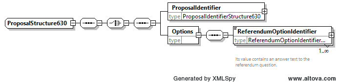

Het beperkte complex data type ProposalIdentifierStructure630 herdefinieert standaard EML element ProposalIdentifierStructure met als enige wijziging dat ProposalName verplicht is gemaakt. Dit element bevat de referendumvraag, bijvoorbeeld “Bent u voor of tegen de Wet op de inlichtingen- en veiligheidsdiensten 2017?”.

> 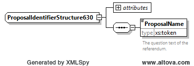

Het beperkte complex data type ReferendumOptionIdentifierStructure630 herdefinieert standaard EML element ReferendumOptionIdentifierStructure en staat alleen de attributen Id, DisplayOrder en ShortCode toe. Het attribuut Id is verplicht gemaakt om elk antwoord op het referendum een identifier mee te geven welke in de 510 gebruikt kan worden als AffiliationIdentifier en CandidateIdentifier.

> 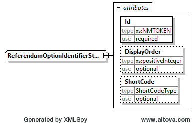

Het base type van het EML (root) element is beperkt tot EMLstructure630. Het is daarna uitgebreid op dezelfde manier als de originele EML V5.0 definitie door het child element OptionsList.

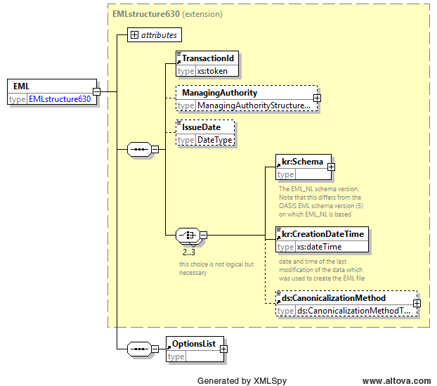

Het element OptionsList is beperkt compatible in een aantal opzichten in vergelijking tot het originele EML element. Election is toegestaan. Het maximale aantal kardinale getallen Election is teruggebracht naar één. Het "any" extension point is verwijderd. Daarnaast is het type van ElectionIdentifier beperkt tot ElectionIdentifierStructure630, het type van Proposal tot ProposalStructure630 en het element kr:ElectionTree is toegevoegd.

Een voorbeeld van de EML\_NL 630 is hieronder weergegeven. De Ids die hier als attribuut van ReferendumOptionIdentifier worden gedefinieerd, kunnen gebruikt worden als “affiliation id” in de EML 510.

<table>
<tbody>
<tr class="odd">
<td>
&lt;EML SchemaVersion="5" Id="630" xmlns="urn:oasis:names:tc:evs:schema:eml" xmlns:kr="http://www.kiesraad.nl/extensions"&gt;

&lt;TransactionId&gt;1&lt;/TransactionId&gt;

&lt;kr:Schema Version="1.3"/&gt;

&lt;kr:CreationDateTime&gt;2018-01-15T12:35:10.328&lt;/kr:CreationDateTime&gt;

&lt;OptionsList&gt;

&lt;Election&gt;

&lt;ElectionIdentifier Id="NR20180321"&gt;

&lt;ElectionName&gt;de Wet op de inlichtingen- en veiligheidsdiensten 2017&lt;/ElectionName&gt;

&lt;ElectionCategory&gt;NR&lt;/ElectionCategory&gt;

&lt;kr:ElectionSubcategory&gt;NR&lt;/kr:ElectionSubcategory&gt;

&lt;kr:ElectionDate&gt;2018-03-21&lt;/kr:ElectionDate&gt;

&lt;/ElectionIdentifier&gt;

&lt;Proposal&gt;

&lt;ProposalIdentifier&gt;

&lt;ProposalName&gt;Bent u voor of tegen de Wet op de inlichtingen- en veiligheidsdiensten 2017?&lt;/ProposalName&gt;

&lt;/ProposalIdentifier&gt;

&lt;Options&gt;

&lt;ReferendumOptionIdentifier Id="1"&gt;Voor&lt;/ReferendumOptionIdentifier&gt;

&lt;ReferendumOptionIdentifier Id="2"&gt;Tegen&lt;/ReferendumOptionIdentifier&gt;

&lt;/Options&gt;

&lt;/Proposal&gt;

&lt;kr:ElectionTree&gt;

&lt;kr:Region RegionCategory="STAAT"&gt;

&lt;kr:RegionName&gt;Nederland&lt;/kr:RegionName&gt;

&lt;/kr:Region&gt;

&lt;kr:Region RegionNumber="1" RegionCategory="KIESKRING" SuperiorRegionCategory="STAAT"&gt;

&lt;kr:RegionName&gt;Groningen&lt;/kr:RegionName&gt;

&lt;kr:Committee CommitteeCategory="HSB"/&gt;

&lt;/kr:Region&gt;

&lt;kr:Region RegionNumber="0003" RegionCategory="GEMEENTE" SuperiorRegionNumber="1" SuperiorRegionCategory="KIESKRING"&gt;

&lt;kr:RegionName&gt;Appingedam&lt;/kr:RegionName&gt;

&lt;/kr:Region&gt;

...

&lt;/kr:ElectionTree&gt;

&lt;/Election&gt;

&lt;/OptionsList&gt;

&lt;/EML&gt;
</td>
</tr>
</tbody>
</table>

1.  In het [kiesbesluit d.d. 17-07-2025](https://wetten.overheid.nl/jci1.3:c:BWBR0004632&afdeling=II&hoofdstuk=H&artikel=H_2&z=2023-01-01&g=2023-01-01) bestaat alleen de mogelijkheid voor een \<\<m\>\> of een \<\<v\>\> op de kandidatenlijst. Hoewel de standaard hier extra waarden toestaan, moeten de aanduidingen op de kandidatenlijst alsnog het kiesbesluit volgen.

2.  Zie ook <https://www.amsterdam.nl/stelselpedia/bag-index/handboek-inwinnen/introductie-bag/registratie/gebruiksdoel/>

3.  <https://www.cbs.nl/nl-nl/dossier/nederland-regionaal/informatie-voor-gemeenten/codering-gebieden>

4.  Voor meer informatie, zie: <https://www.oogvereniging.nl/leven-met/stemmen-met-een-oogaandoening/#stemmal>, <https://stemmal.nl/> en <https://www.stembox.nl/>.

5.  Persoonsgegevens zijn gefingeerd en afkomstig van <https://www.fakenamegenerator.com/>
