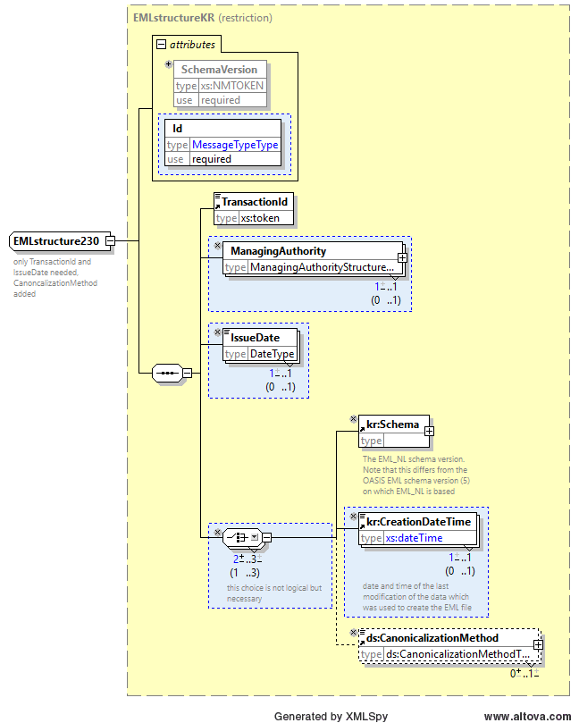
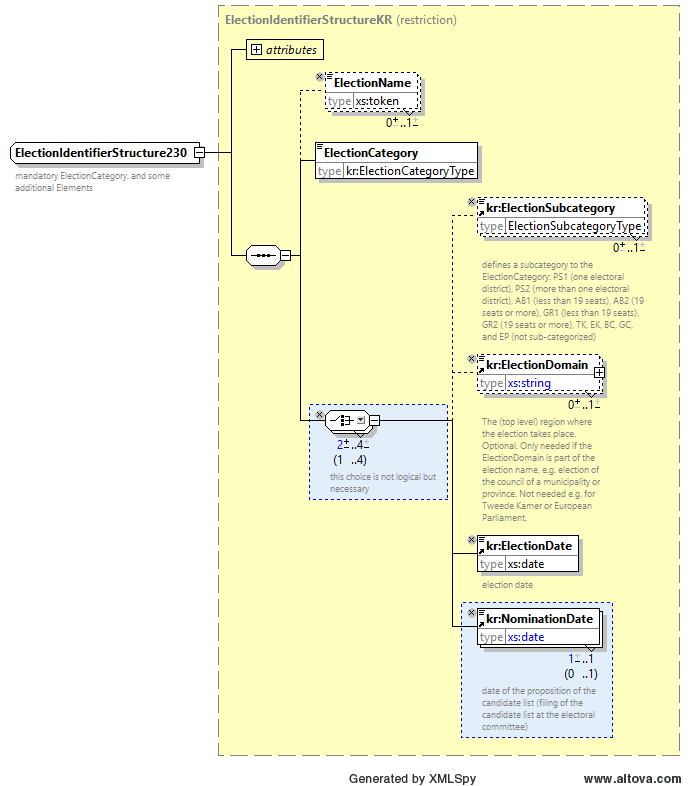
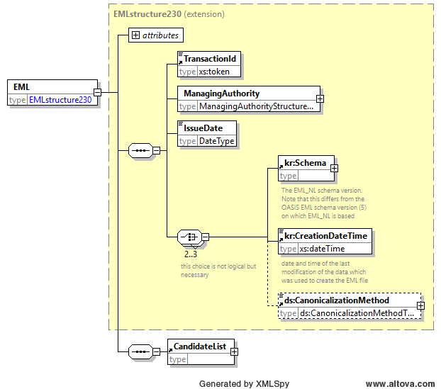
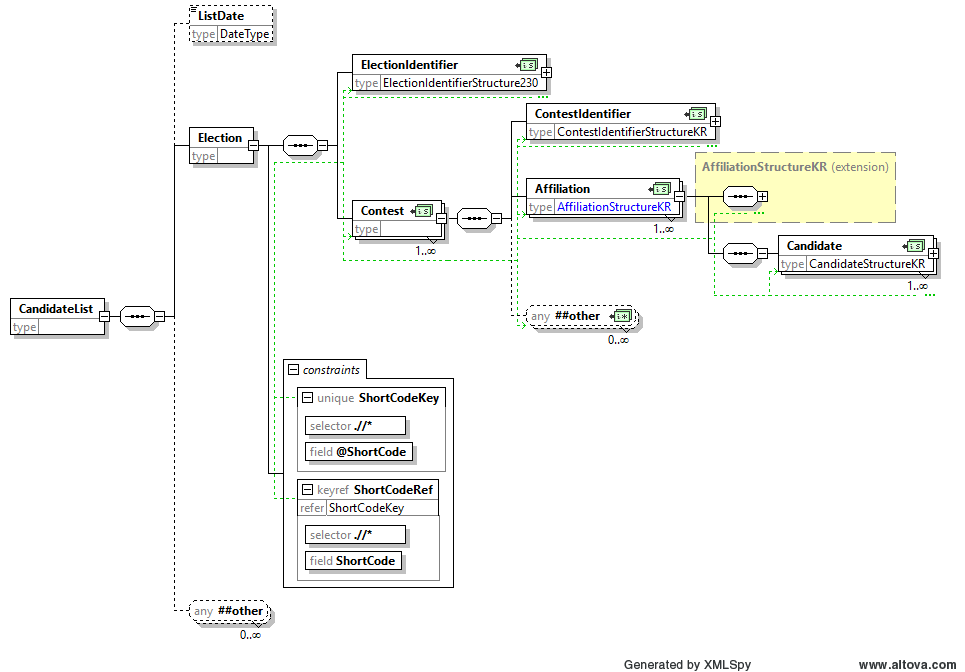

Het beperkte complex data type `EMLstructure230` gebruikt het type `EMLstructureKR` als base type, en maakt child elementen `ManagingAuthority`, `IssueDate` en `kr:CreationDateTime` verplicht.



Het beperkte complex data type `ElectionIdentifierStructure230` gebruikt het type `ElectionIdentifierStructureKR` als base type, en maakt het child element `kr:NominationDate` verplicht.



Het base type van het EML (root) element is beperkt tot `EMLstructure230`. Daarna is het uitgebreid op dezelfde manier als in de originele EML V5.0 definitie door het child element `CandidateList`.



Het element `CandidateList` is beperkt compatibel in een aantal opzichten in vergelijking tot het originele EML element. Alleen child elementen `ListDate` en `Election` zijn toegestaan. Het maximale aantal kardinale getallen `Election` is teruggebracht naar één. De "any" extension point wordt gehandhaafd.



Het child element `Election` is ook beperkt compatibel. Het type van het child element `ElectionIdentifier` is beperkt tot `ElectionIdentifierStructure230`. Het ander child element is `Contest`. Het child element van het type `ContestIdentifier` is beperkt tot `ContestIdentifierStructureKR`. Verder is het andere toegestane child element van `Contest` een opeenvolging van het verplichte element `Affiliation`. Andere opties zijn niet toegestaan. De "any" extension point wordt behouden. Het type van het child element `Affiliation` is eerst beperkt tot `AffiliationStructureKR`, en daarna uitgebreid als op dezelfde manier als in de originele EML V5.0 definitie door een opeenvolging van `Candidate` elementen. Het type child element `Candidate` is beperkt tot `CandidateStructureKR`.

Een voorbeeld van EML_NL 230b voor de Tweede Kamerverkiezingen voor een specifieke kieskring wordt hieronder getoond:

```xml
<?xml version="1.0" encoding="UTF-8"?>
<EML xmlns="urn:oasis:names:tc:evs:schema:eml"
  xmlns:ds="http://www.w3.org/2000/09/xmldsig#"
  xmlns:kr="http://www.kiesraad.nl/extensions"
  xmlns:xal="urn:oasis:names:tc:ciq:xsdschema:xAL:2.0"
  xmlns:xnl="urn:oasis:names:tc:ciq:xsdschema:xNL:2.0" Id="230b" SchemaVersion="5">
  <TransactionId>1</TransactionId>
  <ManagingAuthority>
    <AuthorityIdentifier Id="CSB">De Kiesraad</AuthorityIdentifier>
    <AuthorityAddress/>
  </ManagingAuthority>
  <IssueDate>2025-01-20</IssueDate>
  <kr:Schema Version="1.3"/>
  <kr:CreationDateTime>2025-01-20T10:35:51.604</kr:CreationDateTime>
  <ds:CanonicalizationMethod Algorithm="http://www.w3.org/TR/2001/REC-xml-c14n-20010315#WithComments"/>
  <CandidateList>
    <Election>
      <ElectionIdentifier Id="TK2025">
        <ElectionName>Tweede Kamer der Staten-Generaal 2025</ElectionName>
        <ElectionCategory>TK</ElectionCategory>
        <kr:ElectionSubcategory>TK</kr:ElectionSubcategory>
        <kr:ElectionDate>2025-02-03</kr:ElectionDate>
        <kr:NominationDate>2025-01-06</kr:NominationDate>
      </ElectionIdentifier>
      <Contest>
        <ContestIdentifier Id="14">
          <ContestName>Dordrecht</ContestName>
        </ContestIdentifier>
        <Affiliation>
          <AffiliationIdentifier Id="1">
            <RegisteredName>De Partij</RegisteredName>
          </AffiliationIdentifier>
          <Type>op zichzelf staande lijst</Type>
          <kr:ListData PublicationLanguage="nl" PublishGender="true"/>
          <Candidate>
            <CandidateIdentifier Id="1"/>
            <CandidateFullName>
              <xnl:PersonName>
                <xnl:NameLine NameType="Initials">H.</xnl:NameLine>
                <xnl:FirstName>Horatio</xnl:FirstName>
                <xnl:LastName>Bultenaar</xnl:LastName>
              </xnl:PersonName>
            </CandidateFullName>
            <!-- Hier kan op dezelfde manier het geslacht weggelaten -->
            <!-- worden zoals in de EML 210: -->
            <!-- <Gender>male</Gender> -->
            <QualifyingAddress>
              <xal:Locality>
                <xal:LocalityName>Hellevoetsluis</xal:LocalityName>
              </xal:Locality>
            </QualifyingAddress>
          </Candidate>
          ...
        </Affiliation>
      </Contest>
    </Election>
  </CandidateList>
</EML>
```