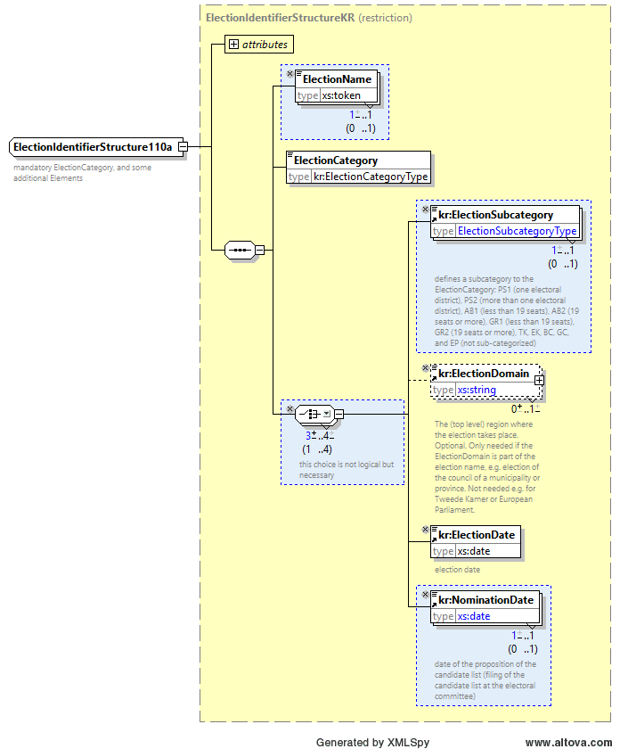
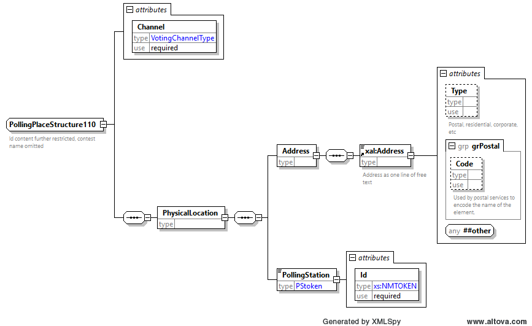
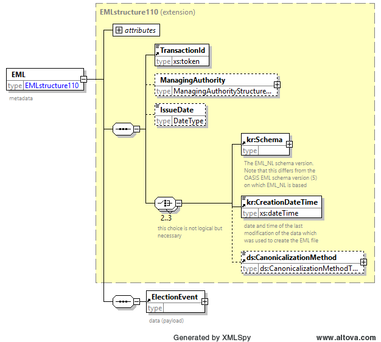
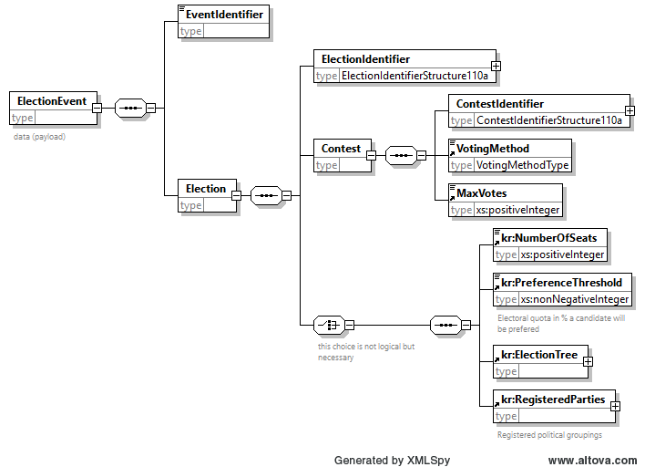

# 110a_electionevent_kiesraad_strict

Het beperkte complex data type `EMLstructure110` gebruikt het type `EMLstructureKR` als base type en maakt child element `kr:CreationDateTime` verplicht.


Het beperkte complex data type `ElectionIdentifierStructure110a` gebruikt het type `ElectionIdentifierStructureKR` als base type en maakt `ElectionName`, `kr:ElectionSubcategory` en `kr:NominationDate` verplicht.



Het beperkte complex data type `ContestIdentifierStructure110a` gebruikt het type `ContestIdentifierStructureKR` als base type. Het element `ContestName` is niet toegestaan.


Het complex data type `PollingPlaceStructure110` wordt opnieuw gedefinieerd en is in beperkte mate compatibel met het core EML element `PollingPlaceStructure`. Hoewel dit element in de 110a wordt gedefinieerd wordt deze feitelijk niet in de 110a gebruikt. Uitgebreidere informatie over stembureaus wordt in de 110b uitgevraagd. Het beperkt de attributes tot `Channel`. Daarnaast is het enige toegestane child element beperkt tot `PhysicalLocation`. Het `Address` element is beperkt tot het `xal:Address` type uit EML_NL. Daarnaast is het `PollingStation` element toegevoegd met een verplicht `Id` attribuut.



Het base type van het EML (root) element is beperkt tot `EMLstructure110`. Daarna is het uitgebreid op dezelfde manier als in de originele EML V5.0 definitie door het child element `ElectionEvent`.



Het element `ElectionEvent` is beperkt compatibel in een aantal manieren vergeleken met het originele EML element. Het type van het child element `ElectionIdentifier` is beperkt tot `ElectionIdentifierStructure110a`. Het type van het child element `ContestIdentifier` is beperkt tot `ContestIdentifierStructure110a`. Verder zijn alleen child elementen `EventIdentifier` en `Election` toegestaan, welke beiden verplicht zijn. Andere opties zijn niet toegestaan. Het “any" extension point is verwijderd. Verder zijn enkele extra elementen onder de `kr` namespace toegevoegd om benodigde informatie over Nederlandse verkiezingen te kunnen registreren. Ook wordt de `kr:ElectionTree` in dit bestand opgenomen om de hiërarchie van de regios welke meedoen aan deze verkiezing te definiëren.



Een voorbeeld van een EML 110a voor de Europees Parlementsverkiezing wordt hieronder weergegeven:

```xml
<?xml version="1.0" encoding="UTF-8" standalone="yes"?>
<EML xmlns:xnl="urn:oasis:names:tc:ciq:xsdschema:xNL:2.0"
  xmlns="urn:oasis:names:tc:evs:schema:eml"
  xmlns:xal="urn:oasis:names:tc:ciq:xsdschema:xAL:2.0"
  xmlns:kr="http://www.kiesraad.nl/extensions" Id="110a" SchemaVersion="5">
  <TransactionId>1</TransactionId>
  <IssueDate>2024-04-29</IssueDate>
  <kr:Schema Version="1.3"/>
  <kr:CreationDateTime>2024-04-29T18:13:50.148</kr:CreationDateTime>
  <ElectionEvent>
    <EventIdentifier/>
    <Election>
      <ElectionIdentifier Id="EP2024">
        <ElectionName>Europees Parlement 2024</ElectionName>
        <ElectionCategory>EP</ElectionCategory>
        <kr:ElectionSubcategory>EP</kr:ElectionSubcategory>
        <kr:ElectionDate>2024-06-06</kr:ElectionDate>
        <kr:NominationDate>2024-04-23</kr:NominationDate>
      </ElectionIdentifier>
      <Contest>
        <ContestIdentifier Id="alle"/>
        <VotingMethod>SPV</VotingMethod>
        <MaxVotes></MaxVotes>
      </Contest>
      <kr:NumberOfSeats>31</kr:NumberOfSeats>
      <kr:PreferenceThreshold>10</kr:PreferenceThreshold>
      <kr:ElectionTree>
        <kr:Region RegionCategory="STAAT">
          <kr:RegionName>Nederland</kr:RegionName>
          <kr:Committee CommitteeCategory="CSB" CommitteeName="De Kiesraad"/>
          <kr:Committee CommitteeCategory="HSB" CommitteeName="De Kiesraad" AcceptCentralSubmissions="true"/>
        </kr:Region>
        <kr:Region RegionNumber="1" RegionCategory="KIESKRING" SuperiorRegionCategory="STAAT">
          <kr:RegionName>Groningen</kr:RegionName>
        </kr:Region>
        ...
        <kr:Region RegionNumber="14" RegionCategory="GEMEENTE" SuperiorRegionNumber="1" SuperiorRegionCategory="KIESKRING">
          <kr:RegionName>Groningen</kr:RegionName>
        </kr:Region>
        ...
      </kr:ElectionTree>
      <kr:RegisteredParties>
        <kr:RegisteredParty>
          <kr:RegisteredAppellation>GROENLINKS / Partij van de Arbeid (PvdA)</kr:RegisteredAppellation>
        </kr:RegisteredParty>
        ...
      </kr:RegisteredParties>
    </Election>
  </ElectionEvent>
</EML>
```