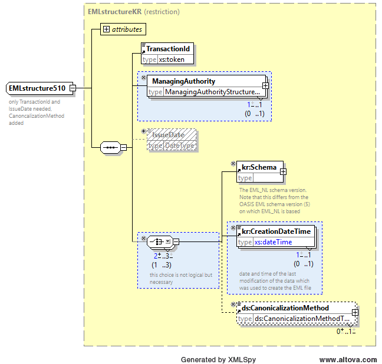
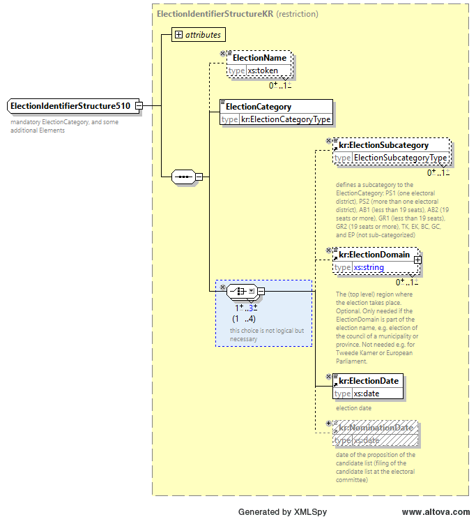
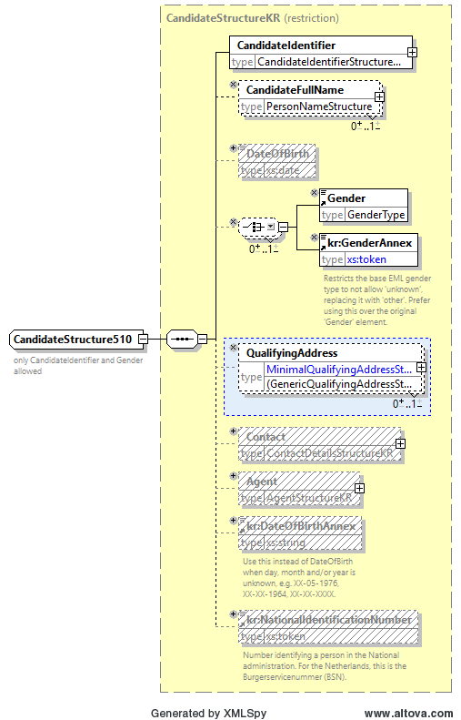
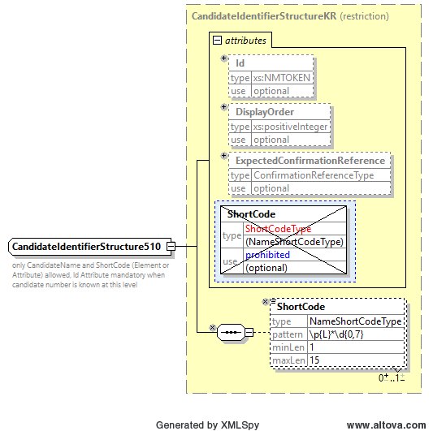
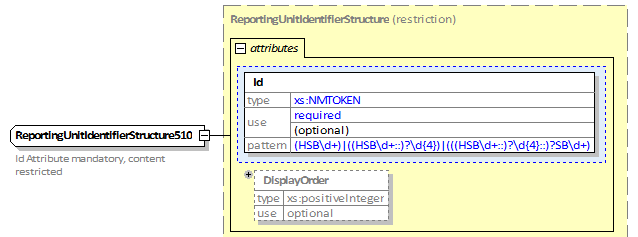
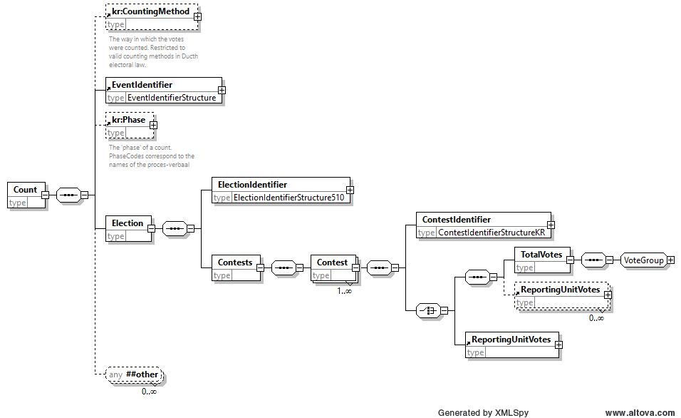
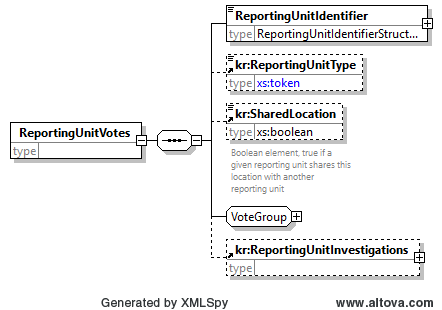

# 510_count_kiesraad_strict

Het beperkte complex data type `EMLstructure510` gebruikt het type `EMLstructureKR` als base type, en maakt de elementen `ManagingAuthority` en `kr:CreationDateTime` verplicht. Child element `IssueDate` is niet toegestaan.



Het beperkte complex data type `ElectionIdentifierStructure510` gebruikt het type `ElectionIdentifierStructureKR` als base type, en staat child element `kr:NominationDate` niet toe.



Het beperkte complex data type `AffiliationIdentifierStructure510` gebruikt het type `AffiliationIdentifierStructureKR` als base type, maakt het `Id` attribuut verplicht, en beperkt zijn waarden tot decimale cijfers.


Het beperkte complex data type `CandidateStructure510` gebruikt het type `CandidateStructureKR` als base type, beperkt het type van child element `CandidateIdentifier` tot `CandidateIdentifierStructureKR`, en laat het gebruik van child elementen `DateOfBirth`, `Contact`, `Agent`, en `DateOfBirthAnnex` niet toe. Child elementen `Gender`, `CandidateFullName` en `QualifyingAddress` worden optioneel toegestaan in het geval dat deze informatie benodigd is (in 510d).



Het beperkte complex data type `CandidateIdentifierStructure510` gebruikt het type `CandidateIdentifierStructureKR` als base type, en staat het attribuut `ShortCode` niet toe.

Het `Id` attribuut is optioneel maar is feitelijk verplicht voor alle niveaus waar deze bekend zijn als kandidaatnummer van de specifieke kandidaat op de kandidatenlijsten. Voor aggregatieniveaus boven het niveau waarop kandidatenlijsten gedefinieerd zijn (dus bijvoorbeeld voor de Totaaltelling 510d bij een Tweede Kamer verkiezing) is het kandidaatnummer niet meer uniek aangezien de lijsten per kieskring kunnen verschillen. Daarom wordt in de 510d in dat geval het `Id` element weggelaten en wordt het `ShortCode` element gebruikt om de koppeling naar de kandidatenlijsten te kunnen maken.



Het beperkte complex data type `ReportingUnitIdentifierStructure510` gebruikt het type `ReportingUnitIdentifierStructure` als base type, maakt het `Id` attribuut verplicht, en beperkt het type tot een hiërarchisch patroon. De hiërarchie start één niveau lager dan het niveau waar het hele EML 510 bestand aan toebehoort. Voor 510d is de hoogste reporting unit een HSB. Voor 510c, is de hoogste reporting unit de gemeente. Voor 510b is de reporting unit het stembureau. Een HSB wordt aangeduid door de identifier `HSB` gevolgd door zijn nummer, een gemeente alleen door een viercijferig nummer (het gemeentenummer volgens de CBS codering), een stembureau door de identifier `SB` gevolgd door zijn nummer. Reporting units die niet de hoogste zijn in het gegeven EML-510-bestand zijn omgeven door de codes van de unit die daaropvolgend hoger is tot aan de hoogste unit. De grens is altijd een dubbele punt (::).



Het base type van het EML (root) element is beperkt tot `EMLstructure510`. Het is daarna op dezelfde manier uitgebreid als de originele EML V5.0 definitie door het child element `Count`.


Het element `Count` is beperkt compatible in een aantal opzichten in vergelijking met het originele EML element. Alleen child elementen `EventIdentifier` en `Election` zijn toegestaan. Het maximale aantal kardinale getallen van een element `Election` is beperkt tot één. Daarnaast zijn als uitbereiding aan het originele element de optionele elementen `kr:CountingMethod` en `kr:Phase` toegevoegd. Het "any" extension point wordt gehandhaafd.



Het child element `EventIdentifier` wordt in werkelijkheid niet gebruikt maar mag niet worden verwijderd.

Het element `Election` is ook compatible beperkt. Het type van het child element `ElectionIdentifier` is beperkt tot `ElectionIdentifierStructure510`. Dit zijn wijzigingen in het descendent element `Contest`. Het type van het child element `ContestIdentifier` is beperkt tot `ContestIdentifierStructureKR`. Betreffende andere descendant elementen, zijn alleen verplichte elementen over, met uitzondering van de optionele opvolging van `ReportingUnitVotes`, welke ook is gehandhaafd.

Het element `ReportingUnitVotes` is uitgebreid ten opzichte van het originele EML element door toevoeging van de optionele elementen `kr:ReportingUnitType`, `kr:SharedLocation` en het element `kr:ReportingUnitInvestigations`.



Het type van child element `ReportingUnitIdentifier` is beperkt tot `ReportingUnitIdentifierStructure510`. De descendant `VoteGroup` was beperkt tot alleen de onbeperkte opvolging van het child element `Selection`, het child element `Cast`, het child element `TotalCounted`, en een opeenvolging van twee van de child elementen `RejectedVotes`, allen verplicht. Daarnaast zijn 0 tot 14 optionele elementen `UncountedVotes` toegevoegd. De child elementen van `Selection` kan één van de `Candidate`, `AffiliationIdentifier`, of `ReferendumOptionIdentifier` zijn, alsmede het element `ValidVotes`. Het type van het element `Candidate` is beperkt tot `CandidateStructure510`. Het type van het element `AffiliationIdentifier` is beperkt tot `AffiliationIdentifierStructure510`. Het element `RejectedVotes` kan alleen de waarden `blanco` en `ongeldig` hebben voor het attribuut `ReasonCode`.

Daarnaast is voor alle elementen welke een aantal beschrijven onder de `kr` namespace een element toegevoegd met prefix `Initial`. Deze elementen komen altijd voor de aantallen die voor het huidige EML bericht gelden en geven de initiële waarde van deze aantallen aan voordat er een corrigendum en dus een nieuw EML bericht is opgemaakt. Deze elementen mogen alleen voorkomen indien `kr:Phase` onder `Count` attribuut `Phasecode="corrigendum"` heeft en het initiële aantal anders was dan het aantal na het corrigendum.


Een voorbeeld van de EML\_NL 510b voor de Tweede Kamerverkiezing is hieronder weergegeven. Het voorbeeld betreft een corrigendum met een aantal gecorrigeerde waarden

```xml
<EML xmlns="urn:oasis:names:tc:evs:schema:eml" xmlns:ds="http://www.w3.org/2000/09/xmldsig#" xmlns:kr="http://www.kiesraad.nl/extensions" xmlns:xal="urn:oasis:names:tc:ciq:xsdschema:xAL:2.0" xmlns:xnl="urn:oasis:names:tc:ciq:xsdschema:xNL:2.0" Id="510b" SchemaVersion="5">
  <TransactionId>1</TransactionId>
  <ManagingAuthority>
    <AuthorityIdentifier Id="0312">Bunnik</AuthorityIdentifier>
    <AuthorityAddress/>
  </ManagingAuthority>
  <kr:Schema Version="1.3"/>
  <kr:CreationDateTime>2023-11-23T18:19:30.837</kr:CreationDateTime>
  <ds:CanonicalizationMethod Algorithm="http://www.w3.org/TR/2001/REC-xml-c14n-20010315#WithComments"/>
  <Count>
    <kr:CountingMethod MethodCode="centrale stemopneming"/>
    <EventIdentifier/>
    <kr:Phase PhaseCode="corrigendum"/>
    <Election>
      <ElectionIdentifier Id="TK2023">
        <ElectionName>Tweede Kamer der Staten-Generaal 2023</ElectionName>
        <ElectionCategory>TK</ElectionCategory>
        <kr:ElectionSubcategory>TK</kr:ElectionSubcategory>
        <kr:ElectionDate>2023-11-22</kr:ElectionDate>
      </ElectionIdentifier>
      <Contests>
        <Contest>
          <ContestIdentifier Id="8">
            <ContestName>Utrecht</ContestName>
          </ContestIdentifier>
          <TotalVotes>
            <Selection>
              <AffiliationIdentifier Id="1">
                <RegisteredName>De Partij</RegisteredName>
              </AffiliationIdentifier>
              <kr:InitialValidVotes>1887</kr:InitialValidVotes>
              <ValidVotes>1886</ValidVotes>
            </Selection>
            <Selection>
              <Candidate>
                <CandidateIdentifier Id="1"/>
              </Candidate>
              <ValidVotes>1655</ValidVotes>
            </Selection>
            ...
            <Cast>12124</Cast>
            <kr:InitialTotalCounted>10704</kr:InitialTotalCounted>
            <TotalCounted>10702</TotalCounted>
            <kr:InitialRejectedVotes ReasonCode="ongeldig">20</kr:InitialRejectedVotes>
            <RejectedVotes ReasonCode="ongeldig">19</RejectedVotes>
            <RejectedVotes ReasonCode="blanco">20</RejectedVotes>
            <kr:InitialUncountedVotes ReasonCode="andere verklaring">1</kr:InitialUncountedVotes>
            <UncountedVotes ReasonCode="geldige stempassen">9799</UncountedVotes>
            <UncountedVotes ReasonCode="geldige volmachtbewijzen">922</UncountedVotes>
            <UncountedVotes ReasonCode="geldige kiezerspassen">24</UncountedVotes>
            <UncountedVotes ReasonCode="toegelaten kiezers">10745</UncountedVotes>
            <UncountedVotes ReasonCode="meer getelde stembiljetten">0</UncountedVotes>
            <UncountedVotes ReasonCode="minder getelde stembiljetten">3</UncountedVotes>
            <UncountedVotes ReasonCode="meegenomen stembiljetten">0</UncountedVotes>
            <UncountedVotes ReasonCode="te weinig uitgereikte stembiljetten">0</UncountedVotes>
            <UncountedVotes ReasonCode="te veel uitgereikte stembiljetten">0</UncountedVotes>
            <UncountedVotes ReasonCode="geen verklaring">3</UncountedVotes>
            <UncountedVotes ReasonCode="andere verklaring">0</UncountedVotes>
          </TotalVotes>
          <ReportingUnitVotes>
            <ReportingUnitIdentifier Id="0312::SB4">Stembureau Prikkebeen (postcode: 3981 WC)</ReportingUnitIdentifier>
            <Selection>
              <AffiliationIdentifier Id="1">
                <RegisteredName>De partij</RegisteredName>
              </AffiliationIdentifier>
              <ValidVotes>131</ValidVotes>
            </Selection>
            <Selection>
              <Candidate>
                <CandidateIdentifier Id="1"/>
              </Candidate>
              <ValidVotes>113</ValidVotes>
            </Selection>
            ...
            <Cast>967</Cast>
            <TotalCounted>692</TotalCounted>
            <RejectedVotes ReasonCode="ongeldig">3</RejectedVotes>
            <RejectedVotes ReasonCode="blanco">0</RejectedVotes>
            <UncountedVotes ReasonCode="geldige stempassen">650</UncountedVotes>
            <UncountedVotes ReasonCode="geldige volmachtbewijzen">41</UncountedVotes>
            <UncountedVotes ReasonCode="geldige kiezerspassen">4</UncountedVotes>
            <UncountedVotes ReasonCode="toegelaten kiezers">695</UncountedVotes>
            <UncountedVotes ReasonCode="meer getelde stembiljetten">0</UncountedVotes>
            <UncountedVotes ReasonCode="minder getelde stembiljetten">0</UncountedVotes>
            <UncountedVotes ReasonCode="meegenomen stembiljetten">0</UncountedVotes>
            <UncountedVotes ReasonCode="te weinig uitgereikte stembiljetten">0</UncountedVotes>
            <UncountedVotes ReasonCode="te veel uitgereikte stembiljetten">0</UncountedVotes>
            <UncountedVotes ReasonCode="geen verklaring">0</UncountedVotes>
            <UncountedVotes ReasonCode="andere verklaring">0</UncountedVotes>
          </ReportingUnitVotes>
        </Contest>
      </Contests>
    </Election>
  </Count>
</EML>
```

Aangezien de 510d een aggregatie tot een niveau *boven* de kieskringen kan zijn, is het soms nodig om shortcodes te gebruiken om de kandidaten te identificeren. Dit aangezien het kandidaatnummer in de verschillende kieskringen die geaggregeerd zijn kan verschillen:

```xml
<EML xmlns="urn:oasis:names:tc:evs:schema:eml" xmlns:ds="http://www.w3.org/2000/09/xmldsig#" xmlns:kr="http://www.kiesraad.nl/extensions" xmlns:xal="urn:oasis:names:tc:ciq:xsdschema:xAL:2.0" xmlns:xnl="urn:oasis:names:tc:ciq:xsdschema:xNL:2.0" Id="510d" SchemaVersion="5">
  <TransactionId>1</TransactionId>
  <ManagingAuthority>
    <AuthorityIdentifier Id="CSB">De Kiesraad</AuthorityIdentifier>
    <AuthorityAddress/>
  </ManagingAuthority>
  <kr:Schema Version="1.3"/>
  <kr:CreationDateTime>2023-12-03T14:20:55.204</kr:CreationDateTime>
  <ds:CanonicalizationMethod Algorithm="http://www.w3.org/TR/2001/REC-xml-c14n-20010315#WithComments"/>
  <Count>
    <EventIdentifier/>
    <Election>
      <ElectionIdentifier Id="TK2023">
        <ElectionName>Tweede Kamer der Staten-Generaal 2023</ElectionName>
        <ElectionCategory>TK</ElectionCategory>
        <kr:ElectionSubcategory>TK</kr:ElectionSubcategory>
        <kr:ElectionDate>2023-11-22</kr:ElectionDate>
      </ElectionIdentifier>
      <Contests>
        <Contest>
          <ContestIdentifier Id="alle"/>
          <TotalVotes>
            <Selection>
              <AffiliationIdentifier Id="1">
                <RegisteredName>De Partij</RegisteredName>
              </AffiliationIdentifier>
              <ValidVotes>12345678</ValidVotes>
            </Selection>
            <Selection>
              <Candidate>
                <CandidateIdentifier ShortCode="BakkerA"/>
              </Candidate>
              <ValidVotes>1234</ValidVotes>
            </Selection>
            ...
          </TotalVotes>
          <ReportingUnitVotes>
            <ReportingUnitIdentifier Id="HSB1">Kieskring Groningen</ReportingUnitIdentifier>
            <Selection>
              <AffiliationIdentifier Id="1">
                <RegisteredName>De Partij</RegisteredName>
              </AffiliationIdentifier>
              <ValidVotes>1234</ValidVotes>
            </Selection>
            <Selection>
              <Candidate>
                <CandidateIdentifier Id="1" ShortCode="BakkerA"/>
              </Candidate>
              <ValidVotes>12</ValidVotes>
            </Selection>
            ...
          </ReportingUnitVotes>
        </Contest>
      </Contests>
    </Election>
  </Count>
</EML>
```