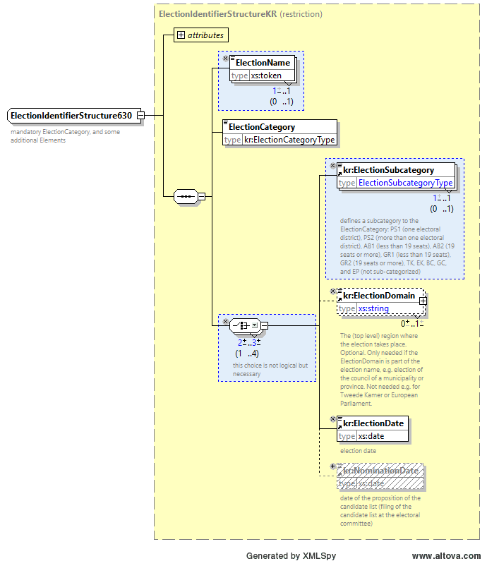
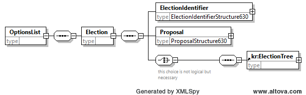

# 630_optionslist_kiesraad_strict

Het beperkte complex data type `EMLstructure630` gebruikt het type `EMLstructureKR` als base type, en maakt `kr:CreationDateTime` verplicht.


Het beperkte complex data type `ElectionIdentifierStructure630` gebruikt het type `ElectionIdentifierStructureKR` als base type. Het maakt de elementen `ElectionName` en `kr:ElectionSubcategory` verplicht en staat het child element `kr:NominationDate` niet toe. De `ElectionName` is hier de naam van het referendum, bijvoorbeeld "de Wet op de inlichtingen- en veiligheidsdiensten 2017".



Het beperkte complex data type `ProposalStructure630` herdefinieert het EML type `ProposalStructure` zonder erfenis door inflexibele restrictie regels. Echter, de nieuwe definitie is nog steeds een wettelijke restrictie van de oude definitie. Het staat alleen de elementen `ProposalIdentifier` en `Options` met child elementen `ReferendumOptionIdentifier` toe. Daarnaast beperkt het `ProposalIdentifier` tot het type `ProposalIdentifierStructure630` en `ReferendumOptionIdentifier` tot het type `ReferendumOptionIdentifier630`.


Het beperkte complex data type `ProposalIdentifierStructure630` herdefinieert standaard EML element `ProposalIdentifierStructure` met als enige wijziging dat `ProposalName` verplicht is gemaakt. Dit element bevat de referendumvraag, bijvoorbeeld "Bent u voor of tegen de Wet op de inlichtingen- en veiligheidsdiensten 2017?".


Het beperkte complex data type `ReferendumOptionIdentifierStructure630` herdefinieert standaard EML element `ReferendumOptionIdentifierStructure` en staat alleen de attributen `Id`, `DisplayOrder` en `ShortCode` toe. Het attribuut `Id` is verplicht gemaakt om elk antwoord op het referendum een identifier mee te geven welke in de 510 gebruikt kan worden als `AffiliationIdentifier` en `CandidateIdentifier`.


Het base type van het EML (root) element is beperkt tot `EMLstructure630`. Het is daarna uitgebreid op dezelfde manier als de originele EML V5.0 definitie door het child element `OptionsList`.


Het element `OptionsList` is beperkt compatible in een aantal opzichten in vergelijking tot het originele EML element. `Election` is toegestaan. Het maximale aantal kardinale getallen `Election` is teruggebracht naar één. Het "any" extension point is verwijderd. Daarnaast is het type van `ElectionIdentifier` beperkt tot `ElectionIdentifierStructure630`, het type van `Proposal` tot `ProposalStructure630` en het element `kr:ElectionTree` is toegevoegd.



Een voorbeeld van de EML\_NL 630 is hieronder weergegeven. De `Ids` die hier als attribuut van `ReferendumOptionIdentifier` worden gedefinieerd, kunnen gebruikt worden als "affiliation id" in de EML 510.

```xml
<EML SchemaVersion="5" Id="630" xmlns="urn:oasis:names:tc:evs:schema:eml" xmlns:kr="http://www.kiesraad.nl/extensions">
  <TransactionId>1</TransactionId>
  <kr:Schema Version="1.3"/>
  <kr:CreationDateTime>2018-01-15T12:35:10.328</kr:CreationDateTime>
  <OptionsList>
    <Election>
      <ElectionIdentifier Id="NR20180321">
        <ElectionName>de Wet op de inlichtingen- en veiligheidsdiensten 2017</ElectionName>
        <ElectionCategory>NR</ElectionCategory>
        <kr:ElectionSubcategory>NR</kr:ElectionSubcategory>
        <kr:ElectionDate>2018-03-21</kr:ElectionDate>
      </ElectionIdentifier>
      <Proposal>
        <ProposalIdentifier>
          <ProposalName>Bent u voor of tegen de Wet op de inlichtingen- en veiligheidsdiensten 2017?</ProposalName>
        </ProposalIdentifier>
        <Options>
          <ReferendumOptionIdentifier Id="1">Voor</ReferendumOptionIdentifier>
          <ReferendumOptionIdentifier Id="2">Tegen</ReferendumOptionIdentifier>
        </Options>
      </Proposal>
      <kr:ElectionTree>
        <kr:Region RegionCategory="STAAT">
          <kr:RegionName>Nederland</kr:RegionName>
        </kr:Region>
        <kr:Region RegionNumber="1" RegionCategory="KIESKRING" SuperiorRegionCategory="STAAT">
          <kr:RegionName>Groningen</kr:RegionName>
          <kr:Committee CommitteeCategory="HSB"/>
        </kr:Region>
        <kr:Region RegionNumber="0003" RegionCategory="GEMEENTE" SuperiorRegionNumber="1" SuperiorRegionCategory="KIESKRING">
          <kr:RegionName>Appingedam</kr:RegionName>
        </kr:Region>
        ...
      </kr:ElectionTree>
    </Election>
  </OptionsList>
</EML>
```
