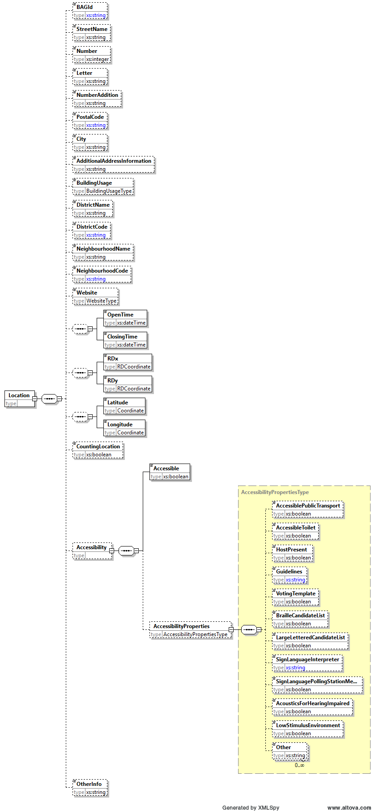
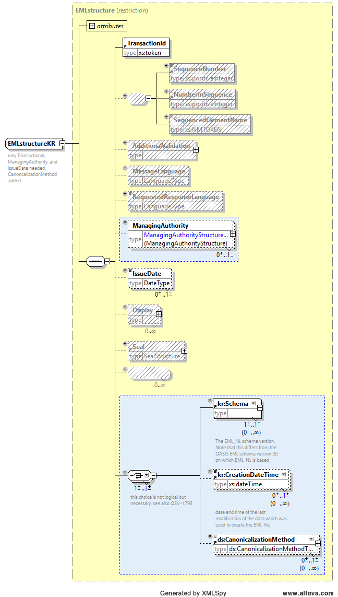
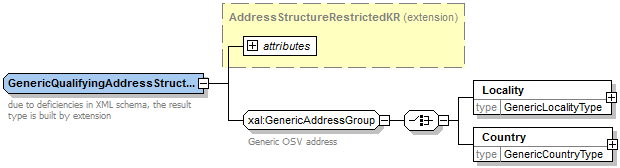
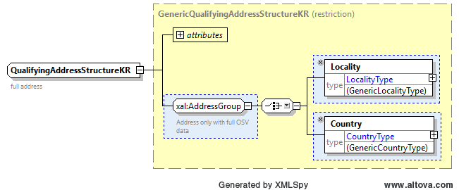
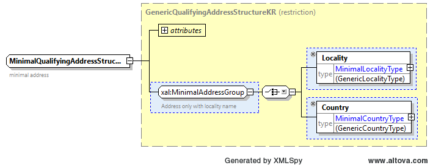
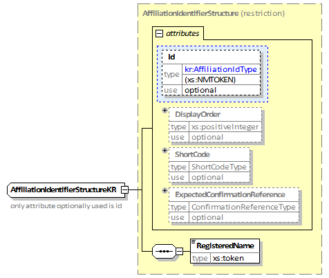
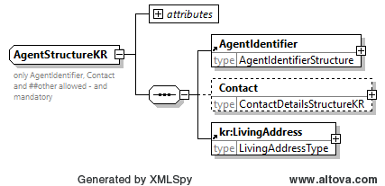
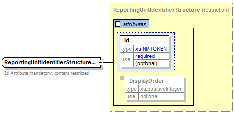

# Toevoegingen ten opzichte van EML 5.0

## kiesraad-eml-extensions.xsd

Dit bestand definieert nieuwe elementen die informatie verschaffen en welke niet worden gedekt door standaard EML tags. Deze elementen worden in de andere schema definities geïmporteerd onder de `kr` namespace.

Element `Schema` is een leeg element met één verlicht attribuut `Version` welke het versienummer van gebruikte EML\_NL standaard bevat (bijvoorbeeld `1.3`).

Voor toepassing in het element `ElectionIdentifier`, worden elementen `ElectionSubcategory`, `ElectionDomain`, `ElectionDate`, en `NominationDate` gebruikt. Voor toepassing in het element `ManagingAuthority`, wordt het nieuwe element `CreatedByAuthority` gebruikt. Voor toepassing in het element `Affiliation` wordt het nieuwe element `ListData` gebruikt.

Element `ElectionSubcategory` definieert een subcategorie naar de `ElectionCategory`: `PS1` (een kieskring), `PS2` (meer dan een kieskring), `GR1` en `AB1` (minder dan 19 zetels), `GR2` en `AB2` (19 of meer zetels), `KCCN` (Kiescollege Caribisch Nederland), `KCNI` (Kiescollege niet ingezetenen).

Element `ElectionDomain` is de (top niveau) regio waar de verkiezing plaats vindt. Het element is alleen nodig wanneer `ElectionDomain` deel uitmaakt van de verkiezingsnaam, bijvoorbeeld gemeenteraadsverkiezingen of Provinciale Statenverkiezingen. Dit is niet nodig voor bijvoorbeeld Tweede Kamerverkiezingen of Europese Parlementsverkiezingen.

Element `ElectionDate` is de datum van de verkiezing.

Element `NominationDate` is de datum van indiening van de kandidatenlijst bij het centraal stembureau.

Element `CreationDateTime` is de datum en tijd waarop de EML gegenereerd is.

Element `CreatedByAuthority` duidt een procedure aan die een dataset aangemaakt heeft voor een andere procedure. Het zou alleen gebruikt moeten worden indien de beherende autoriteit (die het aanmaakt) verschillend is van de verantwoordelijke autoriteit.

Element `ReportingUnitInvestigations` bevat informatie over of een bepaalde `ReportingUnit` onderzoek heeft gedaan naar de uitslag vanwege bijvoorbeeld een onverklaard verschil of een andere fout. Het bevat de combinaties aan ‘vinkjes’ zoals deze op de modellen voor decentrale- en centrale stemopneming staan. Dit element is alleen bedoeld voor gebruik in EML 510b en gaat dus over stembureaus.

Element `ListData` definieert verschillende additionele gegevens die de kandidaatlijsten nodig hebben. De gegevens zijn opgeslagen in attributen van dit element. Het attribuut `PublishGender` slaat een boolean op indien de geslachtsaanduiding gepubliceerd of ingesloten moet worden in (officiële) uitslagen EML bestanden. De volgende drie attributen zijn optioneel. Deze worden alleen gebruikt als de informatie op de specifieke lijst van toepassing is. Het attribuut `PublicationLanguage` geeft aan in welke taal de kandidatenlijst gepubliceerd wordt (geldige waarden zijn nl en fy), dit is van belang om de afkorting voor het geslacht correct op de kandidatenlijsten te weergeven. De attributen `BelongsToSet` en `BelongsToCombination` slaat het aantal lijstenstellen op waaraan de lijst behoort. Het attribuut zou alleen gebruikt moeten worden in EML 230b en c indien de gebruiker definieert dat de lijst aan een lijstencombinatie toebehoord.

Daarnaast bevat element `ListData` ook het element `Contests`, wat uit één of meer elementen `Contest` bestaat. Dit element bevat de Ids van de `Contest` waarvoor deze lijst ingeleverd wordt.

Er zijn ook zes simpele data type gedefinieerd die meerdere keren worden hergebruikt in de beperkte schema’s van EML\_NL. Deze zijn `XSBType`, `ElectionCategoryType`, `ElectionIdType`, `CandidateIdType`, `AffiliationType`, `AffiliationIdType` en `ContestIdType`.

Simple type `XSBType` definieert de toegestane waarden voor de autoriteit Id (CSB, HSB, empty string (wat GSB betekent), of SB, gevolgd door een nummer).

Simple type `ElectionCategoryType` definieert de toegestane waarden voor de verkiezingscategorie (verkiezingstype afkorting).

Simple type `ElectionIdType` definieert de toegestane waarden voor de verkiezing Id. Het bestaat uit de verkiezingscategorie en het verkiezingsjaar.

Simple type `CandidateIdType` definieert de toegestane waarden voor de kandidaat Id. Het is gedefinieerd als een positief decimaal nummer.

Simple type `AffiliationType` definieert de toegestane waarden voor het affiliation type. Dat zijn voornamelijk de drie mogelijke samenstellingen voor de lijst van een groepering.

Simple type `AffiliationIdType` definieert de toegestane waarden voor de affiliation ld. Het is gedefinieerd als een positief decimaal nummer.

Simple type `ContestIdType` definieert de toegestane waarden voor de context identifier Id. Dit kan een positief decimaal nummer zijn, een Romeins cijfer, of `geen`, of `alle`.

Daarnaast duidt het *element* `ReportingUnitType`, bedoeld voor gebruik in de EML 510b, het type reportingunit (= stembureau) aan. Dit is ofwel `FixedLocation` voor een standard stembureau welke in een stemlokaal gevestigd is, `Mobile` voor een mobiel stembureau welke meerdere locaties kan hebben en `Special` voor bijzondere stembureaus welke eventueel aangepaste openingstijden hebben.

Element `SharedLocation`, bedoeld voor gebruik in de EML 510b, geeft aan of een reporting unit een locatie deelt met andere reporting units. In deze gevallen kan het stembureau bijvoorbeeld anders behandeld worden in controles die door het Centraal Stembureau uitgevoerd worden. De waarde is ofwel `true` ofwel `false`.

Element `CountingMethod`, bedoeld voor gebruik in de EML 510b, geeft aan op welke manier de stemmen geteld zijn. Sinds de Nieuwe Procedure Vaststelling Verkiezingsuitslagen is het namelijk mogelijk om de stemmen centraal te tellen. Dit element is leeg, maar heeft een verplicht attribuut `MethodCode` met ofwel de waarde `centrale stemopneming` ofwel `decentrale stemopneming`.

Element `Phase`, bedoeld voor gebruik in de EML 510a, 510b en EML 510c, geeft aan op welke ‘fase’ van het telproces het EML bestand betrekking heeft. Sinds de NPVV kan een SB, GSB of een HSB namelijk ook een corrigendum opstellen met daarin gewijzigde aantallen. Dit element geeft via een verplicht attribuut `PhaseCode` aan of het EML bericht behoort tot de `eerste zitting` of tot een `corrigendum`.

Complex type `UncountedVotesType` wordt gebruikt als restrictie op het element uit EML 5.0. Het element `UncountedVotes` met dit type wordt gebruikt in EML 510a, 510b, 510c en 510d om extra gegevens op te nemen die inzicht geven in eventuele telverschillen en het aantal volmachtstemmen. Het type uit EML 5.0 heeft een verplichte `ReasonCode`, dit type beperkt deze `ReasonCode` tot de volgende geldige waarden: `geldige stempassen`, `geldige volmachtbewijzen`, `geldige kiezerspassen`, `toegelaten kiezers`, `meer getelde stembiljetten`, `minder getelde stembiljetten`, `meegenomen stembiljetten`, `te weinig uitgereikte stembiljetten`, `te veel uitgereikte stembiljetten`, `geen briefstembiljetten`, `te veel briefstembiljetten`, `kwijtgeraakte stembiljetten`, `geen verklaring` en `andere verklaring`.

Complex type `RejectedVotesType` wordt gebruikt als restirctie op het element `RejectedVotes` uit EML 5.0. Het element `RejectedVotes` met dit type wordt gebruikt in EML 510a, 510b, 510c en 510d om bij te houden hoeveel blanco en ongeldige stemmen er op dat niveau uitgebracht zijn. Het attribuut `ReasonCode` is hiervoor beperkt tot geldige waarden `blanco` en `ongeldig`.

De elementen `InitialValidVotes`, `InitialCast`, `InitialTotalCounted`, `InitialRejectedVotes` en `InitialUncountedVotes` zijn elementen die optioneel in een 510a, 510b of 510c voor kunnen komen in het geval dat element `Phase Phasecode="corrigendum"` heeft. De bedoeling van deze elementen is om het initiële aantal (dus het aantal zoals vastgesteld in de eerste zitting) vast te leggen zodat deze vergeleken kan worden met het gecorrigeerde aantal (hetzelfde element maar dan zonder prefix ‘Initial’). Dit element komt alleen voor <u>indien het aantal in het corrigendum aangepast is</u>. Als de waarde in het corrigendum niet aangepast is, komt het element dus ook niet voor.

Tevens zijn de elementen `NumberOfSeats`, `PreferenceThreshold`, `RegisteredParties`, `ElectionTree`, `Region`, `RegionName`, en `Committee` gedefinieerd en de simple types `RegionCategoryType` en `CommitteeCategoryType`.

Het element `NumberOfSeats` definieert het aantal te verdelen zetels bij de te houden verkiezingen.

Het element `PreferenceThreshold` geeft de voorkeurdrempel aan in procenten van de kiesdeler.

Het element `RegisteredParties` bestaat uit een lijst van `RegisteredParty` elementen. Het Element `RegisteredParty` definieert de naam van een partij volgens de Kieswet “Hoofdstuk G. De registratie van de aanduiding van een politieke groepering”, in zoverre deze bij het aanmaken van het EML-110a bestand bekend is.

Het complexe element `ElectionTree` beschrijft de gebiedsstructuur bij de verkiezingen. De daarin opgenomen `Region` elementen definiëren gebieden zoals provincies en gemeenten. Een gebied kan `Committee` elementen bevatten, deze definieren welke stembureaus (bijvoorbeeld CSB of HSB) zich in het gebied bevinden.

Element `RegionName` definieert de naam van een Region.

Simple type `RegionCategoryType` definieert de verschillende gebiedstypen binnen de gebieden, Bijv. `PROVINCIE`, `KIESKRING`, `GEMEENTE`, `DEELGEMEENTE`, `STEMBUREAU` of `KIESCOLLEGE`.

Simple type `CommitteeCategoryType` definieert de verschillende stembureautypen: `CSB`, `HSB`, `PSB` en `PROV_SB`. `PROV_SB` geeft hierbij het provinciale stembureau aan bij `EK`.

Het element `DateOfBirthAnnex` definieert de geboortedatum, ook als deze slechts deels bekend is, bijv. `XX-05-1976`.

Het element `GenderAnnex` is een vervangend element voor het core EML `Gender` element. Aangezien `Gender` in alle specifieke EML schemas een optioneel veld is, is de waarde `unknown` niet nodig. In plaats daarvan bevat dit element de optie `other` welke bij een eventuele wijziging in het kiesbesluit als indicatie voor het geslacht `<<x>>` gebruikt zou kunnen worden[^1].

Het element `NationalIdentificationNumber` voegt de mogelijkheid toe om het BSN-nummer van een kandidaat te registreren in de EML-210. In het modelformulier H9 (de instemmingsverklaring) wordt bij de kandidaatgegevens dit nummer opgenomen. Dit nummer dient ter ondersteuning van de controle van de kandidaatsgegevens door het centraal stembureau.

Simple type `LivingAddressType` en element `LivingAddress` beschrijven het woonadres (alleen woonplaats en optioneel de landcode) voor kandidaten en kandidaatsgemachtigden.

## kiesraad-eml-sb-extensions.xsd

Dit bestand definieert nieuwe elementen die informatie over stembureaus verschaffen en welke niet worden gedekt door standaard EML tags. Deze elementen worden in de andere schema definities geïmporteerd onder de `sb` namespace.

Deze elementen worden gebruikt om de EML 110b flink uit te breiden met informatie over stembureaus. Hiervoor is [de open data standaard stembureaus van waarismijnstemlokaal.nl](https://waarismijnstemlokaal.nl/files/Stembureaus%20Open%20Data%20Standaard%201.6%20-%20Europese%20Parlementsverkiezingen%202024%20voorbeeld.ods), specifiek versie 1.6, vertaald naar XSD schema definities die in de EML_NL standaard gebruikt kunnen worden. Dit maakt het mogelijk voor software die deze extra stembureauinformatie verzamelt mogelijk deze ook weg te schrijven in de EML 110b.

Simple type `BuildingUsageType` definieert een gebruiksdoel van een pand zoals gedinieerd in de BAG[^2] en staat de volgende waarden toe: `Wonen`, `Bijeenkomst`, `Winkel`, `Gezondheidszorg`, `Kantoor`, `Logies`, `Industrie`, `Onderwijs`, `Sport`, `Overig` of `Cel`.

Simple type `Coordinate` definieert het type dat gebruikt wordt om de latitude en longitude van de locatie van een stembureau te registreren. Het bestaat uit twee getallen, gevolgd door een punt (`.`) en dan vier of meer getallen om de locatie met voldoende precisie vast te leggen. Voorbeelden van geldige waarden zijn `1.1234`, `52.546493` en `12.123456789`.

Simple type `RDCoordinate` definieert het type dat gebruikt wordt om de locatie van een stembureau te registreren met Rijksdriehoekscoördinaten. Het bestaat uit een tot zes getallen, optioneel gevolgd door een punt (`.`) met daarachter 1 of meer getallen. De zes worden voor de EML\_NL standaard als voldoende precies gezien, aangezien Rijksdriehoekscoördinaten in meters uitgedrukt worden. Meer precieze coordinaten vastleggen is wel toegestaan.

Simple type `WebsiteType` definieert een website, beginnend met `http`, eventueel een `s`, `://` en dan een of meer karakters. Er wordt geen volledige URL-verificatie uitgevoerd.

Element `Location` bevat alle informatie gerelateerd aan de locatie van een stembureau. Zie het onderstaande diagram voor de samenstelling.

Element `BAGId` is de identifier van de [BAG nummeraanduiding](https://catalogus.kadaster.nl/bag/nl/page/Nummeraanduiding), vindbaar door bijvoorbeeld het adres van het stembureau op [bagviewer](https://bagviewer.kadaster.nl/) in te voeren en links onder het kopje `Nummeraanduiding` te kijken bij `Identificatienummer`. Deze `BAGId` bestaat uit zestien getallen.

Element `StreetName` definieert de straatnaam waar het stembureau zich bevindt.

Element `Number` definieert het huisnummer van het adres waar het stembureau zich bevindt. Het type is een getal, eventuele huisletters of toevoegingen moeten in het element `Letter` of `NumberAddition` gedefinieerd worden.

Element `Letter` definieert een eventuele huisletter van het adres waar het stembureau zich bevindt.

Element `NumberAddition` definieert een eventuele huisnummertoevoeging van het adres waar het stembureau zich bevindt.

Element `PostalCode` definieert een postcode in het Nederlandse adressensysteem en bestaat uit vier getallen gevolgd door een spatie en dan twee hoofdletters. Er is gekozen om dit element onder de `sb` namespace te herdefiniëren en *niet* die uit `xAL` te gebruiken om externe afhankelijkheden te voorkomen en alles onder de `sb` namespace te laten vallen.

Element `City` definieert de plaats waarin het stembureau zich bevindt.

Element `AdditionalAddressInformation` definieert eventuele extra informatie over de locatie van het stembureau, bijvoorbeeld 'Ingang aan achterkant gebouw' of 'Mobiel stembureau op het midden van het plein'.

Element `BuildingUsage` definieert het gebruiksdoel van het gebouw waar het stembureau huist volgens de BAG. Zie ook het type `BuildingUsageType`.

Element `DistictName` definieert de naam van de wijk waarin het stembureau zich bevindt. Een wijk bestaat uit één of meer buurten.

Element `DistrictCode` definieert de CBS-codering[^3] van de wijk waarin het stembureau zich bevindt. Deze wijkcode begint met de letters `WK` gevolgd door zes karakters: vier voor de gemeentecode en twee voor de wijkcode.

Element `NeighbourhoodName` definieert de naam van de buurt waarin het stembureau zich bevindt.

Element `NeighbourhoodCode` definieert de CBS-codering van de buurt waarin het stembureau zich bevindt. Deze buurtcode begint met de letters `BU` gevolgd door acht karakters: vier voor de gemeentecode, twee voor de wijkcode en twee voor de buurtcode.

Element `Website` definieert de website van de locatie waar het stembureau zich bevindt.

Elementen `OpenTime` en `ClosingTime` definiëren de openingstijd en sluitingstijd van het stembureau op deze locatie in `xs:dateTime` formaat (`CCYY-MM-DDThh:mm:ss.sssZ` waar `CCYY` het jaar is, `MM` de maand, `DD` de dag, `hh` het uur, `mm` de minuut en `ss` de seconden met optionele fracties. Daarnaast kan optioneel `Z` gedefinieerd worden als `UTC` of een offset van `UTC`). Deze elementen moeten als paar voorkomen.

Elementen `RDx` en `RDy` definiëren de locatie van het stembureau als paar coordinaten in het Rijksdriehoeksstelsel. Deze elementen moeten als paar voorkomen.

Elementen `Latitude` en `Logitude` definiëren de locatie van het stembureau als paar coordinaten (`EPSG:4326`). Deze elementen moeten als paar voorkomen.

Element `CountingLocation` is een boolean die aangeeft of deze locatie ook een locatie is waar de stemmen worden geteld.

Element `Accessibility` bevat informatie over de toegankelijkheid van de locatie waar het stembureau gevestigd is. Het bestaat uit boolean element Accessible dat verplicht voorkomt indien het `Accessibility` element voorkomt dat een algemene beoordeling geeft van de toegankelijkheid van de locatie. Daarnaast bevat het optioneel het element `AccessibilityProperties` met meer gedetailleerde informatie over de toegankelijkheid van de locatie. Deze informatie wordt gedefinieerd in het type `AccessibilityPropertiesType`.

Complex type `AccessibilityPropertiesType` bevat de volgende elementen:

  - Boolean element `AccessiblePublicTransport` dat aangeeft of er een toegankelijke OV-halte in de buurt is.

  - Boolean element `AccessibleToilet` dat aangeeft of er een toegankelijke WC aanwezig is op de locatie.

  - Boolean element `HostPresent` dat aangeeft of er iemand aanwezig is die kiezers ontvangt en kan helpen.

  - Element `GuideLines` met als type een restrictie van een string. Geeft aan of er geleidelijnen aanwezig zijn buiten en/of binnen het stembureau voor mensen met een visuele beperking? Toegestane waarden zijn: `inside and outside`, `outside`, `inside` en `not present`.

  - Boolean element `VotingTemplate` dat aangeeft of er een stemmal met audio-ondersteuning (stembox/soundbox) aanwezig is voor mensen met een visuele beperking of mensen die moeite hebben met lezen[^4].

  - Boolean element `BrailleCandidateList` dat aangeeft of er een kandidatenlijst in braille aanwezig is voor mensen met een visuele beperking.

  - Boolean element `LargeLetteredCandidateList` dat aangeeft of er een kandidatenlijst in braille aanwezig is voor mensen met een visuele beperking.

  - Element `SignLanguageInterpreter` met als type een restrictie van een string. Geeft aan of er een gebarentolk op locatie in het stembureau of op afstand (via videobellen) aanwezig is die de Nederlandse Gebarentaal (NGT) beheerst. Indien de gebarentolk niet de hele dag aanwezig is, vermeldt dan gedurende welke periode(n) deze precies aanwezig is met een extra `Other` element. Toegestane waarden zijn: `at location`, `remote` of `not present`.

  - Boolean element `SignLanguagePollingStationMember` dat aangeeft of er een stembureaulid aanwezig is die de Nederlandse Gebarentaal (NGT) beheerst.

  - Boolean element `AcousticsForHearingImpaired` dat aangeeft of de akoestiek van het stembureau geschikt is voor slechthorenden.

  - Boolean element `LowStimulusEnvironment` dat aangeeft of de ruimte zo is ingericht dat er weinig prikkels zijn.

  - Eventueel meerdere `Other` elementen van een vrij teksttype. Deze elementen kunnen toegevoegd worden om toegankelijkheidskenmerken door te geven die (nog) niet in de EML_NL standaard gespecificeerd zijn, of om bijvoorbeeld extra informatie over reeds aanwezige toegankelijkheidskenmerken toe te voegen.

Als laatste bevat het `Location` element het element `OtherInfo` waar algemene extra informatie voor de locatie toegevoegd kan worden.

Ook worden nog twee elementen die niet locatiegebonden zijn gedefinieerd: `MunicipalityContactDetails` en `MunicipalityElectionSite`.

Element `MunicipalityContactDetails` bevat de afdeling of specifieke functie binnen de gemeente die zich bezighoudt met de stembureaus; bij voorkeur dus niet de naam/contactgegevens van een persoon. Dit kan een e-mailadres of telefoonnummer zijn.

Element `MunicipalityElectionSite` bevat het webadres van de website (type `WebsiteType`) van de gemeente met data of informatie over de stembureaus of verkiezingen. Dit is een algemene pagina, en is dus niet verbonden aan één specifieke locatie of stembureau.

## kiesraad-eml-restrictions.xsd

Dit bestand definieert de meest gebruikte restricties van de originele EML data types. Het definieert meerdere complexe data types die restricties zijn van corresponderende EML data types. Alle types zijn gedefinieerd binnen het EML naamgebied (in tegenstelling tot `kiesraad-eml-extensions.xsd`) om compatibiliteit met EML te houden.

Er is een derived simple type in dit schema `NameShortCodeType`, alsook achttien derived complex types: `EMLstructureKR`, `ManagingAuthorityStructureKR`, `AuthorityIdentifierStructureKR`, `ElectionIdentifierStructureKR`, `ContestIdentifierStructureKR`, `CandidateStructureKR`, `CandidateIdentifierStructureKR`, `AddressStructureRestrictedKR`, `GenericQualifyingAddressStructureKR`, `QualifyingAddressStructureKR`, `MinimalQualifyingAddressStructureKR`, `GenericMailingAddressStructureKR`, `MailingAddressStructureKR`, `AffiliationStructureKR`, `AffiliationIdentifierStructureKR`, `ContactDetailsStructureKR`, `AgentStructureKR`, en `ReportingUnitIdentifierStructureKR`.

In tegenstelling tot andere simple types, is het beperkte simple date type `NameShortCodeType` gedefinieerd in dit bestand en niet in `kiesraad-eml-extensions.xsd` omdat het een EML base type vereist, in tegenstelling tot andere die algemene schema base types vereisen. `NameShortCodeType` is een string met een maximum lengte van 15 tekens. Het moet beginnen met een letter. Na de letter kunnen verschillende letters volgen, vermeerder met 0 tot 7 decimale nummers indien nodig.

Het beperkte complex data type `EMLstructureKR` staat alleen child elements `TransactionId`, `ManagingAuthority`, `IssueDate`, en de drie elementen `kr:Schema`, `kr:CreationDateTime` en `ds:CanonicalizationMethod` toe. Laatstgenoemde drie elementen werden toegevoegd door gebruik van het "any" extensie punt. De constructie met 1 tot 3 choices is noodzakelijk om te voldoen aan de eisen van restricties in XML-schemas. Hierdoor valideren EML bestanden welke deze elementen niet bevatten ook. De formele specificatie in dit document is echter leidend. Deze drie elementen zijn:

  - `kr:Schema` (verplicht aanwezig, versie van EML\_NL welke gebruikt is)

  - `kr:CreationDateTime` (optioneel aanwezig, datetime van wanneer de EML gegenereerd is)

  - `ds:CanonicalizationMethod` (optioneel maar canonisatie wordt toegepast voorafgaand aan de berekening van de hash code en het schrijven van het EML bestand, dus in werkelijkheid zou het altijd aanwezig moeten zijn).

Het beperkte complex data type `ManagingAuthorityStructureKR` staat alleen child elementen `AuthorityIdentifier`, `AuthorityAddress`, en `kr:CreatedByAuthority` toe. Laatstgenoemde werd toegevoegd door gebruik van het "any" extensie punt. Het is optioneel. Het child element `AuthorityIdentifier` gebruikt de afgeleide `AutorityIdentifierStructureKR` als type.

Het child element `AuthorityAddress` wordt eigenlijk niet gebuikt maar is verplicht in het originele type zodat het niet kan worden verwijderd.

Het beperkte complex data type `AuthorityIdentifierStructureKR` beperkt het data type van zijn `Id` attribuut naar `kr:XSBType`.

Het beperkte complex data type `ElectionIdentifierStructureKR` staat alleen child elementen `ElectionName`, `ElectionCategory`, `kr:ElectionSubcategory`, `kr:ElectionDomain`, `kr:ElectionDate`, en `kr:NominationDate` toe. De laatste vier elementen zijn toegevoegd met gebruik van het "any" extension point. Het child element `ElectionName` is optioneel.

De child elements `kr:ElectionSubcategory`, `kr:ElectionDomain` en `kr:NominationDate` zijn ook optioneel omdat ze niet in alle berichtformaten worden gebruikt. Het element `kr:ElectionDate` komt verplicht voor.

Het beperkte complex data type `ContestIdentifierStructureKR` maakt zijn `Id` attribuut verplicht en begrenst het data type van laatstgenoemde aan `kr:ContestIdType`.

Het beperkte complex data type `CandidateStructureKR` herdefinieert het EML type `CandidateStructure` zonder erfenis door inflexibele restrictie regels. Echter, de nieuwe definitie is nog steeds een wettelijke restrictie van de oude definitie. Het staat alleen child elementen `CandidateIdentifier`, `CandidateFullName`, `DateOfBirth`, `Gender` of `kr:GenderAnnex`, `QualifyingAddress`, `Contact`, `Agent`, `kr:DateOfBirthAnnex` en `kr:NationalIdentificationNumber` toe. Het type van het child element `CandidateIdentifier` is beperkt tot `CandidateIdentifierStructureKR`. Het type van het child element `QualifyingAddress` is beperkt tot `QualifyingAddressStructureKR`. Het type van het child element `Affiliation` is beperkt tot `AffiliationStructureKR`. Het type van het child element `Agent` is beperkt tot `AgentStructureKR`.

Het beperkte complex data type `CandidateIdentifierStructureKR` staat alleen child element `ShortCode` toe, en beperkt het type van de `ShortCode` attributen evenals het type van het child element `ShortCode` tot `NameShortCodeType`.

Het beperkte complex data type `AddressStructureRestrictedKR` is noodzakelijk doordat het schema restrictie mechanisme zelf gebreken kent. Het haalt het basis type uit elkaar naar alleen de attributen.

Het complexe type `GenericQualifyingAddressStructureKR` is een uitbreiding op het basis type `AddressStructureRestrictedKR`.

De uitgebreide complex data type `QualifyingAddressStructureKR` gebruikt het base type `AddressStructureRestrictedKR` om handmatig een effectieve restrictie te bepalen van de `xal:AddressDetails` base type.

Het staat als het child element exact één van de (eerder verwijderd) `xal:Locality` en `xal:Country` toe.

Het complexe type `MinimalQualifyingAddressStructureKR` is een beperking van het basis type `GenericQualifyingAddressStructureKR`.

Het complexe type `GenericMailingAddressStructureKR` is een uitbreiding van het basis type `AddressStructureRestrictedKR`.

Het beperkte complex data type `MailingAddressStructureKR` gebruikt `GenericMailingAddressStructureKR` als base type. Het staat alleen een `xal:GenericAddressGroup` toe als child element.

Het beperkte complex data type `AffiliationStructureKR` staat alleen child elements `AffiliationIdentifier`, Type, en de additionele `kr:ListData` toe (die het "any" extensie punt gebruikt). Een extra syntactische constructie was nodig om het gebruik van formulieren generator extensies intern nog mogelijk te maken. Het child element `AffiliationIdentifier` is beperkt tot het type `AffiliationIdentifierStructureKR`, het child element Type is beperkt tot the simple type `kr:AffiliationType`.

Het beperkte complex data type `AffiliationIdentifierStructureKR` beperkt zijn `Id` attribuut `kr:AffiliationIdType`.

Het beperkte complex data type `ContactDetailsStructureKR` herdefinieert door beperkingen in XML-schema het element in plaats van een beperking op `ContactDetailsStructure` te zijn. Echter, de nieuwe definitie is nog steeds een wettelijke restrictie van de oude definitie. Het staat alleen child element `MailingAddress` toe als verplicht element.

Het beperkte complex data type `AgentStructureKR` herdefinieert door beperkingen in XML-schema het element in plaats van een beperking op `AgentStructure` te zijn. Echter, de nieuwe definitie is nog steeds een wettelijke restrictie van de oude definitie. Het staat alleen child elementen `AgentIdentifier`, en `Contact` toe en voegt `kr:LivingAddress` toe. `Contact` is optioneel.

Het complexe type `ReportingUnitIdentifierStructureKR` is een restrictie van het basis type `ReportingUnitIdentifierStructure`, dat het `id` attribuut verplicht maakt.

[^1]: In het [kiesbesluit d.d. 17-07-2025](https://wetten.overheid.nl/jci1.3:c:BWBR0004632&afdeling=II&hoofdstuk=H&artikel=H_2&z=2023-01-01&g=2023-01-01) bestaat alleen de mogelijkheid voor een \<\<m\>\> of een \<\<v\>\> op de kandidatenlijst. Hoewel de standaard hier extra waarden toestaan, moeten de aanduidingen op de kandidatenlijst alsnog het kiesbesluit volgen.

[^2]: Zie ook https://www.amsterdam.nl/stelselpedia/bag-index/handboek-inwinnen/introductie-bag/registratie/gebruiksdoel/

[^3]: https://www.cbs.nl/nl-nl/dossier/nederland-regionaal/informatie-voor-gemeenten/codering-gebieden

[^4]: Voor meer informatie, zie: <https://www.oogvereniging.nl/leven-met/stemmen-met-een-oogaandoening/#stemmal>, <https://stemmal.nl/> en <https://www.stembox.nl/>.