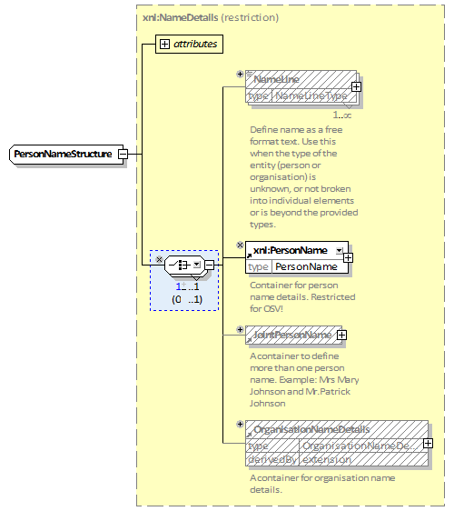
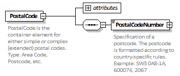
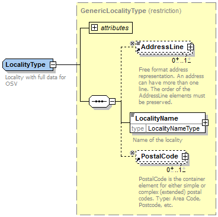
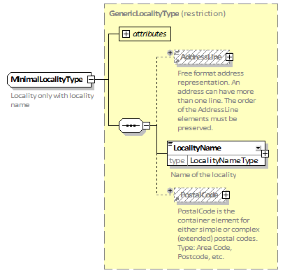
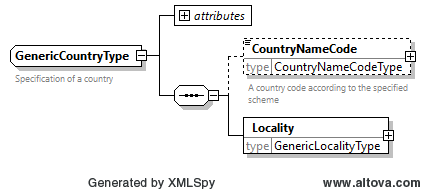
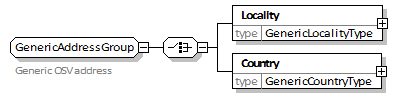
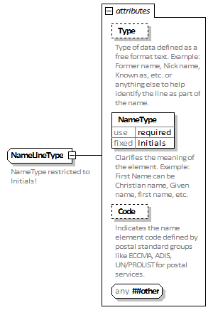

# Wijzingen ten opzichte van EML 5.0

## emlcore-kiesraad-strict.xsd als vervanging van emlcore-v5-0.xsd

Wijzigingen werden aangebracht na het kopiëren van het originele bestand. In plaats van het originele schema bestand `emlexternals-v5-0.xsd`, werd het bestand `emlexternals-kiesraad-strict.xsd` geïmporteerd. Er zijn geen andere aanpassingen toegepast.

## emlexternals-kiesraad-strict.xsd als vervanging van emlexternals-v5-0.xsd

Na het kopiëren van het originele bestand zijn er wijzigingen in aangebracht. In plaats van het originele schema-bestand `xAL.xsd`, en `xNL.xsd`, werden de bestanden `xAL-kiesraad-strict.xsd`, en `xNL-kiesraad-strict.xsd` geïmporteerd.

Bovendien werd de definitie van het complexe type `PersonNameStructure` veranderd. In plaats van een (lege) extensie van het type `xnl:NameDetails`, dat effectief alleen een alias is van het basistype, werd het basis type `xnl:NameDetails` beperkt om alleen `xnl:PersonName` te bevatten als toegestaan child element.

## xAL-kiesraad-strict.xsd als vervanging voor external/xAL.xsd

Wijzigingen werden aangebracht na het kopiëren van het originele bestand en alleen de wijzigingen die niet mogelijk waren door de nieuwe bestanden hieronder te gebruiken.

Element `PostalCode` is aangepast aan de Nederlandse situatie. Alleen child element `PostalCodeNumber` is toegestaan en moet precies één keer voorkomen.

Het naamloze type van element `Locality` werd gekopieerd in het complexe type `LocalityType`. Dit type is beperkt tot de Nederlandse situatie. Alleen child elementen `AddressLine`, `LocalityName` en `PostalCode` kunnen voorkomen en moeten precies één keer voorkomen.

Het complexe type `LocalityType` is nu deel van een hoger type hiërarchie, met `GenericLocalityType` als basis. In het complexe type `GenericLocalityType`, zijn de child elementen `AddressLine`, en `PostalCode` optioneel. Het complex type `LocalityType` is een restrictie van het complex type `GenericLocalityType`. De andere restrictie van het complexe type `GenericLocalityType` is het complexe type `MinimalLocalityType`. Het staat het gebruik van child elementen `AddressLine`, en `PostalCode` niet toe.

Het nieuwe globale element `Country` werd gedefinieerd. Hiervan is het type een nieuw complex type `CountryType`, dat een restrictie is van vorig aanwezig lokale definitie van het `Country` element in het globale `AddressDetails` element.

Alleen child elementen `CountryNameCode` en `Locality` zijn toegestaan, en moeten precies één keer voorkomen.

Het complexe type `CountryType` maakt nu deel van een hoger type hiërarchie met, `GenericCountryType` als basis. Om het complexe type `GenericCountryType`, hebben de child elementen `Locality` het complexe type `GenericLocalityType` als basis type. Het complexe type `CountryType` is een restrictie van het complexe type `GenericCountryType`, met child element `Locality` beperkt tot `LocalityType`. De andere restrictie van het complexe type `GenericCountryType` is het complexe type `MinimalCountryType`, met child element `Locality` beperkt tot `MinimalLocalityType`.

Bovendien zijn verschillende groepen met een keuze tussen elementen `Locality` en `Country` gedefinieerd. De reden om hier deze groepen te definiëren, is de mogelijkheid om correct `xal:AddressDetails` te beperken in schema’s met andere doelnaamgebieden. Alhoewel het niet expliciet kan worden uitgedrukt in XML schema, definiëren de groepen een hiërarchie van keuzes, waar de keuzes in groepen `AddressGroup` en `MinimalAddressGroup` wettelijke restricties voorstellen van de keuze in de `GenericAddressGroup`. Elke groep definieert `Locality` en een `Country` als een lokaal element met een eigen complex type. In `GenericAddressGroup`, zijn deze `GenericLocalityType` en `GenericCountryType`. In `AddressGroup`, zijn deze `LocalityType` en `CountryType`. In `MinimalAddressGroup`, zijn deze `MinimalLocalityType` en `MinimalCountryType`.

## xNL-kiesraad-strict.xsd als vervanging voor external/xNL.xsd

Wijzigingen werden aangebracht na het kopiëren van het originele bestand, en alleen de wijzigingen die niet mogelijk waren door de nieuwe bestanden hieronder te gebruiken.

Complex type `PersonName` is beperkt tot de Nederlandse situatie. Alleen child elementen `NameLine`, `FirstName`, `NamePrefix` en `LastName` zijn toegestaan. Child elementen `NameLine` en `LastName` zijn verplicht en moeten precies een keer voorkomen.

Complex type `NameLineType`, welke gebruikt wordt voor element `NameLine`, was beperkt tot de Nederlandse situatie. Het attribuut hiervan `NameType` werd verplicht gemaakt en ingesteld op de vaste waarde `"Initials"`.

Element `PersonName` werd vereenvoudigd tot het basis type `PersonName`. Naamloze extensies binnen de elementdefinitie werden verwijderd zodat de huidige definitie effectief een restrictie is van de oorspronkelijke definitie.